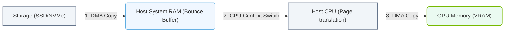

# 21.1a Standard path: NVMe → PCIe → System RAM (CPU bounce buffer) → PCIe → GPU VRAM

#### 🏷️ The AI Data Center Networking — Moving Petabytes Without Latency > 21 Accelerating the Storage Pipeline — GPUDirect Storage > 21.1 The Traditional Storage Data Path — Every Copy Is a Tax

## 🌐 Context Introduction

In modern AI workloads, data must travel from storage (where datasets live) to the GPU (where computation happens). The **standard path** is the traditional way this journey occurs. While it works, it introduces unnecessary copies and latency — which is why NVIDIA developed GPUDirect Storage as an alternative. Understanding this baseline path is critical for engineers learning how to optimize AI data pipelines.

---

## ⚙️ How the Data Travels — Step by Step

The journey from disk to GPU follows a **four-stage** path:

- **1. NVMe (Storage)** — The dataset resides on an NVMe SSD. Data is read from the drive.
- **2. PCIe (First Transfer)** — Data travels over the PCIe bus from the NVMe drive to the CPU.
- **3. System RAM (CPU Bounce Buffer)** — Data lands in a temporary buffer in system memory (RAM). The CPU must "touch" or copy this data before it can move to the GPU.
- **4. PCIe (Second Transfer)** — Data travels again over the PCIe bus, this time from system RAM to GPU VRAM.

> 🧠 **Key Insight:** The data is copied **twice** over PCIe — once into system RAM, then again into GPU memory. Each copy adds latency and consumes CPU resources.

---

## 🕵️ Why This Path Is Inefficient

Every copy is a tax on performance. Here's what happens behind the scenes:

- **CPU involvement** — The CPU must manage the bounce buffer, consuming cycles that could be used for computation.
- **Double PCIe bandwidth usage** — The same data crosses the PCIe bus twice, effectively halving the effective bandwidth for data movement.
- **Increased latency** — Each copy adds microseconds of delay, which compounds over millions of data transfers.
- **Memory pressure** — System RAM is used as a temporary holding area, competing with other system processes.

---

### 📊 Visual Representation: Standard Storage-to-GPU Data Path (CPU bounce buffer)
This diagram displays the standard data path, showing how data must be copied from storage into system memory bounce buffers before being sent to GPU memory.

## 📊 Comparison: Standard Path vs. Ideal Path

| Aspect | Standard Path (This Topic) | Ideal Path (GPUDirect Storage) |
|--------|---------------------------|-------------------------------|
| **Number of PCIe transfers** | 2 (NVMe → RAM, then RAM → GPU) | 1 (NVMe → GPU directly) |
| **CPU involvement** | Required (manages bounce buffer) | Minimal (bypasses CPU) |
| **System RAM usage** | Used as temporary buffer | Not used for data transit |
| **Latency per transfer** | Higher (two copies) | Lower (one copy) |
| **Effective bandwidth** | Reduced by ~50% | Near full PCIe bandwidth |

---

## 🛠️ Real-World Impact for Engineers

When you see this path in action, here's what to watch for:

- **Monitoring tools** — Use **nvidia-smi** to check GPU memory usage and **iostat** to observe disk read patterns. You'll notice data arriving in bursts due to the bounce buffer.
- **Performance bottlenecks** — If your GPU utilization is low but disk I/O is high, the standard path's double copy is likely the culprit.
- **Scaling challenges** — As datasets grow (e.g., from 100 GB to 10 TB), the overhead of the bounce buffer becomes a significant drag on training throughput.

---

## ✅ Key Takeaway

The **standard path** (NVMe → PCIe → System RAM → PCIe → GPU VRAM) works but is **inefficient** for AI workloads. It introduces a **CPU bounce buffer** that doubles PCIe traffic and adds latency. This is why NVIDIA developed **GPUDirect Storage** — to eliminate the bounce buffer and let data flow directly from storage to GPU memory.

> 💡 **For new engineers:** Always question whether data is taking this standard path in your AI infrastructure. If you see low GPU utilization despite high storage activity, the bounce buffer is likely the bottleneck.