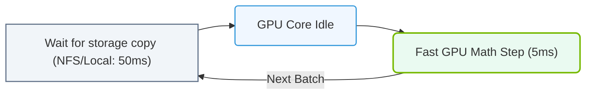

# 21.1c How this limits GPU utilization during data-intensive training

#### 🏷️ The AI Data Center Networking — Moving Petabytes Without Latency > 21 Accelerating the Storage Pipeline — GPUDirect Storage > 21.1 The Traditional Storage Data Path — Every Copy Is a Tax

## 📖 Context Introduction

In traditional AI training setups, data must travel from storage to the GPU for processing. During data-intensive training—where large datasets (like high-resolution images, video, or genomic sequences) are fed into the model—the GPU often sits idle waiting for data. This section explains how the traditional storage data path creates bottlenecks that limit GPU utilization, especially when training with massive datasets.

---

## ⚙️ The Traditional Data Path: A Step-by-Step Bottleneck

When a GPU requests training data, the data takes a long, inefficient journey:

1. **Storage (Disk or SSD)** → Data is read from physical media.
2. **System RAM (CPU Memory)** → Data is copied from storage into the CPU's main memory.
3. **CPU Processing** → The CPU may decompress, shuffle, or augment the data.
4. **GPU Memory (VRAM)** → Data is copied from CPU RAM to GPU memory via the PCIe bus.

**The problem:** Every copy between these stages consumes time and bandwidth. The GPU must wait for the CPU to finish its work before receiving data.

---

## 🕵️ How This Limits GPU Utilization

During data-intensive training, the GPU spends more time waiting than computing. Here’s why:

- **Data starvation:** The GPU completes its current batch quickly, but the next batch hasn't arrived yet.
- **CPU bottleneck:** The CPU becomes the middleman, slowing down data transfers.
- **PCIe contention:** Both data and model parameters compete for the same PCIe bandwidth.
- **Memory bandwidth limits:** Copying data through system RAM adds latency.

The result is **low GPU utilization**—often below 50%—meaning your expensive GPU is idle half the time.

---

## 📊 Comparison: GPU Utilization with vs. without Data Bottlenecks

| Scenario | GPU Utilization | Training Time | Key Limitation |
|----------|----------------|---------------|----------------|
| Small dataset (fits in GPU memory) | 90–100% | Fast | No bottleneck |
| Large dataset (traditional path) | 30–50% | Slow | CPU & PCIe bottleneck |
| Large dataset (optimized path) | 80–95% | Fast | Storage speed only |

---

### 📊 Visual Representation: Standard Path GPU Starvation Loop
This flowchart illustrates how I/O copy delays lower GPU core utilization during large dataset epoch loads.

## 🛠️ Real-World Example: Training a Vision Model

Imagine training a model on 4K video frames:

- **GPU compute time per batch:** 0.1 seconds
- **Data loading time per batch:** 0.3 seconds (via traditional path)
- **Total time per batch:** 0.4 seconds
- **GPU utilization:** Only 25% (0.1 / 0.4)

The GPU spends 75% of its time waiting for data.

---

## 🔍 Key Factors That Worsen the Bottleneck

- **Dataset size:** Larger datasets mean more data transfers.
- **Data complexity:** High-resolution images, video, or 3D point clouds require more bandwidth.
- **Batch size:** Larger batches need more data per step.
- **Storage speed:** Slow HDDs vs. fast NVMe SSDs.
- **Network latency:** In distributed training, data may come from remote storage.

---

## ✅ Summary: Why This Matters for Engineers

- **Low GPU utilization = wasted compute power and higher costs.**
- **Traditional data paths create unnecessary copies through CPU RAM.**
- **Data-intensive training amplifies these bottlenecks.**
- **Understanding this limitation is the first step toward solutions like GPUDirect Storage.**

---

## 🧠 Key Takeaway

> Every copy of data between storage, CPU, and GPU is a "tax" on performance. In data-intensive training, these taxes add up quickly, leaving your GPU idle and your training slow. Reducing these copies is essential for maximizing GPU utilization.