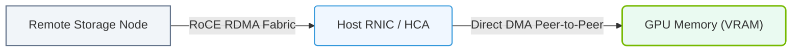

# 21.3a Combining GDS and GPUDirect RDMA for network storage servers

#### 🏷️ The AI Data Center Networking — Moving Petabytes Without Latency > 21 Accelerating the Storage Pipeline — GPUDirect Storage > 21.3 GPUDirect RDMA — Network to GPU Without CPU Involvement

---

## 📘 Context Introduction

In modern AI workloads, data must flow from remote storage servers directly into GPU memory as quickly as possible. Traditionally, data travels from a network storage server → CPU memory → GPU memory, which creates bottlenecks. By combining **GPUDirect Storage (GDS)** with **GPUDirect RDMA**, engineers can create a direct data path from a network-attached storage server straight into GPU memory — bypassing the CPU and system memory entirely. This dramatically reduces latency and frees the CPU for other compute tasks.

---

## ⚙️ What Are GDS and GPUDirect RDMA?

- **GPUDirect Storage (GDS)** — A technology that allows a direct data path between storage (local or remote) and GPU memory, bypassing the CPU and system RAM.
- **GPUDirect RDMA** — A technology that enables network adapters (like Mellanox ConnectX) to read/write data directly to/from GPU memory over a network, without CPU involvement.
- **Combined Effect** — When used together, a network storage server can send data over RDMA directly into GPU memory, eliminating two copy operations (CPU memory copy and PCIe transfer).

---

## 🛠️ How the Combined Architecture Works

- A remote storage server (e.g., NFS or Lustre over RDMA) holds training datasets.
- The GPU server has a **GPUDirect RDMA-capable NIC** (e.g., Mellanox ConnectX-6 or newer).
- The NIC uses RDMA to pull data from the storage server.
- GDS maps the incoming data directly into GPU memory via **GPU page migration** and **BAR1 mapping**.
- The GPU processes the data without any intermediate CPU buffer.

**Data Flow (simplified):**

Remote Storage → RDMA Network → NIC → PCIe → GPU Memory (via GDS)

---

## 📊 Comparison: Traditional vs. GDS + GPUDirect RDMA

| Aspect | Traditional Path | GDS + GPUDirect RDMA Path |
|--------|------------------|----------------------------|
| Data copies | 3 copies (NIC→CPU, CPU→GPU, GPU→GPU) | 1 direct copy (NIC→GPU) |
| CPU involvement | High (manages all transfers) | Minimal (only setup/teardown) |
| Latency | Higher due to extra hops | Lower (direct path) |
| Memory bandwidth usage | Wastes CPU RAM bandwidth | Saves CPU RAM for other tasks |
| Throughput | Limited by CPU memory bandwidth | Limited by PCIe and network bandwidth |

---

## 🕵️ Key Components Required

- **NVIDIA GPU** with CUDA 11.0+ and GDS support (e.g., A100, H100, V100)
- **GPUDirect RDMA-capable NIC** (e.g., Mellanox ConnectX-5/6/7, BlueField DPU)
- **RDMA-enabled storage server** (e.g., NFS over RDMA, Lustre, or custom storage)
- **NVIDIA GPUDirect Storage driver** (nvidia-fs.ko)
- **CUDA Toolkit** with GDS libraries (libcufile.so)
- **Mellanox OFED** or **MLNX_OFED** drivers for RDMA

---


### 📊 Visual Representation: GDS and GPUDirect RDMA Unified Path
This diagram displays unified GDS/RDMA execution: copying data directly from remote NVMe-oF network targets to GPU memory.




## 🧩 Configuration Steps Overview

1. **Verify hardware compatibility** — Ensure GPU, NIC, and storage server all support RDMA and GDS.
2. **Install drivers** — Install NVIDIA driver, CUDA Toolkit, GDS driver, and Mellanox OFED.
3. **Enable RDMA on the NIC** — Configure IP over InfiniBand or RoCE (RDMA over Converged Ethernet).
4. **Mount storage over RDMA** — Use NFS over RDMA or a parallel filesystem with RDMA support.
5. **Load GDS kernel module** — Load **nvidia-fs.ko** on the GPU server.
6. **Test the data path** — Use GDS-aware tools (e.g., **nvidia-fs** utilities) to verify direct GPU access.

---

## 🔧 Example: Verifying GDS + RDMA Integration

**For reference:**
```
nvidia-fs -l /mnt/rdma_storage/dataset.bin
```

**📤 Output:**  
**GDS file opened successfully on GPU 0. Direct path active.**

**For reference:**
```
nvidia-smi topo -m
```

**📤 Output:**  
**GPU0 : NIC0 (Mellanox ConnectX-6) — PIX (Direct Path)**

---

## ⚠️ Common Pitfalls for New Engineers

- **Missing BAR1 mapping** — Ensure GPU BAR1 size is large enough (e.g., 256 GB or more) to map large files directly.
- **RDMA not enabled on storage server** — Both client and server must support the same RDMA transport (InfiniBand or RoCE).
- **Firewall blocking RDMA traffic** — RDMA uses specific ports (e.g., 20079 for NFS over RDMA). Open these between servers.
- **Incorrect GPU-NIC topology** — Use **nvidia-smi topo -m** to confirm the NIC is on the same PCIe root complex as the target GPU.
- **GDS module not loaded** — Run **lsmod | grep nvidia_fs** to verify. If missing, load with **modprobe nvidia_fs**.

---

## ✅ Summary

- Combining **GDS** and **GPUDirect RDMA** creates a zero-copy data path from network storage directly into GPU memory.
- This eliminates CPU bottlenecks and reduces data transfer latency by up to 50% in many AI training pipelines.
- Key requirements: compatible hardware, proper drivers, RDMA-enabled storage, and correct topology mapping.
- For new engineers, start with small-scale tests using a single GPU and a local RDMA storage server before scaling to multi-node clusters.

---

## 📚 Further Reading

- NVIDIA GPUDirect Storage Documentation
- Mellanox GPUDirect RDMA User Guide
- CUDA Toolkit GDS Programming Guide
- RDMA Aware Programming (libibverbs, librdmacm)