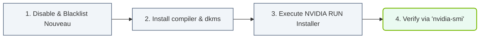

# 22.1b Installation methods: apt/dnf repository (recommended) vs .run file (manual)

#### 🏷️ The Nvidia Software Stack — Bridging Silicon and Python > 22 Base Drivers, CUDA, and Core Libraries > 22.1 NVIDIA Data Center GPU Drivers

---

## 🧭 Context Introduction

When setting up NVIDIA GPUs for AI workloads, one of the first decisions an engineer must make is **how to install the NVIDIA Data Center GPU drivers**. These drivers are the essential software layer that allows your operating system to communicate with the GPU hardware.

There are two primary installation methods:
- **Repository-based installation** (using **apt** on Ubuntu/Debian or **dnf** on RHEL/CentOS) — this is the **recommended** approach.
- **Manual .run file installation** — a more hands-on method used in specific scenarios.

This guide explains both approaches, their trade-offs, and when to use each.

---

## ⚙️ Method 1: Repository-Based Installation (apt/dnf) — Recommended

### What is it?
This method uses your Linux distribution's native package manager to install NVIDIA drivers from NVIDIA's official package repository.

### How it works
- You add NVIDIA's official repository to your system's package sources.
- You then use **apt** (for Debian/Ubuntu) or **dnf** (for RHEL/CentOS/Fedora) to install the driver.
- The package manager handles dependencies, versioning, and future updates automatically.

### ✅ Advantages
- **Automatic updates** — drivers stay current with system updates.
- **Dependency management** — the package manager resolves all required libraries.
- **Clean uninstallation** — removing the driver is as simple as a single command.
- **Kernel compatibility** — the package manager ensures driver and kernel versions match.
- **Recommended by NVIDIA** for most production and development environments.

### ❌ Disadvantages
- Requires internet access to the repository.
- May not offer the absolute latest driver version immediately (slight delay vs. .run file).
- Requires adding a third-party repository to your system.

---

## 🛠️ Method 2: Manual .run File Installation

### What is it?
This method involves downloading a standalone executable **.run file** directly from NVIDIA's website and running it manually.

### How it works
- You download the driver package (a single **.run file**) from NVIDIA's driver portal.
- You make the file executable and run it with root privileges.
- The installer handles the driver installation, but you must manage dependencies and updates yourself.

### ✅ Advantages
- **Immediate access** to the latest driver version as soon as NVIDIA releases it.
- **No repository dependency** — works on systems without internet access or custom repositories.
- **Full control** over installation options (e.g., disabling Nouveau, selecting components).
- **Useful for testing** new driver versions before they reach official repositories.

### ❌ Disadvantages
- **Manual updates** — you must manually download and reinstall for each driver update.
- **No automatic dependency resolution** — you must ensure all prerequisites (kernel headers, compilers, etc.) are installed beforehand.
- **Kernel update breaks** — after a kernel update, the driver may need to be reinstalled.
- **More complex uninstallation** — requires running the .run file with an uninstall flag.
- **Not recommended** for production environments or beginners.

---

### 📊 Visual Representation: NVIDIA Driver Installation flow
This flowchart outlines driver installation: disabling Nouveau drivers, building kernel modules, and verifying with nvidia-smi.

## 📊 Comparison Table: apt/dnf Repository vs .run File

| Feature | apt/dnf Repository (Recommended) | .run File (Manual) |
|---|---|---|
| **Ease of installation** | ✅ Simple, one command | ⚠️ Requires multiple steps |
| **Automatic updates** | ✅ Yes, with system updates | ❌ No, manual only |
| **Dependency handling** | ✅ Automatic | ❌ Manual |
| **Kernel update handling** | ✅ Automatic rebuild | ❌ Requires reinstall |
| **Latest driver version** | ⚠️ Slight delay | ✅ Immediate |
| **Offline installation** | ❌ Requires internet | ✅ Possible with pre-download |
| **Uninstallation** | ✅ Clean, one command | ⚠️ Requires specific command |
| **Production readiness** | ✅ Recommended | ❌ Not recommended |
| **Control over options** | ⚠️ Limited | ✅ Full control |

---

## 🕵️ When to Use Each Method

### ✅ Use apt/dnf repository when:
- You are setting up a **production system** or **development workstation**.
- You want **automatic updates** and **minimal maintenance**.
- You have **internet access** to the NVIDIA repository.
- You are a **new engineer** learning AI infrastructure.

### ✅ Use .run file when:
- You need the **absolute latest driver** for testing a new GPU feature.
- Your system has **no internet access** (air-gapped environment).
- You need **fine-grained control** over installation options.
- You are troubleshooting a driver issue and need a specific version.

---

## 🧪 Practical Guidance for New Engineers

### Starting Point
As a new engineer, always start with the **repository-based method**. It is the safest, most maintainable, and most widely supported approach.

### Verification
After installation, verify the driver is working by checking the GPU status. You can do this by running a command that queries the driver version and GPU state.

### Troubleshooting
- If the repository method fails, check that you have added the correct repository for your OS version.
- If the .run file method fails, ensure you have installed the required kernel headers and development tools first.
- Always reboot after driver installation to load the new kernel module.

---

## ✅ Summary

- **Repository-based installation (apt/dnf)** is the **recommended** method for most engineers. It is simpler, safer, and more maintainable.
- **Manual .run file installation** is a **fallback** method for specific scenarios like offline systems or bleeding-edge testing.
- For production AI infrastructure, always prefer the repository method unless you have a clear reason to use the .run file.
- As you gain experience, understanding both methods will help you handle diverse deployment environments.