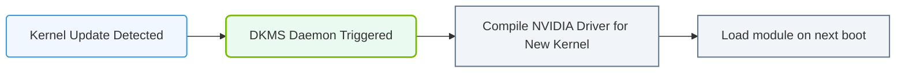

# 22.1c DKMS (Dynamic Kernel Module Support): auto-rebuilding drivers after kernel updates

#### 🏷️ The Nvidia Software Stack — Bridging Silicon and Python > 22 Base Drivers, CUDA, and Core Libraries > 22.1 NVIDIA Data Center GPU Drivers

---

## 🌱 Context Introduction

When you install NVIDIA drivers on a Linux system, those drivers are compiled specifically for the current kernel version running on your machine. Every time you update your Linux kernel (which happens frequently with security patches and system updates), the old driver modules no longer match the new kernel. Without DKMS, you would need to manually reinstall the NVIDIA drivers after every kernel update — a tedious and error-prone process.

DKMS (Dynamic Kernel Module Support) automates this process. It watches for kernel updates and automatically rebuilds the NVIDIA driver modules so they work with the new kernel. Think of it as a smart assistant that keeps your GPU drivers in sync with your operating system's kernel, without any manual intervention from you.

---

## ⚙️ What DKMS Actually Does

DKMS is a framework that enables kernel modules (like NVIDIA drivers) to be automatically rebuilt when a new kernel is installed. Here's how it works in simple terms:

- **Registers driver source code** — When you install NVIDIA drivers with DKMS enabled, the driver source code is copied to a special DKMS directory on your system
- **Monitors kernel updates** — DKMS hooks into the Linux package management system (like apt or yum) to detect when a new kernel is installed
- **Triggers automatic rebuild** — After a kernel update completes, DKMS automatically compiles the NVIDIA driver modules against the new kernel's headers and APIs
- **Installs rebuilt modules** — The freshly compiled driver modules are placed into the correct location for the new kernel, making them available immediately on the next reboot

---

## 🛠️ Why DKMS Matters for AI Workloads

For engineers working with AI infrastructure, DKMS solves a critical operational problem:

- **Prevents downtime** — Without DKMS, a routine kernel security update could break GPU acceleration, forcing you to manually troubleshoot and reinstall drivers
- **Maintains compatibility** — AI frameworks like PyTorch and TensorFlow depend on CUDA and NVIDIA drivers working correctly. DKMS ensures this chain remains intact after system updates
- **Reduces manual effort** — In environments with many GPU servers, manually reinstalling drivers after every kernel update is impractical. DKMS handles this automatically across all machines
- **Supports custom kernels** — If you compile your own kernel or use a specialized distribution, DKMS still works because it rebuilds modules from source code

---

## 🕵️ How DKMS Integrates with NVIDIA Drivers

When you install NVIDIA drivers using the official `.run` installer or through your distribution's package manager, DKMS integration typically happens automatically. Here is the typical flow:

1. **Driver installation** — The NVIDIA installer places driver source code into `/usr/src/nvidia-<version>/`
2. **DKMS registration** — The installer runs a command that tells DKMS about the new module, adding it to the DKMS database
3. **Initial build** — DKMS compiles the driver modules for the current kernel and installs them
4. **Kernel update event** — When you update your kernel (e.g., via `apt upgrade`), the package manager triggers DKMS
5. **Automatic rebuild** — DKMS detects the new kernel, rebuilds the NVIDIA modules, and installs them

---


### 📊 Visual Representation: Dynamic Kernel Module Support (DKMS) flow
This flowchart shows DKMS: when host kernels update, DKMS automatically rebuilds proprietary NVIDIA driver modules in the background.




## 📊 DKMS vs. Manual Driver Management

| Feature | With DKMS | Without DKMS |
|---------|-----------|--------------|
| Kernel update handling | Automatic rebuild of drivers | Manual reinstallation required |
| Downtime risk | Low — drivers ready after reboot | High — GPU may not work until you fix it |
| Engineer effort | Zero after initial setup | Significant — each kernel update needs manual work |
| Custom kernel support | Fully supported | Requires manual compilation |
| Multi-server management | Consistent across all machines | Each server needs individual attention |

---

## 🔍 Checking DKMS Status on Your System

To verify that DKMS is properly managing your NVIDIA drivers, you can check the status using a simple command. The output will show you which modules are registered with DKMS and their current build status.

For reference, the command to check DKMS status is:

```
dkms status
```

📤 Output: This will display a list of modules, including **nvidia**, along with their version numbers and build status (e.g., "installed" or "built").

---

## 🧩 Common DKMS Scenarios for Engineers

**Scenario 1: Fresh driver installation**
When you install NVIDIA drivers for the first time, DKMS automatically registers the module and builds it for your current kernel. No extra steps needed.

**Scenario 2: Kernel security update**
Your system administrator pushes a kernel security patch. After the update completes, DKMS automatically rebuilds the NVIDIA drivers. You may need to reboot, but no manual driver reinstallation is required.

**Scenario 3: Driver upgrade**
When you upgrade to a newer NVIDIA driver version, the old DKMS module is removed and the new one is registered. DKMS handles the transition seamlessly.

**Scenario 4: Troubleshooting a failed build**
If a kernel update causes the DKMS build to fail (rare, but possible with very new kernels), you will see an error message. In this case, you may need to temporarily use a fallback kernel or wait for an updated NVIDIA driver.

---

## ✅ Best Practices for DKMS with NVIDIA Drivers

- **Always install NVIDIA drivers with DKMS enabled** — This is the default behavior for most installation methods, but verify it during installation
- **Keep driver source files intact** — Do not delete the `/usr/src/nvidia-<version>/` directory, as DKMS needs it for rebuilds
- **Monitor system logs after kernel updates** — Check for DKMS-related messages to confirm successful driver rebuilds
- **Test driver functionality after kernel updates** — Run a simple GPU verification (like `nvidia-smi`) after rebooting into a new kernel
- **Use distribution-provided drivers when possible** — Package managers like apt or yum handle DKMS integration more reliably than manual `.run` installers

---

## 📌 Key Takeaway

DKMS is a silent but essential component of AI infrastructure. It ensures that your NVIDIA GPU drivers remain functional across kernel updates without any manual intervention. For engineers managing GPU-accelerated systems, DKMS eliminates a common source of operational friction and keeps AI workloads running smoothly.