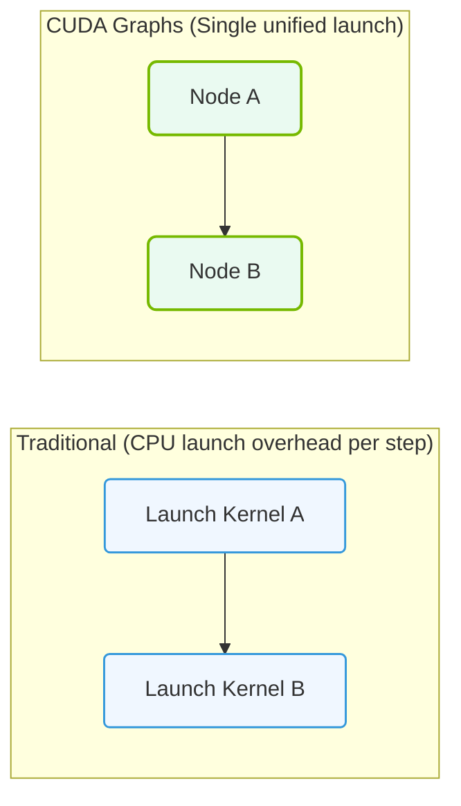

# 22.2g CUDA Graphs: pre-compiling GPU execution graphs for reduced launch overhead

#### 🏷️ The Nvidia Software Stack — Bridging Silicon and Python > 22 Base Drivers, CUDA, and Core Libraries > 22.2 The CUDA Toolkit — The Foundation of GPU Computing

---

## 🌱 Context Introduction

When you write CUDA code, every time you launch a kernel (a function that runs on the GPU), there is a small but measurable overhead. This overhead comes from the CPU telling the GPU what to do — setting up arguments, scheduling the kernel, and synchronizing. For simple programs, this overhead is negligible. But for complex AI workloads that launch thousands of tiny kernels repeatedly, this launch overhead can become a significant bottleneck.

**CUDA Graphs** solve this problem by letting you **capture** a sequence of GPU operations (kernels, memory copies, etc.) into a single "graph" structure. You then **pre-compile** that graph, so the GPU knows exactly what to do ahead of time. When you need to run the same sequence again, you simply launch the entire graph with one command — drastically reducing launch overhead.

Think of it like this: instead of giving the GPU step-by-step instructions every time (like a teacher reading each line of a recipe aloud), you give it the entire recipe book once, and then just say "go."

---

## ⚙️ How CUDA Graphs Work — The Core Idea

CUDA Graphs operate in three main phases:

- **Capture Phase:** You record a series of CUDA operations (kernels, memory copies, events) into a graph. This is done using special CUDA APIs that wrap your existing kernel launches.
- **Instantiation Phase:** The captured graph is "compiled" into an optimized executable form. This is where the GPU pre-computes the execution plan.
- **Launch Phase:** You launch the entire pre-compiled graph with a single API call. The GPU executes all the operations in sequence without any per-kernel overhead.

---

## 🛠️ When Should You Use CUDA Graphs?

CUDA Graphs are most beneficial in these scenarios:

- **Repetitive workloads:** When the same sequence of kernels runs many times (e.g., training iterations in deep learning).
- **Many small kernels:** When you have hundreds or thousands of tiny kernel launches that each have high relative overhead.
- **Fixed computation patterns:** When the graph structure (which kernels run, in what order) does not change between iterations.
- **Latency-sensitive applications:** When every microsecond of overhead matters (e.g., real-time inference).

---

## 📊 Comparison: Traditional Launch vs. CUDA Graphs

| Feature | Traditional Kernel Launch | CUDA Graphs |
|---------|---------------------------|-------------|
| **Launch overhead** | Per-kernel overhead (CPU→GPU communication) | One-time overhead for the entire graph |
| **Flexibility** | Can change kernel parameters each launch | Graph structure is fixed after capture |
| **Best for** | Dynamic, one-off computations | Repeated, fixed-pattern workloads |
| **Memory usage** | Low (no graph storage) | Higher (stores compiled graph) |
| **Setup time** | None | Requires capture + instantiation phase |

---

### 📊 Visual Representation: CUDA Graphs kernel execution flow
This diagram displays CUDA Graphs: combining separate launch steps into a single dependency graph to bypass CPU launch overhead.

## 🕵️ Key Benefits for AI Workloads

- **Reduced CPU utilization:** The CPU spends less time managing GPU launches, freeing it for other tasks.
- **Lower latency:** Each graph launch is much faster than launching individual kernels.
- **Better GPU utilization:** The GPU can start executing immediately without waiting for CPU instructions.
- **Deterministic execution:** The graph guarantees the same execution order every time, which helps with debugging and reproducibility.

---

## 🧩 Practical Considerations for Engineers

- **Graph capture overhead:** The first time you capture a graph, it takes extra time. This is a one-time cost.
- **Graph updates:** If your computation pattern changes (e.g., different batch sizes), you may need to re-capture the graph.
- **Memory footprint:** The compiled graph occupies GPU memory. For very large graphs, this can be significant.
- **Debugging complexity:** Debugging a graph is harder than debugging individual kernels because the execution is pre-planned.

---

## 🔄 Common Use Cases in AI Infrastructure

- **Training loops:** Capture the forward pass, backward pass, and optimizer update into a single graph for each iteration.
- **Inference pipelines:** Pre-compile the entire inference sequence (preprocessing, model execution, postprocessing) into one graph.
- **Data preprocessing:** Graph sequences of data loading, augmentation, and transfer to GPU memory.
- **Multi-GPU synchronization:** Capture synchronization points and collective operations across multiple GPUs.

---

## ✅ Summary

CUDA Graphs are a powerful optimization technique for engineers working with repetitive GPU workloads. By pre-compiling the execution plan, you eliminate per-kernel launch overhead and improve overall system efficiency. While they add some complexity to the setup phase, the performance gains — especially in AI training and inference — can be substantial.

**Key takeaway:** If your workload runs the same sequence of GPU operations many times, CUDA Graphs can significantly reduce latency and improve throughput.