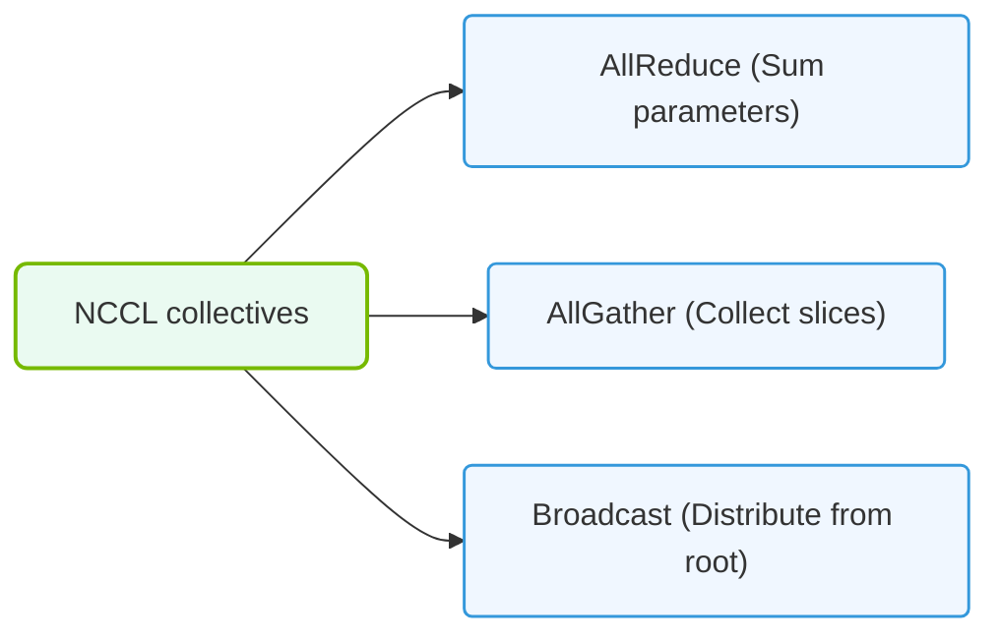

# 22.4a NCCL operations: AllReduce, AllGather, Reduce, Broadcast, ReduceScatter

#### 🏷️ The Nvidia Software Stack — Bridging Silicon and Python > 22 Base Drivers, CUDA, and Core Libraries > 22.4 NCCL — GPU Collective Communications

## 🌐 Context Introduction

When you train large AI models across multiple GPUs, those GPUs need to talk to each other constantly. They share gradients, parameters, and data. **NCCL** (NVIDIA Collective Communications Library) is the high-speed communication library that makes this possible. Think of it as a super-efficient postal service for GPUs — it knows the fastest routes and the best packaging to move data between GPUs in a cluster.

This section covers the five fundamental NCCL operations. Each operation is a specific pattern of communication that solves a particular problem during distributed training.

---

## ⚙️ Operation 1: Broadcast

**What it does:** One GPU sends its data to all other GPUs.

**When you use it:** When you want every GPU to start with the same model parameters or the same input data.

**How it works:**
- One GPU is designated as the "root" (the sender).
- The root GPU has a piece of data (e.g., model weights).
- All other GPUs receive an identical copy of that data.

**Real-world analogy:** A teacher (root GPU) handing out the same worksheet to every student (other GPUs) in the classroom.

---

## 📊 Operation 2: Reduce

**What it does:** All GPUs send their data to one GPU, which combines them using an operation (usually summation).

**When you use it:** When you need to aggregate results from all GPUs onto a single GPU (e.g., calculating total loss across all batches).

**How it works:**
- Every GPU has its own value (e.g., a partial gradient).
- All values are sent to one destination GPU.
- The destination GPU performs the reduction (e.g., adds them all up).
- Only the destination GPU ends up with the final result.

**Real-world analogy:** Each student (GPU) writes their score on a slip of paper. One student collects all slips and adds them up to get the total class score.

---

## 🛠️ Operation 3: AllReduce

**What it does:** All GPUs send their data, the data is combined (reduced), and the result is sent back to every GPU.

**When you use it:** This is the most common operation in distributed training — used for synchronizing gradients after each training step.

**How it works:**
- Every GPU has its own gradient values.
- NCCL sums all the gradients together.
- The final summed gradient is sent back to every GPU.
- All GPUs now have identical, updated gradients.

**Real-world analogy:** Every student (GPU) has a piece of a puzzle. They all send their pieces to a central table, the pieces are assembled into the complete puzzle, and then each student gets a photo of the completed puzzle.

---

## 🕵️ Operation 4: AllGather

**What it does:** Every GPU sends its data to every other GPU. No reduction happens — just copying.

**When you use it:** When each GPU has a unique piece of data, and you want every GPU to have the complete dataset (e.g., for all-to-all communication of embeddings).

**How it works:**
- Each GPU holds a different chunk of data (e.g., GPU 0 has chunk A, GPU 1 has chunk B).
- Every GPU sends its chunk to all other GPUs.
- After the operation, every GPU has chunks A, B, C, D... (the full set).

**Real-world analogy:** Four friends each have a different chapter of a book. They all photocopy their chapter and give copies to everyone else. Now each friend has the entire book.

---

### 📊 Visual Representation: NCCL Collective communication algorithms
This diagram displays NCCL collective actions, using optimized Ring or Tree topologies for high-throughput GPU parameter sharing.

## 🔄 Operation 5: ReduceScatter

**What it does:** A hybrid operation — first reduces data across GPUs, then scatters (distributes) the reduced chunks back to each GPU.

**When you use it:** When you want to distribute the work of processing reduced data. Often used as part of a larger AllReduce implementation.

**How it works:**
- Each GPU has an array of values.
- The arrays are split into chunks.
- For each chunk position, the values from all GPUs are reduced (summed).
- Each GPU receives only one chunk of the reduced result.

**Real-world analogy:** Four chefs each have four ingredients. They combine all the flour together, all the sugar together, all the eggs together, and all the butter together. Then Chef 1 gets only the flour, Chef 2 gets only the sugar, Chef 3 gets only the eggs, and Chef 4 gets only the butter.

---

## 📋 Comparison Table: NCCL Operations at a Glance

| Operation | Input | Output | Data Movement | Use Case |
|-----------|-------|--------|---------------|----------|
| **Broadcast** | One GPU has data | All GPUs have same data | One-to-all | Distribute initial model weights |
| **Reduce** | All GPUs have data | One GPU has combined result | All-to-one | Aggregate loss to a single GPU |
| **AllReduce** | All GPUs have data | All GPUs have same combined result | All-to-all | Gradient synchronization |
| **AllGather** | Each GPU has unique data | All GPUs have all data | All-to-all | Collect full dataset on each GPU |
| **ReduceScatter** | All GPUs have data | Each GPU has a unique chunk of reduced data | All-to-all (reduced) | Distributed processing of aggregated data |

---

## 🧠 How These Operations Work Together in Training

In a typical distributed training step, these operations are used in sequence:

1. **Broadcast** is used at the start to give all GPUs the same model weights.
2. Each GPU processes its own batch of data and computes **local gradients**.
3. **AllReduce** is called to sum all gradients across GPUs and give every GPU the same averaged gradient.
4. Each GPU independently updates its model weights using the averaged gradient.
5. Repeat from step 2 for the next training step.

**Why this matters:** Without NCCL, each GPU would have to manually send data to every other GPU using slower methods. NCCL optimizes these operations to use the fastest available paths (NVLink, InfiniBand, or Ethernet) and the most efficient algorithms (ring, tree, or NVLink-specific patterns).

---

## 🎯 Key Takeaways for New Engineers

- **AllReduce** is the most important operation — you will use it constantly in distributed training.
- **Broadcast** and **Reduce** are simpler building blocks that AllReduce builds upon.
- **AllGather** is useful when you need full data on every GPU without combining it.
- **ReduceScatter** is an optimization that combines reduction and distribution in one step.
- NCCL automatically chooses the best algorithm and communication path for your hardware — you just call the operation.
- The performance of these operations directly impacts how fast your model trains across multiple GPUs.

---

## 📚 Next Steps

To practice these concepts, try visualizing the data flow for each operation with a simple example of 4 GPUs. Draw arrows showing which GPU sends data to which other GPU. This mental model will help you understand why certain operations are faster than others and when to use each one.