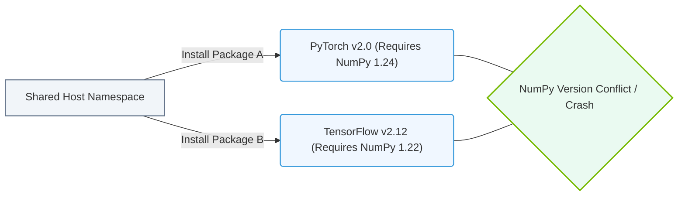

# 23.1a Why Python environments break: conflicting library versions, system package collisions

#### 🏷️ The Nvidia Software Stack — Bridging Silicon and Python > 23 Containerization Fundamentals — Docker from First Principles > 23.1 The Problem Containers Solve — Dependency Hell

## 🌱 Context Introduction

As a new engineer stepping into AI infrastructure, you'll quickly discover that Python environments are fragile. One day your model training script works perfectly; the next day, after installing a seemingly unrelated package, everything breaks. This isn't a bug in your code — it's a fundamental challenge called **dependency hell**. Understanding why this happens is the first step toward mastering containerization with tools like Docker, which NVIDIA-certified workflows rely on heavily.

---

## ⚙️ The Core Problem: Conflicting Library Versions

Python projects depend on libraries (packages) that themselves depend on other libraries. These dependencies form a tree. When two packages require **different versions** of the same underlying library, you get a conflict.

**How this manifests:**
- **Package A** requires **Library X v2.0**
- **Package B** requires **Library X v1.5**
- Your system can only hold one version of **Library X** at a time
- Result: One of the two packages breaks

**Real-world AI example:**
- **TensorFlow 2.10** requires **NumPy 1.23**
- **PyTorch 1.13** requires **NumPy 1.24**
- Installing both in the same environment causes import errors or silent numerical inaccuracies

---

## 🗂️ System Package Collisions: The Hidden Danger

Beyond Python libraries, your system has its own package manager (like **apt** on Ubuntu or **brew** on macOS). System packages can collide with Python packages in two ways:

**Type 1: System Python vs. Project Python**
- Your OS uses Python 3.8 for system tools
- Your AI project needs Python 3.10
- Installing Python 3.10 system-wide can break OS tools

**Type 2: System Libraries vs. Python Libraries**
- System **OpenSSL** version: 1.1.1
- Python package **cryptography** requires OpenSSL 3.0
- Result: Installation fails or runtime errors occur

---

## 🕵️ Common Scenarios That Break Environments

Here are the most frequent situations engineers encounter:

- **Pip upgrade cascade**: Running **pip install --upgrade** on one package upgrades its dependencies, breaking other packages that relied on the older versions
- **Global site-packages pollution**: Installing packages with **sudo pip install** writes to system directories, affecting all Python projects
- **Conda channel conflicts**: Mixing packages from **conda-forge** and **defaults** channels can lead to incompatible builds
- **GPU driver mismatches**: A CUDA toolkit version required by PyTorch may conflict with the NVIDIA driver version installed on the system
- **OS-level Python modifications**: Using **apt install python3-xxx** can overwrite Python packages managed by pip

---

### 📊 Visual Representation: Python dependency conflicts
This diagram displays how installing conflicting package versions directly into the host system namespace breaks package dependencies.

## 📊 Comparison: Healthy vs. Broken Environment

| Aspect | ✅ Healthy Environment | ❌ Broken Environment |
|--------|----------------------|----------------------|
| **Package versions** | All dependencies satisfy version constraints | Conflicting requirements exist (e.g., NumPy 1.23 vs 1.24) |
| **Installation order** | Any order works | Must install in exact sequence to avoid breakage |
| **Reproducibility** | Same setup works on any machine | Works only on original machine |
| **Error messages** | Clear, actionable | Cryptic tracebacks like **ImportError: cannot import name 'x'** |
| **GPU support** | CUDA version matches all frameworks | **RuntimeError: CUDA error: no kernel image is available** |

---

## 🛠️ How to Spot a Broken Environment

When your Python environment breaks, look for these telltale signs:

- **ImportError**: A library fails to load because a dependency is missing or wrong version
- **ModuleNotFoundError**: A package you installed is invisible to Python
- **Version mismatch warnings**: Messages like **"NumPy 1.24 is incompatible with TensorFlow 2.10"**
- **Segmentation faults**: The Python interpreter crashes due to binary incompatibility
- **Silent numerical errors**: Models train but produce wrong results because of library version differences

---

## 🧠 Why This Matters for AI Infrastructure

In AI workflows, you typically juggle multiple frameworks:

- **TensorFlow** for model training
- **PyTorch** for research prototyping
- **JAX** for high-performance computing
- **CUDA Toolkit** for GPU acceleration
- **cuDNN** for deep neural network primitives

Each of these has strict version requirements. A single mismatch can waste hours of debugging. This is precisely why NVIDIA-certified workflows emphasize **containerization** — it isolates each project's dependencies from the system and from each other.

---

## 🔑 Key Takeaway

Python environments break because **dependencies are global by default** but **requirements are project-specific**. The solution isn't to avoid installing packages — it's to isolate environments. Containers (Docker) and virtual environments (venv, conda) solve this by giving each project its own sandboxed world of libraries, free from conflicts with other projects or the system.

As you continue learning about AI infrastructure, remember: **dependency hell is normal, not a personal failure**. The tools you'll learn next — Docker containers — are designed specifically to escape this hell.