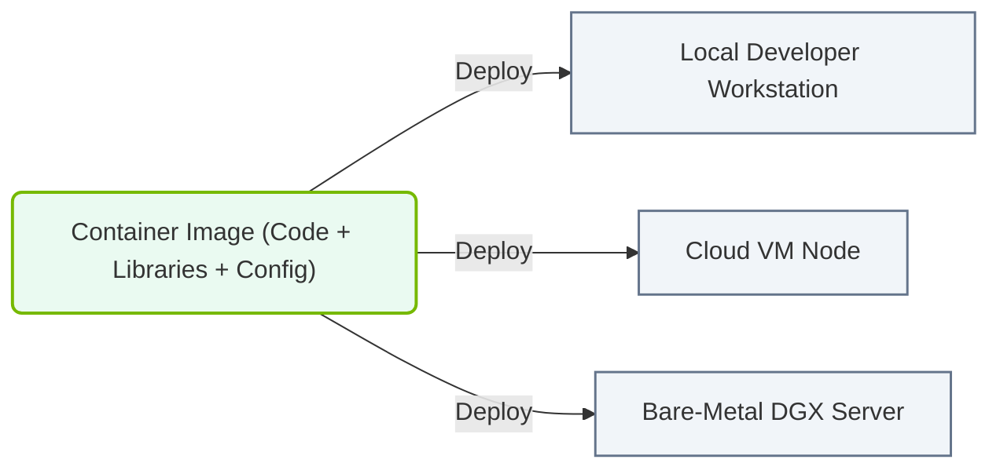

# 23.1c The container promise: 'works on my machine' becomes deployable everywhere

#### 🏷️ The Nvidia Software Stack — Bridging Silicon and Python > 23 Containerization Fundamentals — Docker from First Principles > 23.1 The Problem Containers Solve — Dependency Hell

---

## 🧠 Context Introduction

Every engineer has heard the phrase **"It works on my machine!"** at some point. This statement is usually followed by frustration when the same code fails on a colleague's laptop, a test server, or a production cluster. The root cause is almost always **environment inconsistency** — different operating systems, library versions, GPU drivers, or Python package combinations.

Containers solve this problem by packaging your application **together with everything it needs to run** — including the operating system libraries, runtime, tools, and dependencies — into a single, portable unit. This means your application behaves the same way on your local machine, your teammate's workstation, and a production GPU cluster.

---

## 📦 What Is the Container Promise?

The container promise is simple: **"If it runs in a container on my machine, it will run identically anywhere a container engine is installed."**

| Aspect | Without Containers | With Containers |
|--------|-------------------|-----------------|
| 🔧 Environment setup | Manual installation of libraries, drivers, and tools | Everything is pre-configured inside the container image |
| 🐍 Python dependencies | pip install may break due to OS differences | All packages are frozen at specific versions inside the image |
| 🖥️ GPU support | Requires matching CUDA and driver versions | Container includes the exact CUDA toolkit needed |
| 🚀 Deployment | Each server needs manual configuration | One image deploys to any container runtime |
| 🔄 Reproducibility | "Works on my machine" problem | Identical behavior across all environments |

---

## ⚙️ How Containers Eliminate Dependency Hell

Dependency hell occurs when different applications require conflicting versions of libraries, runtimes, or system tools. Containers solve this by **isolating each application in its own environment**.

- **Library isolation**: Each container has its own filesystem with exactly the libraries it needs — no conflicts with other containers or the host system.
- **Version pinning**: You specify exact versions of every dependency (e.g., Python 3.10, CUDA 12.2, PyTorch 2.1.0) inside the container image.
- **No host contamination**: Installing or removing packages inside a container does not affect the host operating system or other containers.
- **GPU driver abstraction**: NVIDIA containers include the CUDA runtime and libraries needed, while only requiring the NVIDIA driver on the host.

---

### 📊 Visual Representation: Container Package Portability Promise
This diagram displays how containers bundle application binaries and all dependent libraries into a portable image that runs consistently across any infrastructure.

## 🛠️ The Building Blocks of a Container Image

A container image is a **snapshot** of a complete filesystem with your application and its dependencies. It is built layer by layer.

- **Base image**: The starting point — typically a minimal Linux distribution (e.g., Ubuntu, Alpine) or a specialized image like **nvidia/cuda** for GPU workloads.
- **Application code**: Your scripts, models, and configuration files are copied into the image.
- **Dependencies**: All required libraries, packages, and tools are installed inside the image.
- **Runtime configuration**: Environment variables, entry points, and default commands are set.

When you run a container from this image, it creates an isolated environment that behaves exactly as defined — regardless of the host system.

---

## 🕵️ Why This Matters for AI Workloads

AI and machine learning applications are particularly sensitive to environment differences because they depend on:

- **GPU drivers and CUDA versions**: A mismatch between the CUDA version used during training and the version available on a deployment server can cause crashes or silent performance degradation.
- **Python package versions**: Deep learning frameworks like PyTorch and TensorFlow have strict version compatibility requirements with CUDA and cuDNN.
- **System libraries**: Libraries like NCCL (for multi-GPU communication) and cuBLAS (for linear algebra) must match the exact versions used during development.

Containers ensure that the **exact same software stack** used during development is used during training, testing, and inference — eliminating the "works on my machine" problem entirely.

---

## ✅ Key Takeaways for New Engineers

- **Containers are not virtual machines**: They share the host operating system kernel, making them lightweight and fast to start.
- **The container image is the truth**: Everything your application needs is inside the image — nothing depends on the host environment.
- **Portability is the goal**: A container built on your laptop runs identically on a developer workstation, a GPU server, or a cloud instance.
- **NVIDIA provides optimized base images**: Pre-built images with CUDA, cuDNN, and TensorRT are available, saving you from building GPU stacks from scratch.
- **Reproducibility saves time**: Once a container works, you never have to debug environment issues again — the problem is solved at the packaging stage.

---

## 🔁 Summary

The container promise transforms the frustrating "works on my machine" problem into a reliable, repeatable deployment process. By packaging your AI application with its entire software stack — from the operating system libraries to the GPU drivers and Python packages — containers ensure that **what you build is what runs everywhere**. This is the foundation of modern AI infrastructure and operations, enabling teams to focus on building models rather than debugging environments.