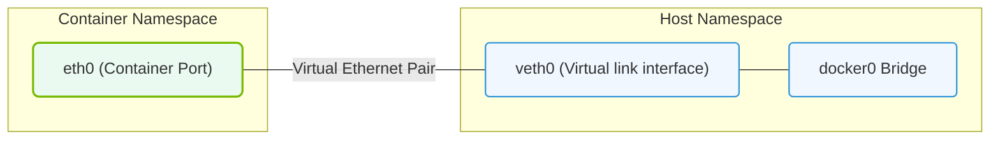

# 23.2b Network namespace: isolated network stacks, interfaces, and routing tables

#### 🏷️ The Nvidia Software Stack — Bridging Silicon and Python > 23 Containerization Fundamentals — Docker from First Principles > 23.2 Linux Namespaces and Cgroups — How Containers Work at the Kernel Level

---

## 🧭 Context Introduction

When you run a container (like a Docker container), it needs its own private view of the network — separate from the host machine and other containers. This is where **network namespaces** come into play.

Think of a network namespace as a **mini, isolated network environment** inside your Linux system. Each namespace has its own:
- Network interfaces (like `eth0`, `lo`)
- IP addresses
- Routing tables
- Firewall rules (iptables)
- Network sockets (ports)

This isolation is what makes containers feel like separate machines on the same network, even though they share the same Linux kernel.

---

## ⚙️ What Is a Network Namespace?

A **network namespace** is a Linux kernel feature that virtualizes the network stack. By default, every process on a Linux system belongs to the **root network namespace** (the host's network). When you create a new network namespace, you get a completely fresh, empty network environment.

**Key characteristics:**
- Each namespace starts with only a **loopback interface** (`lo`) — no physical network cards.
- Processes inside a namespace can only see and use the interfaces, routes, and rules within that namespace.
- Network namespaces can be connected to each other or to the host using **virtual Ethernet pairs (veth pairs)**.

---

## 🛠️ How Network Namespaces Work — A Simple Analogy

Imagine an apartment building:
- The **host machine** is the entire building.
- Each **network namespace** is a separate apartment.
- Each apartment has its own:
  - **Front door** (network interface)
  - **Mailbox** (IP address)
  - **Map of the building** (routing table)
- Residents in one apartment cannot see or use the front door or mailbox of another apartment — unless a special tunnel (veth pair) connects them.

---

## 🕵️ Key Components Inside a Network Namespace

| Component | Description | Example |
|-----------|-------------|---------|
| **Network interfaces** | Virtual or physical network cards | `lo`, `eth0`, `veth1` |
| **IP addresses** | Assigned to interfaces | `192.168.1.10/24` |
| **Routing table** | Determines where packets go | Default gateway, static routes |
| **ARP table** | Maps IP addresses to MAC addresses | Neighbor cache |
| **iptables rules** | Firewall and NAT rules | Port forwarding, packet filtering |
| **Socket connections** | Open TCP/UDP ports | Listening on port 8080 |

---

### 📊 Visual Representation: Linux Network Namespace Virtual Interfaces
This diagram displays how virtual ethernet pairs (veth) bridge container network namespaces with the host network adapter.

## 🔗 Connecting Network Namespaces

Network namespaces are isolated by default. To let them communicate, engineers use **virtual Ethernet (veth) pairs** — like a virtual cable with two ends.

**How it works:**
- Create a veth pair: one end goes into namespace A, the other end goes into namespace B (or stays in the host).
- Assign IP addresses to both ends.
- Now packets can flow between the two namespaces as if they were connected by a physical cable.

**Typical use case in containers:**
- One end of the veth pair is inside the container's network namespace.
- The other end is connected to a **Linux bridge** (like `docker0`) on the host.
- The bridge acts like a virtual switch, allowing containers to talk to each other and to the outside world.

---

## 📊 Comparison: Host Network vs. Container Network Namespace

| Feature | Host (Root Namespace) | Container (New Namespace) |
|---------|----------------------|---------------------------|
| **Interfaces** | All physical + virtual | Only `lo` + assigned veth |
| **IP address** | Host's public/private IP | Separate IP (e.g., 172.17.0.2) |
| **Routing table** | Full host routing | Minimal (default gateway to bridge) |
| **Port visibility** | All ports visible | Only ports inside namespace |
| **Isolation** | None (shared with all) | Fully isolated from other namespaces |

---

## 🧪 Practical Example: What Happens When You Create a Container

When Docker creates a container, it performs these steps under the hood:

1. **Create a new network namespace** for the container.
2. **Create a veth pair** — one end stays on the host (attached to `docker0` bridge), the other end moves into the container's namespace.
3. **Assign an IP address** to the container's end of the veth pair (e.g., `172.17.0.2`).
4. **Set up the routing table** inside the container — typically a default route pointing to the bridge IP.
5. **Enable IP forwarding** on the host so the container can reach the internet.

The result: the container has its own private network stack, completely isolated from other containers and the host.

---

## ✅ Why This Matters for AI Infrastructure

In AI workloads (especially with NVIDIA GPUs and multi-node training):
- **Multiple containers** on the same host need isolated networks to avoid port conflicts.
- **Distributed training** (e.g., NCCL) requires low-latency communication between containers — network namespaces ensure each process has a clean, predictable network path.
- **Security** — network namespaces prevent one container from sniffing traffic or interfering with another container's network connections.

---

## 📝 Key Takeaways

- A **network namespace** is a virtual copy of the entire network stack.
- Each container gets its own namespace, giving it a private IP, interfaces, and routing table.
- **veth pairs** connect namespaces to each other or to the host bridge.
- Network namespaces are the foundation of container networking in Docker, Kubernetes, and other container runtimes.
- For AI engineers, understanding namespaces helps debug network issues in distributed training and multi-container deployments.

---

*Next time you run a container, remember: behind the scenes, Linux is creating a tiny, isolated network world just for that process — and network namespaces make it possible.*