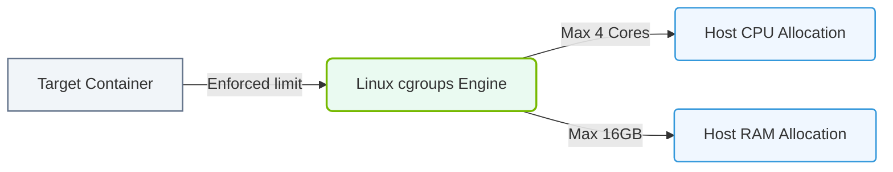

# 23.2d Cgroups v1 and v2: resource limits for CPU, memory, and I/O per container

#### 🏷️ The Nvidia Software Stack — Bridging Silicon and Python > 23 Containerization Fundamentals — Docker from First Principles > 23.2 Linux Namespaces and Cgroups — How Containers Work at the Kernel Level

## 🧠 Context Introduction

When you run a container, it shares the host's Linux kernel. Without limits, a single container could consume all CPU cores, fill up system memory, or saturate disk I/O — starving other containers and even the host itself. This is where **cgroups** (control groups) come in.

Cgroups are a Linux kernel feature that **limits, accounts for, and isolates** resource usage (CPU, memory, I/O) for a group of processes. Think of them as a "budget manager" for your containers. There are two versions: **cgroups v1** (older, more complex) and **cgroups v2** (newer, unified, simpler). Docker and Kubernetes now default to cgroups v2 on modern Linux distributions (e.g., Ubuntu 22.04+, RHEL 9+).

For an engineer new to AI infrastructure, understanding cgroups is essential because:
- AI workloads (training, inference) are resource-hungry.
- You need to guarantee that one model training job doesn't crash another.
- NVIDIA GPUs also integrate with cgroups for memory and compute limits.

---

## ⚙️ Cgroups v1 — The Original Approach

Cgroups v1 was introduced in Linux kernel 2.6.24. It uses a **separate hierarchy** for each resource type (CPU, memory, I/O, devices, etc.). This means you have multiple "trees" of control groups, one per resource.

### Key Characteristics of Cgroups v1

- **Multiple hierarchies**: Each resource (CPU, memory, blkio) has its own independent tree.
- **Complexity**: You must manage each hierarchy separately, which can lead to inconsistent states.
- **Legacy support**: Still used on older distributions (e.g., CentOS 7, Ubuntu 18.04).

### How Resource Limits Work in Cgroups v1

- **CPU limits**: Controlled via the **cpu** subsystem. You set a **cpu.shares** value (relative weight) or **cpu.cfs_period_us** and **cpu.cfs_quota_us** (hard limit in microseconds per period).
- **Memory limits**: Controlled via the **memory** subsystem. You set **memory.limit_in_bytes** (hard limit) and **memory.soft_limit_in_bytes** (soft limit).
- **I/O limits**: Controlled via the **blkio** subsystem. You set **blkio.throttle.read_bps_device** and **blkio.throttle.write_bps_device** (bytes per second per device).

### Example Scenario (Cgroups v1)

Imagine you have a container running an AI training script. In cgroups v1, you would:
- Create a group under **/sys/fs/cgroup/cpu/docker/containerID**.
- Write a quota value (e.g., 50000 out of 100000 microseconds = 0.5 CPU core).
- Create a group under **/sys/fs/cgroup/memory/docker/containerID**.
- Write a memory limit (e.g., 4GB).
- Create a group under **/sys/fs/cgroup/blkio/docker/containerID**.
- Write an I/O limit (e.g., 100MB/s read).

The problem: if you forget to set one hierarchy, the container might have no limit for that resource.

---

## 🛠️ Cgroups v2 — The Unified Approach

Cgroups v2 was introduced in Linux kernel 4.5 and became the default in many modern distributions. It uses a **single unified hierarchy** for all resources. This means one tree, one set of control files, and a cleaner design.

### Key Characteristics of Cgroups v2

- **Single hierarchy**: All resources (CPU, memory, I/O, devices) are managed under one tree at **/sys/fs/cgroup/**.
- **No more "subsystem" directories**: Instead, you have a single directory per control group with files like **cpu.max**, **memory.max**, **io.max**.
- **Better consistency**: Limits are always applied together, avoiding the "forgot one" problem.
- **Mandatory resource accounting**: The kernel always tracks usage, even if no limit is set.

### How Resource Limits Work in Cgroups v2

- **CPU limits**: Controlled via the **cpu** controller. You set **cpu.max** with format **quota period** (e.g., **50000 100000** = 0.5 CPU core).
- **Memory limits**: Controlled via the **memory** controller. You set **memory.max** (hard limit in bytes) and **memory.high** (soft limit/throttling point).
- **I/O limits**: Controlled via the **io** controller. You set **io.max** with format **device major:minor rbps=value wbps=value** (read/write bytes per second).

### Example Scenario (Cgroups v2)

For the same AI training container in cgroups v2, you would:
- Create a single directory under **/sys/fs/cgroup/system.slice/docker-containerID.scope/**.
- Write to **cpu.max**: **50000 100000** (0.5 CPU).
- Write to **memory.max**: **4294967296** (4GB).
- Write to **io.max**: **8:0 rbps=104857600 wbps=104857600** (100MB/s on device 8:0).

All limits are in one place — much simpler to audit and manage.

---

### 📊 Visual Representation: Linux Control Groups (cgroups) Resource Limits
This diagram displays how cgroups restrict container hardware allocations (CPU shares, memory limits) to prevent system crashes.

## 📊 Comparison Table: Cgroups v1 vs Cgroups v2

| Feature | Cgroups v1 | Cgroups v2 |
|---------|------------|------------|
| **Hierarchy structure** | Multiple separate trees (one per resource) | Single unified tree |
| **Control files** | Separate per subsystem (e.g., **cpu.shares**, **memory.limit_in_bytes**) | Unified files (e.g., **cpu.max**, **memory.max**) |
| **CPU limit format** | **cpu.cfs_quota_us** and **cpu.cfs_period_us** | **cpu.max** with **quota period** |
| **Memory limit format** | **memory.limit_in_bytes** | **memory.max** |
| **I/O limit format** | **blkio.throttle.read_bps_device** and **blkio.throttle.write_bps_device** | **io.max** with **rbps** and **wbps** |
| **Default in Docker** | Legacy (pre-2022) | Modern (Docker 20.10+, Kubernetes 1.24+) |
| **Complexity** | Higher (multiple trees to manage) | Lower (single tree) |
| **Consistency** | Risk of missing a subsystem | All limits applied together |

---

## 🕵️ How to Check Which Version Your System Uses

To determine if your Linux host uses cgroups v1 or v2, look at the **/sys/fs/cgroup** directory:

- **Cgroups v1**: You will see multiple subdirectories like **cpu**, **memory**, **blkio**, **devices**, etc.
- **Cgroups v2**: You will see a single flat directory with files like **cgroup.controllers**, **cpu.max**, **memory.max**, etc.

Additionally, you can check the kernel boot parameter. If the system boots with **cgroup_no_v1=all**, it forces cgroups v2. If it boots with **systemd.unified_cgroup_hierarchy=0**, it forces cgroups v1.

---

## 🧪 Practical Implications for AI Infrastructure

For engineers managing AI containers (e.g., training jobs on NVIDIA GPUs), here is what you need to know:

### CPU Limits
- **Cgroups v1**: Use **cpu.cfs_quota_us** and **cpu.cfs_period_us**. For example, to limit a container to 2 CPU cores, set quota to **200000** and period to **100000** (microseconds).
- **Cgroups v2**: Use **cpu.max**. For 2 CPU cores, set **200000 100000**.

### Memory Limits
- **Cgroups v1**: Use **memory.limit_in_bytes**. For 8GB, set **8589934592**.
- **Cgroups v2**: Use **memory.max**. For 8GB, set **8589934592**.

### I/O Limits
- **Cgroups v1**: Use **blkio.throttle.read_bps_device** and **blkio.throttle.write_bps_device**. Format: **major:minor bytes_per_second**.
- **Cgroups v2**: Use **io.max**. Format: **major:minor rbps=value wbps=value**.

### GPU Integration
NVIDIA containers (using **nvidia-container-toolkit**) also leverage cgroups to limit GPU memory and compute. In cgroups v2, GPU devices are managed under the **devices** controller (via **cgroup.type** and **cgroup.subtree_control**). This ensures that a container cannot exceed its allocated GPU memory, preventing "out-of-memory" kills on the GPU.

---

## ✅ Summary

- **Cgroups** are the kernel mechanism that enforces resource limits per container.
- **Cgroups v1** uses multiple separate hierarchies (one per resource) — older and more complex.
- **Cgroups v2** uses a single unified hierarchy — simpler, consistent, and the modern default.
- For AI workloads, always set **CPU**, **memory**, and **I/O** limits to prevent resource starvation.
- Check your system's cgroup version before writing limit files — the file names and formats differ.
- NVIDIA GPU limits also integrate with cgroups, especially under cgroups v2.

As a new engineer, start by understanding the **cgroups v2** approach — it is what you will encounter on most modern AI infrastructure (Ubuntu 22.04+, RHEL 9+, Docker 20.10+). The key takeaway: **always set limits, and know which version of cgroups your host uses**.