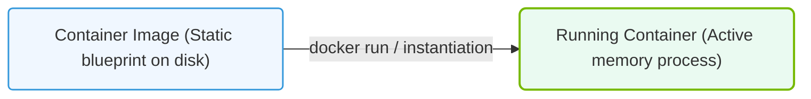

# 23.3a Images vs. containers: the blueprint vs. the running instance

#### 🏷️ The Nvidia Software Stack — Bridging Silicon and Python > 23 Containerization Fundamentals — Docker from First Principles > 23.3 Docker Mastery for AI Infrastructure

---

## 🧭 Context Introduction

When you first start working with Docker for AI workloads, two terms will come up constantly: **images** and **containers**. Think of them like a **blueprint** versus a **house built from that blueprint**. An image is the static, read-only template that defines everything your AI application needs — the operating system, CUDA drivers, Python libraries, and your model code. A container is the running, live instance of that image — it's where your training script actually executes, where logs are written, and where GPU memory is allocated.

Understanding this distinction is critical because it affects how you build, share, and run AI workloads. You can have one image that launches hundreds of containers, each with its own isolated filesystem and runtime state.

---

## ⚙️ What is a Container Image? (The Blueprint)

A container image is a **lightweight, standalone, executable package** that includes everything needed to run a piece of software:

- **Base operating system** (e.g., Ubuntu 22.04)
- **Runtime environment** (e.g., Python 3.10, CUDA 12.1)
- **System libraries** (e.g., cuDNN, NCCL for multi-GPU communication)
- **Application code** (e.g., your PyTorch training script)
- **Configuration files** (e.g., environment variables, entry points)

Key characteristics of an image:

- **Immutable** — once built, the image does not change
- **Layered** — built from stacked layers (each Dockerfile instruction creates a new layer)
- **Portable** — can be pushed to a registry (like NVIDIA NGC) and pulled on any machine
- **Versioned** — tagged with identifiers like `nvidia/cuda:12.1.0-runtime-ubuntu22.04`

---

## 🏠 What is a Container? (The Running Instance)

A container is a **runnable instance of an image**. When you start a container, Docker creates a writable layer on top of the image's read-only layers. This is where your application writes logs, saves checkpoints, and modifies files during execution.

Key characteristics of a container:

- **Ephemeral** — by default, changes are lost when the container stops (unless you use volumes)
- **Isolated** — has its own filesystem, network, and process space
- **Resource-bound** — you can limit CPU, memory, and GPU access
- **Stateful** — can write data to its writable layer during runtime

---

## 🕵️ The Core Difference: Immutable Blueprint vs. Mutable Instance

| Aspect | Image (Blueprint) | Container (Running Instance) |
|--------|-------------------|------------------------------|
| **State** | Read-only, immutable | Read-write, mutable |
| **Lifetime** | Permanent (until deleted) | Temporary (starts and stops) |
| **Purpose** | Distribution and sharing | Execution and development |
| **Storage** | Stored in registry or local cache | Created from image at runtime |
| **Size** | Typically 1–10 GB (AI images) | Same as image + writable layer |
| **Versioning** | Tagged (e.g., `v1.0`, `latest`) | Not versioned (each run is unique) |
| **GPU access** | Defined in image (CUDA drivers) | Assigned at container start |

---

### 📊 Visual Representation: Static Image vs. Active Running Container
This diagram displays the relationship between a static container image (read-only blueprint) and a running container instance.

## 🛠️ How This Applies to AI Workflows

For AI engineers, the image vs. container distinction matters in these practical scenarios:

**Scenario 1: Training a model**
- You build an image containing PyTorch, CUDA, and your training script
- You launch a container from that image on a GPU node
- The container writes model checkpoints and logs to its writable layer
- When training finishes, the container stops — but the image remains for future runs

**Scenario 2: Sharing with a team**
- You push your image to a registry (e.g., NVIDIA NGC or Docker Hub)
- Your colleague pulls the exact same image
- They launch their own container — completely isolated from yours
- Both containers run the same code but have separate runtime states

**Scenario 3: Debugging a failure**
- A training run crashes mid-epoch
- The container stops, but the image is untouched
- You launch a new container from the same image with debug flags
- The original container's writable layer is gone (unless you mounted a volume)

---

## 🔄 The Lifecycle: From Image to Container

The flow from image to container follows this simple path:

1. **Build** — Create an image from a Dockerfile (the recipe)
2. **Store** — Save the image locally or push to a registry
3. **Pull** — Download the image to a target machine
4. **Run** — Create and start a container from the image
5. **Execute** — Your AI workload runs inside the container
6. **Stop** — The container exits, but the image persists
7. **Repeat** — Launch new containers from the same image as needed

---

## 🧩 Common Misconceptions (Cleared Up)

**Misconception:** "I need to rebuild my image every time I change code."
**Reality:** You only rebuild when you change dependencies (new library, different CUDA version). For code changes, you can mount your source code into the container at runtime.

**Misconception:** "Containers are like virtual machines."
**Reality:** VMs virtualize hardware (each has its own OS kernel). Containers share the host kernel and are much lighter — an image might be 2 GB versus a VM that is 20 GB.

**Misconception:** "My data is safe inside the container."
**Reality:** By default, all data written inside a container is lost when it stops. Always use **volumes** or **bind mounts** to persist important data like model weights and logs.

---

## ✅ Quick Summary

- **Image** = the frozen, shareable blueprint of your AI environment
- **Container** = the live, running instance where your code actually executes
- One image can launch many containers, each isolated from the others
- Images are versioned and stored; containers are ephemeral and runtime-only
- For AI workloads, always persist important data outside the container using volumes

Remember this simple analogy: an image is like a **recipe** for a cake, and a container is the **cake itself** — you can use the same recipe to bake many cakes, but each cake is a separate, unique creation.