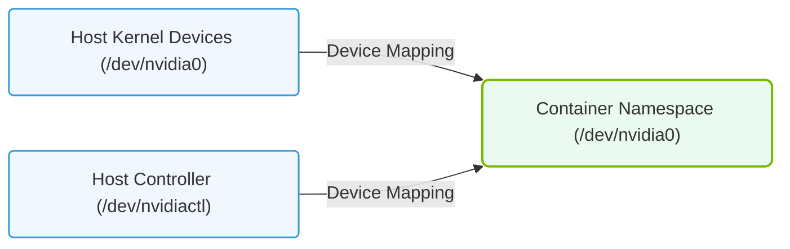

# 24.1a Device files: /dev/nvidia0, /dev/nvidiactl, /dev/nvidia-uvm — what each does

#### 🏷️ The Nvidia Software Stack — Bridging Silicon and Python > 24 GPU-Accelerated Containers — The NVIDIA Container Toolkit > 24.1 The GPU Visibility Problem — Why Docker Cannot See a GPU Natively

---

## 🧠 Context — Why These Files Matter

When you run a containerized workload that needs GPU acceleration, Docker cannot see the GPU hardware directly. The NVIDIA Container Toolkit bridges this gap by exposing special **device files** from the host into the container. These files are the low-level interface between the Linux kernel, the NVIDIA driver, and your GPU hardware.

Think of them as **doors** that allow software to talk to the physical GPU. Without them, your container is blind to the GPU.

---

## ⚙️ The Three Core Device Files

| Device File | Purpose | Analogy |
|---|---|---|
| **/dev/nvidia0** | Represents a specific physical GPU (GPU 0) | A dedicated phone line to the first GPU |
| **/dev/nvidiactl** | Control interface for the NVIDIA driver | The switchboard operator managing all GPU calls |
| **/dev/nvidia-uvm** | Unified Virtual Memory — manages shared CPU/GPU memory | A shared mailbox between CPU and GPU |

---

## 🕵️ /dev/nvidia0 — The GPU Itself

- This file corresponds to **one physical GPU** on your system.
- If you have multiple GPUs, you will see **/dev/nvidia0**, **/dev/nvidia1**, **/dev/nvidia2**, and so on.
- Applications like CUDA programs use this file to send instructions directly to the GPU.
- Each **/dev/nvidiaX** file is a **character device** that the kernel uses to route GPU commands.

**Key point:** Without **/dev/nvidia0** (or the correct index), your container cannot run any CUDA workload on that specific GPU.

---

## 🛠️ /dev/nvidiactl — The Driver Controller

- This is the **control interface** for the entire NVIDIA driver stack.
- It manages global driver state, GPU enumeration, and resource allocation.
- When a CUDA application starts, it first opens **/dev/nvidiactl** to discover available GPUs and negotiate access.
- Think of it as the **gatekeeper** — it decides which GPU a process can talk to and how.

**Key point:** Every GPU-accelerated container **must** have **/dev/nvidiactl** mounted, even if only one GPU is used.

---

### 📊 Visual Representation: Linux GPU Device Files mapping
This diagram displays how physical GPU device files in the host system (/dev/nvidia*) are mapped into isolated container namespaces.

## 📊 /dev/nvidia-uvm — Unified Virtual Memory

- This file enables **UVM (Unified Virtual Memory)** — a technology that allows the CPU and GPU to share memory transparently.
- Without UVM, you would need to manually copy data between CPU RAM and GPU VRAM.
- Many modern deep learning frameworks (like PyTorch and TensorFlow) rely on UVM for seamless tensor operations.
- This device file is created by the **nvidia-uvm kernel module**, which is loaded automatically when the NVIDIA driver starts.

**Key point:** If **/dev/nvidia-uvm** is missing, memory-intensive GPU workloads will fail with cryptic errors.

---

## 🔗 How They Work Together

When you run a GPU-accelerated container, the NVIDIA Container Toolkit performs these steps:

1. **Mounts /dev/nvidiactl** so the container can talk to the driver.
2. **Mounts /dev/nvidia0** (and any additional GPU files) so the container can access specific GPUs.
3. **Mounts /dev/nvidia-uvm** so unified memory operations work correctly.
4. **Injects the CUDA runtime libraries** (libcuda.so, etc.) into the container.

The result is a container that behaves as if it has direct access to the GPU hardware.

---

## 🧪 Verifying the Device Files Exist

To confirm these device files are present on your host system, you can check the **/dev/** directory. A healthy NVIDIA driver installation will show output similar to:

**📤 Output:**  
**crw-rw-rw- 1 root root 195, 0 ... /dev/nvidia0**  
**crw-rw-rw- 1 root root 195, 255 ... /dev/nvidiactl**  
**crw-rw-rw- 1 root root 509, 0 ... /dev/nvidia-uvm**

- The numbers like **195, 0** are the **major and minor device numbers** — they tell the kernel which driver handles this file.
- All three files must be present for GPU acceleration to work inside a container.

---

## ⚠️ Common Pitfalls for New Engineers

- **Missing /dev/nvidia-uvm** — This is the most common issue. It often means the **nvidia-uvm** kernel module did not load. Restarting the NVIDIA driver or rebooting the system usually fixes this.
- **Wrong GPU index** — If you have multiple GPUs but only mount **/dev/nvidia0**, your container cannot see GPU 1. Always mount the correct indices.
- **Permission errors** — These device files require root or membership in the **video** or **render** group. Ensure your user has the right permissions.

---

## ✅ Summary

| File | What It Does | Required For |
|---|---|---|
| **/dev/nvidia0** | Direct access to a specific GPU | Running CUDA workloads |
| **/dev/nvidiactl** | Driver control and GPU discovery | Any GPU-accelerated container |
| **/dev/nvidia-uvm** | Shared CPU/GPU memory management | Modern ML frameworks |

These three device files are the **foundation** of GPU acceleration in Linux containers. Understanding them helps you troubleshoot why a container cannot see a GPU — and gives you the confidence to diagnose driver issues on your own.