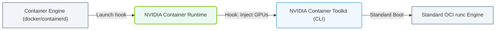

# 24.2a NVIDIA Container Runtime: a shim that injects GPU devices into container specs

#### 🏷️ The Nvidia Software Stack — Bridging Silicon and Python > 24 GPU-Accelerated Containers — The NVIDIA Container Toolkit > 24.2 NVIDIA Container Toolkit — The Right Way to Expose GPUs

## 🧠 Context Introduction

When you run a container with Docker or Podman, the container is isolated from the host system — including its hardware. This is great for security and reproducibility, but it means your container cannot see or use the NVIDIA GPU installed on the host machine. The **NVIDIA Container Runtime** solves this problem. It acts as a **shim** — a small piece of software that sits between the container runtime (like Docker) and the operating system. Its job is to inject GPU devices, drivers, and libraries into the container's specification so that your AI workloads can access the GPU seamlessly.

Think of it like a translator: your container asks for a GPU, and the NVIDIA Container Runtime makes sure the host's GPU is visible and usable inside the container.

---

## ⚙️ What is a "Shim" in This Context?

A **shim** is a lightweight layer that intercepts requests from the container runtime and modifies them before they reach the operating system. In the case of the NVIDIA Container Runtime:

- When you run a container with the `--gpus` flag, Docker calls the NVIDIA Container Runtime.
- The runtime inspects the container's configuration (the "container spec").
- It **injects** the necessary GPU device files, driver libraries, and environment variables into that spec.
- The container then starts with full GPU access.

This happens automatically — you don't need to manually mount GPU devices or copy driver files.

---

## 🛠️ How It Works — Step by Step

1. **User requests a GPU container** — You run a command like `docker run --gpus all nvidia/cuda:12.0-base`.
2. **Docker calls the NVIDIA Container Runtime** — Docker's default runtime is `runc`, but when `--gpus` is used, it switches to `nvidia-container-runtime`.
3. **The runtime reads the container spec** — It looks at the OCI (Open Container Initiative) specification that defines what the container can see.
4. **The runtime injects GPU resources** — It adds:
   - GPU device nodes (e.g., `/dev/nvidia0`, `/dev/nvidiactl`)
   - NVIDIA driver libraries (e.g., `libcuda.so`)
   - Environment variables (e.g., `NVIDIA_VISIBLE_DEVICES=all`)
5. **The container starts** — Now your AI framework (PyTorch, TensorFlow, etc.) can detect and use the GPU.

---

## 📊 Key Components of the NVIDIA Container Runtime

| Component | Role | Analogy |
|-----------|------|---------|
| **nvidia-container-runtime** | The shim itself — intercepts container creation | A customs officer checking what enters the container |
| **nvidia-container-toolkit** | The configuration tool that sets up the runtime | A setup manual for the customs officer |
| **libnvidia-container** | The library that does the actual GPU device injection | The actual cargo loader |
| **nvidia-container-cli** | A command-line interface to test GPU visibility | A test scanner to verify the cargo is loaded |

---

### 📊 Visual Representation: NVIDIA Container Runtime Architecture
This diagram displays how the NVIDIA Container Runtime wraps OCI runc to inject driver libraries and device files before container boot.

## 🕵️ How to Verify It's Working

Once the NVIDIA Container Runtime is installed and configured, you can verify GPU access inside a container by:

- Checking that the **nvidia-smi** command runs successfully inside the container.
- Confirming that environment variables like **NVIDIA_VISIBLE_DEVICES** are set.
- Running a simple AI framework test (e.g., PyTorch's **torch.cuda.is_available()** returns **True**).

If any of these fail, the shim may not be properly injecting the GPU resources.

---

## 🔄 Comparison: Without vs. With NVIDIA Container Runtime

| Aspect | Without NVIDIA Container Runtime | With NVIDIA Container Runtime |
|--------|----------------------------------|-------------------------------|
| GPU visibility inside container | ❌ Not visible | ✅ Fully visible |
| Manual device mounting required | ✅ Yes — complex and error-prone | ❌ No — automatic |
| Driver compatibility | Must match host exactly | Handled by the runtime |
| Multi-GPU support | Difficult to configure | Simple (`--gpus all` or `--gpus '"device=0,1"'`) |
| Reproducibility | Low — depends on host setup | High — consistent across hosts |

---

## 🧩 Real-World Analogy

Imagine you are shipping a package (your AI model) to a warehouse (the container). The warehouse has a special machine (the GPU) that your package needs to use. Without the NVIDIA Container Runtime, you would have to:

1. Manually carry the machine into the warehouse.
2. Connect all its cables.
3. Make sure the machine's software matches the warehouse's system.

With the NVIDIA Container Runtime, you simply tell the warehouse manager: "My package needs the machine." The manager (the shim) automatically brings the machine in, connects everything, and hands you the keys.

---

## ✅ Summary

- The **NVIDIA Container Runtime** is a shim that sits between Docker and the OS.
- It **injects GPU devices, drivers, and libraries** into the container's specification.
- This allows AI workloads to access the GPU without manual configuration.
- It is a core component of the **NVIDIA Container Toolkit**, which is the standard way to expose GPUs to containers.
- For new engineers, remember: if you can run `nvidia-smi` inside a container, the shim is working correctly.

> 💡 **Key takeaway:** The NVIDIA Container Runtime turns a GPU-hostile container into a GPU-ready environment — automatically and reliably.