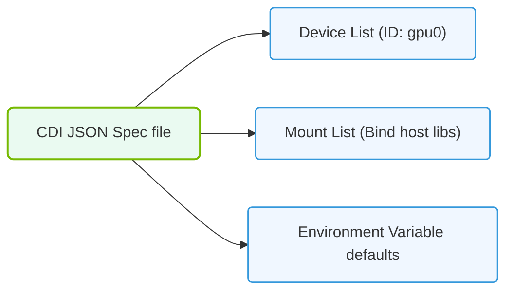

# 24.3a CDI specification: declarative JSON device definitions for any hardware

#### 🏷️ The Nvidia Software Stack — Bridging Silicon and Python > 24 GPU-Accelerated Containers — The NVIDIA Container Toolkit > 24.3 Container Device Interface (CDI) — The Modern Standard

---

## 🧭 Context Introduction

When you run a container with GPU access, the container runtime needs to know exactly what hardware is available and how to expose it inside the container. Historically, NVIDIA used its own proprietary method (the NVIDIA Container Runtime) to handle this. But as containers became more diverse—running on different platforms with different accelerators (GPUs, FPGAs, DPUs, etc.)—the industry needed a **vendor-neutral standard**.

Enter the **Container Device Interface (CDI)** specification. CDI provides a simple, declarative way to describe any hardware device using **JSON files**. Think of it as a universal "driver's license" for hardware inside containers. Instead of each vendor writing custom runtime code, they just write a JSON file that says: *"Here’s my device, here’s how to mount it, here’s what environment variables it needs."*

This topic focuses on **CDI specification version 24.3a**, which refines how these JSON device definitions are structured.

---

## ⚙️ What is the CDI Specification?

The CDI specification defines a **standard JSON schema** for describing hardware devices. A CDI JSON file contains:

- **Device metadata** (name, vendor, version)
- **Container runtime instructions** (what files to mount, what devices to expose)
- **Environment variables** (e.g., `CUDA_VISIBLE_DEVICES`)
- **Hooks** (scripts to run before/after container start)

Key principle: **Declarative** — you describe *what* the device is and *how* to use it, not *how* to discover it.

---

## 🛠️ Anatomy of a CDI JSON Device Definition

Every CDI JSON file follows this structure:

- **`cdiVersion`** — The CDI spec version (e.g., `"0.5.0"`)
- **`kind`** — A unique identifier for the device class (e.g., `"nvidia.com/gpu"`)
- **`devices`** — An array of device objects, each containing:
  - **`name`** — Device instance name (e.g., `"gpu-0"`)
  - **`containerEdits`** — Instructions for the container runtime:
    - **`env`** — Environment variables to set
    - **`deviceNodes`** — Device files to mount (e.g., `/dev/nvidia0`)
    - **`mounts`** — Host paths to bind-mount into the container
    - **`hooks`** — Pre-start or post-start scripts

Example structure (conceptual):

- **kind**: `"nvidia.com/gpu"`
- **devices[0].name**: `"gpu-0"`
- **devices[0].containerEdits.env**: `["NVIDIA_VISIBLE_DEVICES=0"]`
- **devices[0].containerEdits.deviceNodes**: `["/dev/nvidia0", "/dev/nvidiactl"]`
- **devices[0].containerEdits.mounts**: `["/usr/lib/x86_64-linux-gnu/libcuda.so"]`

---

### 📊 Visual Representation: Container Device Interface (CDI) spec layout
This diagram displays the JSON schema of Container Device Interface specifications, separating vendors, device classes, and mounts.

## 📊 CDI vs. Legacy NVIDIA Container Runtime

| Feature | Legacy NVIDIA Runtime | CDI Specification |
|---------|----------------------|-------------------|
| **Format** | Proprietary config files | Standard JSON |
| **Vendor lock-in** | NVIDIA-only | Vendor-neutral (any hardware) |
| **Device discovery** | Automatic (NVIDIA driver) | Declarative (JSON defines it) |
| **Custom hardware** | Not supported | Fully supported |
| **Container runtimes** | Docker-specific | Works with containerd, CRI-O, Podman |

---

## 🕵️ How CDI Works in Practice

1. **Engineer writes a CDI JSON file** describing the hardware (e.g., an FPGA accelerator).
2. **File is placed in a standard directory** (e.g., `/etc/cdi/` or `/var/run/cdi/`).
3. **Container runtime reads the CDI file** at container startup.
4. **Runtime applies the edits** (mounts devices, sets env vars, runs hooks).
5. **Container sees the hardware** as if it were natively attached.

For NVIDIA GPUs, the NVIDIA Container Toolkit automatically generates CDI JSON files from your system's GPU configuration. You don't need to write them manually—but understanding the format lets you **extend CDI to any custom hardware**.

---

## 🧩 Key Benefits for New Engineers

- **Simplicity** — One JSON file replaces complex runtime configuration
- **Portability** — Same CDI file works across Docker, Podman, Kubernetes
- **Extensibility** — You can define CDI for non-NVIDIA hardware (e.g., Intel GPUs, custom AI accelerators)
- **Debugging** — CDI files are human-readable; you can inspect exactly what a container will see

---

## ✅ Summary

The CDI specification (24.3a) is the **modern standard** for declaring hardware devices to container runtimes. It uses simple, declarative JSON files that tell the runtime: *"Here's my device, here's how to give it to the container."* For NVIDIA GPUs, this is automated by the NVIDIA Container Toolkit. For any other hardware, you write the JSON yourself.

As an engineer new to AI infrastructure, think of CDI as the **universal translator** between hardware and containers—making GPU-accelerated workloads (and any future accelerators) portable, predictable, and easy to manage.