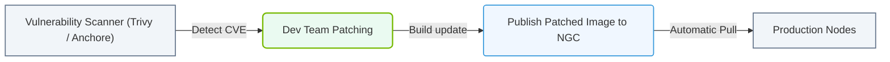

# 25.2d CVE patching lifecycle: how NVIDIA responds to security vulnerabilities in its stack

#### 🏷️ The Nvidia Software Stack — Bridging Silicon and Python > 25 NVIDIA NGC, AI Enterprise, and NIMs > 25.2 NVIDIA AI Enterprise (NVAIE) — Production Support for AI

## 🧭 Context Introduction

When you work with AI infrastructure, you are essentially building on a software stack that includes NVIDIA drivers, CUDA toolkits, container runtimes, and AI frameworks. Every piece of software can have security vulnerabilities — known as **CVEs** (Common Vulnerabilities and Exposures). NVIDIA takes these seriously and has a structured lifecycle for identifying, patching, and communicating fixes. Understanding this lifecycle helps you plan upgrades, maintain compliance, and keep your AI workloads secure.

---

## 🔍 What is a CVE?

A CVE is a publicly disclosed security flaw. Each CVE gets a unique identifier (e.g., CVE-2024-1234) and a severity score (CVSS). For NVIDIA's stack, CVEs can affect:

- **GPU drivers** — kernel-level access risks
- **CUDA libraries** — memory corruption or data leaks
- **Container toolkits** — privilege escalation in containerized AI workloads
- **AI Enterprise components** — vulnerabilities in NGC containers or NIM microservices

---

## ⚙️ The NVIDIA CVE Patching Lifecycle — Step by Step

NVIDIA follows a structured process that moves from discovery to deployment. Here is how it works:

### 🕵️ 1. Discovery & Triage
- NVIDIA's security team monitors internal testing, bug bounty programs, and external researchers.
- When a potential vulnerability is found, it is logged and assigned a severity level (Critical, High, Medium, Low).
- Engineers assess whether the issue affects NVIDIA's AI stack components (drivers, CUDA, containers, etc.).

### 📋 2. Verification & Reproduction
- The security team reproduces the vulnerability in a controlled lab environment.
- They confirm the exact conditions needed to exploit the flaw.
- A CVE ID is requested from MITRE if the vulnerability is confirmed.

### 🛠️ 3. Patch Development
- Engineers develop a fix in the affected component (e.g., a driver patch or a library update).
- The patch is tested against the original exploit scenario to ensure it resolves the issue.
- Regression testing is performed to ensure the fix does not break existing functionality.

### 🔬 4. Internal Validation
- The patched software goes through NVIDIA's QA pipeline.
- Validation includes:
  - Security testing (penetration tests)
  - Performance benchmarks
  - Compatibility checks with popular AI frameworks (PyTorch, TensorFlow, etc.)

### 📢 5. Disclosure & Advisory Release
- NVIDIA publishes a **Security Bulletin** on the NVIDIA Product Security page.
- The bulletin includes:
  - CVE ID and severity score
  - Affected software versions
  - Fixed software versions
  - Mitigation steps (if a patch is not yet available)

### 🚀 6. Patch Distribution
- Patches are released through:
  - **NVIDIA Driver Downloads** — for GPU drivers
  - **NGC Catalog** — for updated container images
  - **AI Enterprise Updates** — for enterprise customers via the NVIDIA Licensing Portal
- Engineers can pull updated containers using the **ngc** CLI tool or download driver packages directly.

### 🔄 7. Customer Notification & Remediation
- NVIDIA notifies registered enterprise customers via email and the NVIDIA Support portal.
- Engineers are expected to:
  - Review the security bulletin
  - Identify affected systems in their infrastructure
  - Schedule maintenance windows for patching
  - Validate the patch in a staging environment before production rollout

---

## 📊 Comparison: CVE Severity Levels and Response Times

| Severity Level | CVSS Score Range | Typical Response Time | Example Impact |
|----------------|------------------|-----------------------|----------------|
| 🔴 Critical | 9.0 – 10.0 | Within 7 days | Remote code execution via GPU driver |
| 🟠 High | 7.0 – 8.9 | Within 14 days | Privilege escalation in CUDA runtime |
| 🟡 Medium | 4.0 – 6.9 | Within 30 days | Denial of service via container toolkit |
| 🟢 Low | 0.1 – 3.9 | Next scheduled release | Information disclosure in debug logs |

---


### 📊 Visual Representation: NVAIE Security Scan and Patch Loop
This flowchart displays how containers are constantly scanned for vulnerabilities, and how security patches are updated in the NVAIE channel.




## 🧰 How Engineers Should Respond to NVIDIA CVEs

Here is a practical workflow for handling a CVE in your AI infrastructure:

- **Step 1 — Subscribe to NVIDIA Security Bulletins**: Go to the NVIDIA Product Security page and sign up for notifications.
- **Step 2 — Inventory Your Stack**: Maintain a list of all NVIDIA software versions in use (drivers, CUDA, containers, AI Enterprise components).
- **Step 3 — Cross-Reference CVEs**: When a bulletin arrives, check if your versions are listed as affected.
- **Step 4 — Test in Staging**: Before patching production, deploy the fixed version in a non-production environment. Run your AI training or inference workloads to confirm stability.
- **Step 5 — Apply the Patch**: Use the appropriate method:
  - For drivers: Download the patched driver from NVIDIA and install it.
  - For containers: Pull the updated NGC container image.
  - For AI Enterprise: Download the updated package from the NVIDIA Licensing Portal.
- **Step 6 — Verify the Fix**: After patching, confirm the vulnerability is resolved by checking the software version against the bulletin.

---

## 🧪 Example: Patching a CUDA Container for a High-Severity CVE

For reference, here is how you might update a container image affected by a CVE:

```
ngc registry image list nvidia/cuda:12.2.0-base-ubuntu22.04
ngc registry image pull nvidia/cuda:12.2.0-base-ubuntu22.04
docker tag nvidia/cuda:12.2.0-base-ubuntu22.04 my-ai-env:latest
```

📤 **Output:** The container image is pulled and tagged. You then rebuild your AI application using this updated base image.

---

## ✅ Key Takeaways for New Engineers

- **CVEs are inevitable** — every software stack has vulnerabilities. NVIDIA's lifecycle ensures they are handled systematically.
- **Always patch in stages** — never apply a critical patch directly to production without testing.
- **Stay informed** — subscribe to NVIDIA's security bulletins and check the NGC catalog regularly for updated containers.
- **Document your versions** — knowing exactly which driver, CUDA, and container versions you run makes CVE response much faster.
- **Use AI Enterprise for production** — NVIDIA AI Enterprise provides extended support and guaranteed patch timelines for enterprise customers.

---

## 📚 Where to Learn More

- **NVIDIA Product Security**: [https://www.nvidia.com/security](https://www.nvidia.com/security)
- **NVIDIA Security Bulletins**: [https://nvidia.custhelp.com/app/answers/detail/a_id/...](https://nvidia.custhelp.com/app/answers/detail/a_id/...)
- **NVIDIA AI Enterprise Documentation**: [https://docs.nvidia.com/ai-enterprise](https://docs.nvidia.com/ai-enterprise)
- **NGC Catalog**: [https://catalog.ngc.nvidia.com](https://catalog.ngc.nvidia.com)

---

*This guide is part of the NVIDIA-Certified Associate: AI Infrastructure and Operations curriculum. Understanding the CVE patching lifecycle helps you maintain a secure, reliable AI infrastructure from day one.*