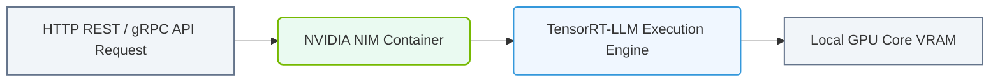

# 25.3a What NIM is: a pre-packaged, optimized inference engine in a container

#### 🏷️ The Nvidia Software Stack — Bridging Silicon and Python > 25 NVIDIA NGC, AI Enterprise, and NIMs > 25.3 NVIDIA NIM (Inference Microservices)

---

## 🌐 Context Introduction

When you're new to AI infrastructure, one of the biggest challenges is taking a trained AI model and making it actually *usable* in production. You can't just drop a model file onto a server and expect it to work efficiently. Models need to be optimized for the specific hardware, packaged with all their dependencies, and served through a standard interface.

This is where **NVIDIA NIM** comes in. NIM stands for **NVIDIA Inference Microservice**. Think of it as a ready-to-go, optimized AI model in a box — specifically, a container. It takes the complexity out of deploying large language models (LLMs), vision models, and other AI models onto NVIDIA GPUs.

---

## ⚙️ What Exactly is a NIM?

A NIM is a **pre-packaged, optimized inference engine** delivered as a container image. It includes everything needed to run a specific AI model for inference (making predictions) on NVIDIA hardware.

- **Pre-packaged**: The model, its dependencies, and the serving software are all bundled together.
- **Optimized**: The model is tuned to run at maximum speed on NVIDIA GPUs using libraries like TensorRT, TensorRT-LLM, and Triton Inference Server.
- **Inference Engine**: It's designed only for *running* the model (inference), not for training it.
- **Container**: It runs as a Docker or Podman container, making it easy to deploy anywhere — on-premises, in the cloud, or at the edge.

---

## 🛠️ Key Components Inside a NIM Container

A NIM container is not just the model file. It's a complete, self-contained environment:

| Component | Purpose |
|-----------|---------|
| **Trained Model** | The actual AI model (e.g., Llama, Mistral, Stable Diffusion) |
| **TensorRT-LLM** | NVIDIA's optimizer for large language models on GPUs |
| **Triton Inference Server** | A high-performance serving framework for managing requests |
| **CUDA & cuDNN** | Low-level GPU acceleration libraries |
| **REST/gRPC API** | Standard endpoints for sending data and getting predictions |
| **Health Checks** | Built-in endpoints to verify the service is running |

---

## 🕵️ How NIM Simplifies AI Deployment

For a new engineer, here's what NIM removes from your to-do list:

- **No manual model optimization** — The model is already converted to TensorRT engine files.
- **No dependency hell** — All Python packages, system libraries, and CUDA versions are locked in.
- **No server configuration** — Triton Inference Server is pre-configured for the model.
- **No hardware guessing** — The container is built specifically for NVIDIA GPUs with the right compute capabilities.

You simply pull the container, run it, and send HTTP requests to get predictions.

---

### 📊 Visual Representation: NVIDIA Inference Microservice (NIM) Architecture
This diagram displays how NIM wraps LLMs in standardized API services, optimizing inference using TensorRT.

## 📊 NIM vs. Traditional Model Deployment

| Aspect | Traditional Deployment | With NIM |
|--------|----------------------|----------|
| Setup time | Days to weeks | Minutes |
| Optimization | Manual (TensorRT, quantization) | Pre-optimized |
| Dependencies | Manual management | Self-contained container |
| Scaling | Complex (custom scripts) | Standard container orchestration |
| API | Custom implementation | Standard REST/gRPC endpoints |
| GPU utilization | Often suboptimal | Maximized via TensorRT |

---

## 🚀 A Simple Workflow for Engineers

Here's the typical flow when you use a NIM:

1. **Pull the NIM container** from NVIDIA NGC (NVIDIA GPU Cloud) or a private registry.
2. **Run the container** on a machine with an NVIDIA GPU and the NVIDIA Container Toolkit installed.
3. **Send inference requests** to the container's API endpoint using standard HTTP tools.
4. **Receive predictions** as JSON responses.

The container handles all the heavy lifting — batching requests, managing GPU memory, and returning results as fast as possible.

---

## 🧠 Why This Matters for AI Infrastructure

As an engineer working with AI infrastructure, NIM allows you to:

- **Deploy models faster** — No need to become an expert in TensorRT or Triton.
- **Standardize deployments** — Every NIM follows the same API pattern.
- **Scale horizontally** — Use Kubernetes or Docker Compose to run multiple NIM instances.
- **Update models easily** — Swap one NIM container for another with a newer model version.

NIM is a key part of NVIDIA's strategy to make AI inference as simple as running a web server.

---

## ✅ Summary

- **NIM** = NVIDIA Inference Microservice.
- It's a **container** containing a **pre-optimized model** and a **high-performance inference server**.
- It removes the complexity of model optimization, dependency management, and server configuration.
- Engineers can deploy AI models in minutes by simply pulling and running a container.
- NIM works with standard APIs (REST/gRPC) and scales using existing container orchestration tools.

For a new engineer, think of NIM as the "app store" for AI models — you download, run, and use without worrying about what's under the hood.