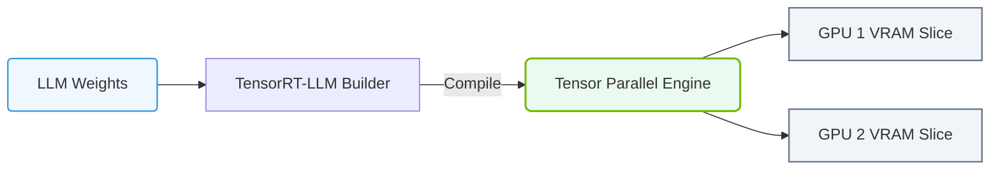

# 25.4b TensorRT-LLM: NVIDIA's open-source LLM inference library with kernel optimizations

#### 🏷️ The Nvidia Software Stack — Bridging Silicon and Python > 25 NVIDIA NGC, AI Enterprise, and NIMs > 25.4 TensorRT and TensorRT-LLM — Inference Optimization Engines

## 🌱 Context Introduction

Large Language Models (LLMs) like GPT, LLaMA, and Mistral are incredibly powerful, but they are also very large and computationally expensive to run. When you want to deploy an LLM so that users can interact with it (inference), you need it to respond quickly and efficiently. This is where **TensorRT-LLM** comes in. It is an open-source library from NVIDIA that takes a trained LLM and supercharges it for fast, low-latency inference on NVIDIA GPUs. Think of it as a high-performance tuning kit for your AI model, making it run much faster and use less memory.

---

## ⚙️ What is TensorRT-LLM?

TensorRT-LLM is a specialized library designed to optimize and run Large Language Models on NVIDIA GPUs. It is built on top of NVIDIA's core inference engine, TensorRT, but adds specific optimizations for the unique architecture of LLMs (like transformer layers and attention mechanisms).

**Key characteristics:**
- **Open-source:** Free to use, modify, and integrate into your own projects.
- **Kernel Optimizations:** Contains hand-tuned, highly efficient code (kernels) for GPU operations like matrix multiplication and attention, which are the core of LLM computation.
- **Fused Operations:** Combines multiple small GPU operations into one larger, faster operation, reducing memory overhead and launch latency.
- **In-flight Batching:** Allows the GPU to process multiple user requests simultaneously, even if they are at different stages of completion, maximizing GPU utilization.

---

## 🛠️ How TensorRT-LLM Works (The Simple Version)

The process of using TensorRT-LLM can be broken down into two main phases:

1.  **Build Phase (Compilation):** You take your trained LLM (e.g., a PyTorch model) and feed it into TensorRT-LLM. The library analyzes the model's architecture and your target GPU hardware. It then compiles the model into a highly optimized **TensorRT engine** — a file that contains all the instructions the GPU needs to run the model as fast as possible. This is a one-time, offline process.

2.  **Runtime Phase (Execution):** You load the compiled TensorRT engine into memory. When a user sends a prompt, the engine executes the model's layers using the optimized kernels, generating a response much faster than the original model could.

---

### 📊 Visual Representation: TensorRT-LLM Parallel Execution Architecture
This diagram displays TensorRT-LLM, enabling tensor-parallelism execution across multiple local GPUs.

## 📊 TensorRT-LLM vs. Standard PyTorch Inference

To understand the value, let's compare running an LLM with standard PyTorch versus using TensorRT-LLM.

| Feature | Standard PyTorch Inference | TensorRT-LLM Inference |
| :--- | :--- | :--- |
| **Speed** | Baseline (slower) | **2x to 8x faster** (or more) |
| **Memory Usage** | Higher (stores many intermediate results) | **Lower** (fused operations reduce memory footprint) |
| **GPU Utilization** | Lower (GPU may be idle between operations) | **Higher** (in-flight batching keeps GPU busy) |
| **Flexibility** | High (easy to modify and debug) | Lower (model is compiled, harder to change) |
| **Setup Complexity** | Low (just load the model) | Higher (requires a build phase) |
| **Best For** | Prototyping, research, small-scale testing | **Production deployment**, high-throughput services |

---

## 🕵️ Key Optimizations Inside TensorRT-LLM

TensorRT-LLM achieves its speed through several clever techniques:

- **Kernel Fusion:** Instead of running separate GPU kernels for operations like "add bias" and "apply activation function," TensorRT-LLM creates a single fused kernel that does both at once. This saves time by reducing the number of times the GPU has to read and write data to its memory.

- **In-Flight Batching (Continuous Batching):** Traditional batching waits for all requests in a batch to finish before starting a new one. In-flight batching allows the GPU to start processing a new request immediately after finishing one, even if other requests in the batch are still running. This dramatically improves throughput.

- **PagedAttention:** This is a memory management technique. Instead of storing the entire "key-value cache" (a large memory structure used by LLMs) in one contiguous block, it is broken into smaller "pages." This eliminates memory fragmentation and allows for much larger batch sizes.

- **Quantization:** TensorRT-LLM supports running models with lower-precision numbers (e.g., FP8 or INT4 instead of FP16). This reduces the memory size of the model and allows the GPU to perform more calculations per second, with a minimal impact on accuracy.

---

## 🧩 Where TensorRT-LLM Fits in the NVIDIA Stack

TensorRT-LLM is a critical component for engineers deploying LLMs in production. It sits between the high-level AI frameworks (like PyTorch or Hugging Face Transformers) and the low-level GPU hardware.

**Typical workflow for an engineer:**
1.  **Train or obtain** an LLM (e.g., LLaMA 3) using PyTorch.
2.  **Convert and build** the model into a TensorRT-LLM engine using the provided tools.
3.  **Deploy** the engine using a runtime server (like `triton_inference_server` or the built-in TensorRT-LLM server).
4.  **Serve** the model to end-users via an API, benefiting from the speed and efficiency optimizations.

---

## ✅ Summary for New Engineers

- **TensorRT-LLM is a performance booster for LLMs.** It makes them run faster and use less GPU memory.
- **It is not a training tool.** You use it *after* your model is already trained.
- **The main trade-off is speed vs. flexibility.** You lose the ability to easily modify the model's code, but you gain massive performance improvements.
- **It is essential for production.** If you are deploying an LLM to serve real users, TensorRT-LLM (or a similar optimization library) is almost always necessary to meet latency and throughput requirements.
- **Start with a supported model.** NVIDIA provides pre-built engines and examples for popular models like LLaMA, Mistral, and GPT-NeoX. This is the easiest way to get started without diving into the complex build process.