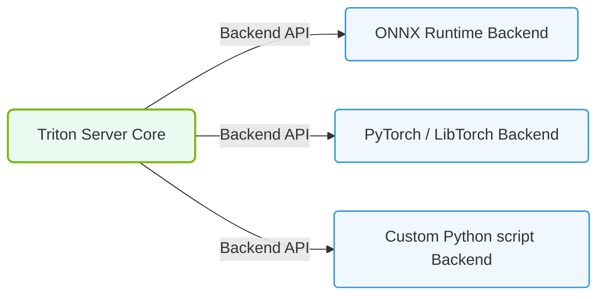

# 25.5b Supported backends: TensorRT, ONNX, PyTorch TorchScript, Python, OpenVINO

#### 🏷️ The Nvidia Software Stack — Bridging Silicon and Python > 25 NVIDIA NGC, AI Enterprise, and NIMs > 25.5 Triton Inference Server — Production Model Serving

When you deploy a machine learning model for real-world use, the model needs to run efficiently on server hardware. The Triton Inference Server is NVIDIA's tool for this job. It acts as a middleman between your trained model and the applications that want to use it. One of its most powerful features is that it supports multiple **backends** — different ways to run your model. This means you can bring a model trained in PyTorch, exported to ONNX, or optimized with TensorRT, and Triton will handle the execution.

This guide explains the five main backends supported by Triton, keeping things simple for new engineers.

---

## ⚙️ What is a Backend?

A backend is the engine that actually runs your model inside Triton. Think of it like a translator: your model speaks one language (e.g., PyTorch), and the backend translates it into instructions the GPU can execute. Different backends offer different trade-offs between speed, flexibility, and ease of use.

---

## 🧩 The Five Supported Backends

### 🚀 TensorRT (NVIDIA TensorRT)

- **What it is:** NVIDIA's high-performance deep learning inference optimizer and runtime.
- **Best for:** Maximum speed and minimum latency. This is the gold standard for production.
- **How it works:** It takes a trained model and applies optimizations like layer fusion, precision calibration (FP16, INT8), and kernel auto-tuning.
- **Key point:** You must convert your model to a TensorRT engine file (`.plan`) before deployment.

---

### 🔄 ONNX (Open Neural Network Exchange)

- **What it is:** An open standard format for representing machine learning models.
- **Best for:** Model portability. You train in one framework (e.g., PyTorch) and deploy in another (e.g., Triton).
- **How it works:** You export your model to an `.onnx` file. Triton can run it directly or pass it to the TensorRT backend for optimization.
- **Key point:** ONNX acts as a universal adapter between frameworks.

---

### 🧠 PyTorch TorchScript

- **What it is:** A way to create serializable and optimizable models from PyTorch code.
- **Best for:** Engineers who want to stay entirely within the PyTorch ecosystem.
- **How it works:** You use `torch.jit.trace` or `torch.jit.script` to convert your model into a TorchScript program (`.pt` file).
- **Key point:** TorchScript captures the model's computation graph, making it independent of Python runtime.

---

### 🐍 Python Backend

- **What it is:** A generic backend that runs any Python code as a model.
- **Best for:** Rapid prototyping, custom preprocessing/postprocessing logic, or models that don't fit other backends.
- **How it works:** You write a Python script that defines how to load and run your model. Triton calls this script for every inference request.
- **Key point:** This is the most flexible but slowest backend. Use it only when other backends cannot work.

---

### 🌐 OpenVINO (Open Visual Inference and Neural Network Optimization)

- **What it is:** Intel's toolkit for optimizing and deploying models on Intel hardware (CPUs, GPUs, VPUs).
- **Best for:** Hybrid environments where you might run some models on Intel CPUs alongside NVIDIA GPUs.
- **How it works:** You convert your model to OpenVINO's Intermediate Representation (IR) format (`.xml` + `.bin`).
- **Key point:** Triton supports OpenVINO as a backend, allowing you to serve models optimized for Intel hardware.

---

## 📊 Comparison Table

| Backend | Primary Use Case | Speed | Flexibility | File Format |
|---------|-----------------|-------|-------------|-------------|
| **TensorRT** | Maximum GPU performance | Fastest | Low | `.plan` |
| **ONNX** | Cross-framework portability | Fast | Medium | `.onnx` |
| **TorchScript** | PyTorch-native deployment | Fast | Medium | `.pt` |
| **Python** | Custom logic & prototyping | Slowest | Highest | `.py` script |
| **OpenVINO** | Intel hardware optimization | Fast (Intel HW) | Medium | `.xml` + `.bin` |

---

### 📊 Visual Representation: Triton Backend Engine Plugins
This diagram displays Triton's modular backend architecture, enabling simultaneous execution of ONNX, TensorRT, and Python models.

## 🛠️ How to Choose a Backend

- **If you want the absolute fastest inference on NVIDIA GPUs:** Use **TensorRT**.
- **If your model comes from a non-NVIDIA framework (e.g., TensorFlow, PyTorch):** Export to **ONNX** first, then let Triton decide.
- **If you are a PyTorch user and want simplicity:** Use **TorchScript**.
- **If you need custom Python logic (e.g., image resizing, text tokenization):** Use the **Python backend** for that logic, but wrap the core model in a faster backend.
- **If you are running on Intel CPUs or mixed hardware:** Use **OpenVINO**.

---

## 🕵️ Common Pitfalls for New Engineers

- **Mixing backends incorrectly:** You cannot load a TensorRT engine file into the PyTorch backend. Each backend expects its own format.
- **Forgetting to optimize:** Running a raw PyTorch model through the Python backend is slow. Always convert to TensorRT or ONNX for production.
- **Ignoring precision:** TensorRT can use FP16 or INT8 for speed, but this may reduce accuracy. Always test after conversion.
- **Not checking hardware compatibility:** OpenVINO backends are designed for Intel hardware. They will not run on NVIDIA GPUs efficiently.

---

## ✅ Summary

Triton Inference Server's five backends give you the flexibility to deploy models from any major framework, optimized for any hardware. As a new engineer, start with **ONNX** for portability and **TensorRT** for performance. Use the **Python backend** only when you need custom logic. This approach will help you build fast, reliable AI infrastructure from day one.