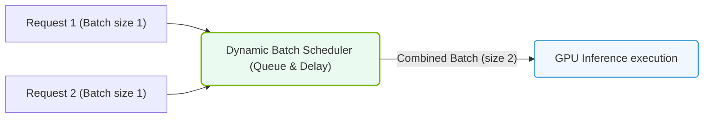

# 25.5c Dynamic batching and model instances for maximum GPU utilization

#### 🏷️ The Nvidia Software Stack — Bridging Silicon and Python > 25 NVIDIA NGC, AI Enterprise, and NIMs > 25.5 Triton Inference Server — Production Model Serving

---

## 🧠 Context Introduction

When deploying AI models in production, one of the biggest challenges is keeping your expensive GPUs busy. Idle GPU time is wasted money and compute capacity. Two powerful features in NVIDIA Triton Inference Server help solve this: **dynamic batching** and **model instances**. Together, they allow you to pack more inference requests into each GPU cycle, dramatically improving throughput and cost-efficiency.

Think of it like a bus service: without batching, each passenger gets their own private car (inefficient). With dynamic batching, passengers are grouped into a bus that leaves at the right time. Model instances are like having multiple bus lanes running in parallel.

---

## ⚙️ What is Dynamic Batching?

Dynamic batching is Triton's ability to automatically group multiple incoming inference requests into a single batch before sending them to the GPU for processing. This happens in real-time, without requiring the client to pre-batch requests.

**Key characteristics:**
- Requests are held briefly (for a configurable delay) to accumulate a batch
- The batch is processed as one unit on the GPU, maximizing parallel compute
- Works transparently — clients send individual requests as normal
- Significantly improves GPU utilization for small request sizes

**How it works in practice:**
- You set a maximum batch size (e.g., 8)
- You set a preferred batch size (e.g., 4)
- You set a maximum queue delay (e.g., 100 microseconds)
- Triton waits up to 100μs to collect up to 8 requests, then sends them as one batch

---

## 🧩 What are Model Instances?

Model instances define how many copies of your model run concurrently on the same GPU (or across multiple GPUs). Each instance is an independent execution context that can process its own batch of requests.

**Key characteristics:**
- Multiple instances can run on a single GPU (using CUDA streams)
- Each instance has its own copy of model weights in GPU memory
- Instances process requests in parallel, increasing throughput
- You can specify different instance counts for different GPUs

**Example configuration:**
- GPU 0: 2 model instances
- GPU 1: 3 model instances
- Total: 5 concurrent processing pipelines

---

## 📊 Comparison: Dynamic Batching vs. Model Instances

| Feature | Dynamic Batching | Model Instances |
|---------|-----------------|-----------------|
| **Purpose** | Groups requests into larger batches | Runs multiple copies of the model in parallel |
| **GPU utilization** | Improves by filling batch slots | Improves by parallel execution |
| **Latency impact** | Adds small delay (configurable) | Minimal added latency |
| **Memory cost** | Low (just buffer space) | Higher (each instance needs model weights) |
| **Best for** | Small, frequent requests | Variable or bursty traffic |
| **Configuration** | max_batch_size, preferred_batch_size | instance_group count |

---

### 📊 Visual Representation: Triton Dynamic Batcher Scheduler
This diagram displays dynamic batching: combining individual concurrent requests into a unified batch to maximize GPU hardware utilization.

## 🛠️ How They Work Together

Dynamic batching and model instances complement each other perfectly:

1. **First layer — Dynamic batching**: Incoming requests are collected into optimal batch sizes
2. **Second layer — Model instances**: Multiple batched requests are processed simultaneously by different instances

**Real-world scenario:**
- You have 10 incoming requests per second
- Dynamic batching groups them into 2 batches of 5
- You have 2 model instances on the GPU
- Each instance processes one batch simultaneously
- Result: All 10 requests processed in roughly the time of one batch

---

## 🕵️ Configuration Best Practices

**For dynamic batching:**
- Start with a **max_batch_size** equal to your model's optimal batch size (often 8, 16, or 32)
- Set **preferred_batch_size** to values that match your model's sweet spot (e.g., 4, 8)
- Keep **max_queue_delay_microseconds** low (50-200μs) to avoid excessive latency
- Monitor queue statistics to see if requests are waiting too long

**For model instances:**
- Start with **1 instance per GPU** and increase gradually
- Monitor GPU memory — each instance consumes additional memory
- Use **count** parameter to specify instances per GPU
- Consider **kind** parameter (KIND_GPU or KIND_CPU) for hybrid deployments

**General guidelines:**
- For latency-sensitive applications: favor more instances over larger batches
- For throughput-focused applications: favor larger batches over more instances
- Always profile with your actual workload — theoretical optimal may differ

---

## 📈 Measuring the Impact

To verify your configuration is working:

**Key metrics to monitor:**
- **GPU utilization**: Should be consistently high (80-95%)
- **Request latency**: Should remain within your SLA
- **Throughput**: Requests per second should increase
- **Queue depth**: Should not grow indefinitely

**Signs of good configuration:**
- GPU compute utilization stays above 80%
- Average batch size matches your preferred_batch_size
- No requests are timing out or being dropped
- Throughput scales linearly with request rate (up to a point)

**Signs of poor configuration:**
- GPU utilization is low (<50%) — increase batch size or instances
- Latency spikes — reduce max_queue_delay or batch size
- Out-of-memory errors — reduce number of instances
- Throughput plateaus — you've hit a hardware or model bottleneck

---

## ✅ Summary

Dynamic batching and model instances are two of the most impactful levers you can pull to maximize GPU utilization in production AI serving. Dynamic batching fills each GPU cycle with more work, while model instances allow multiple work items to be processed in parallel. Used together, they can often double or triple throughput without any model changes.

**Quick start checklist:**
1. ✅ Enable dynamic batching with reasonable batch sizes
2. ✅ Start with 1-2 model instances per GPU
3. ✅ Monitor GPU utilization and latency
4. ✅ Iterate based on real traffic patterns
5. ✅ Scale instances as memory allows

Remember: every workload is different. What works for a large language model may not work for a small image classifier. Always test with your specific model and traffic pattern.