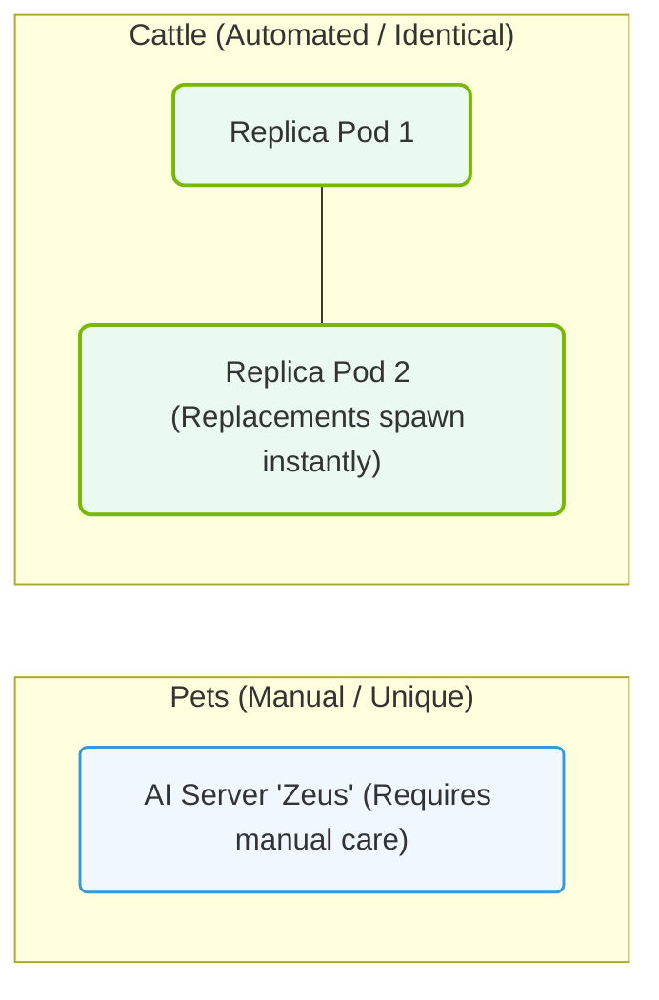

# 26.1a From 'pet' servers to 'cattle' clusters: the philosophy shift

#### 🏷️ The Cluster Orchestration — Managing the GPU Fleet at Scale > 26 Kubernetes Fundamentals — Container Orchestration from Scratch > 26.1 Why Kubernetes Exists — The Problem of Scale

---

## 🌱 Context Introduction

Imagine you are managing a small team of engineers. Each person has their own dedicated laptop, carefully configured with their favorite tools, bookmarks, and custom settings. If someone's laptop breaks, it's a crisis — you need to recover that specific machine because it holds everything that person needs.

Now imagine you are managing a large data center with thousands of servers. You cannot treat each server as a unique, precious individual. Instead, you need to treat them as interchangeable units — if one fails, another instantly takes its place without anyone noticing.

This is the core philosophy shift in modern AI infrastructure: **moving from treating servers as "pets" to treating them as "cattle."**

---

## 🐶 What Are "Pet" Servers?

In traditional IT operations, servers were treated like beloved pets. Each server had:

- A unique name (like "web-server-01" or "database-primary")
- Custom configurations applied manually over time
- Specific roles that could not be easily transferred
- Special attention when something went wrong (nursing it back to health)

**Key characteristics of pet servers:**

- **Manual setup** — Engineers log in and configure by hand
- **Fragile** — If the server fails, services go down until it's fixed
- **Hard to scale** — Adding capacity means carefully configuring new "pets"
- **High maintenance** — Each server requires individual updates and patches

---

## 🐄 What Are "Cattle" Clusters?

In modern AI infrastructure, servers are treated like cattle in a herd. Each server is:

- Given a generic identifier (like "node-abc123")
- Provisioned from a standard template or image
- Completely replaceable — if one fails, it is terminated and a new one spins up
- Managed collectively, not individually

**Key characteristics of cattle clusters:**

- **Automated provisioning** — Servers are created from scripts or templates
- **Resilient** — Failure of one server does not impact overall service
- **Elastic** — Capacity scales up or down automatically based on demand
- **Low maintenance** — Updates are applied to the entire fleet at once

---

## 📊 Comparison Table: Pets vs. Cattle

| Aspect | Pet Servers 🐶 | Cattle Clusters 🐄 |
|--------|---------------|-------------------|
| **Naming** | Unique, meaningful names (e.g., "db-master") | Random identifiers (e.g., "node-4f2a") |
| **When it fails** | "Oh no! Fix it now!" | "Terminate and replace it" |
| **Configuration** | Manually tweaked over time | Identical from a template |
| **Scaling** | Difficult — add another pet | Easy — add more cattle |
| **Recovery** | Restore from backup | Spin up a new instance |
| **Updates** | Patch each server individually | Roll out to the entire herd |
| **Engineer mindset** | "This server is special" | "This server is disposable" |

---

### 📊 Visual Representation: Pets vs. Cattle Infrastructure Analogy
This diagram contrasts 'Pets' infrastructure (manually configured, fragile servers) with 'Cattle' (stateless, automatically replaced container pods).

## ⚙️ Why This Shift Matters for AI Infrastructure

AI workloads — especially training large models — require hundreds or thousands of GPUs working together. If you treat each GPU server as a pet, you face:

- **Long recovery times** — A failed server halts training for hours or days
- **Inconsistent environments** — Slight differences between servers cause mysterious bugs
- **Wasted resources** — Engineers spend time nursing sick servers instead of innovating

With the cattle philosophy:

- **Training jobs continue** — Failed nodes are replaced automatically
- **Consistency is guaranteed** — Every server runs the exact same configuration
- **Engineers focus on AI** — Not on server maintenance

---

## 🛠️ How Kubernetes Enables the Cattle Mindset

Kubernetes is the tool that makes the "cattle" philosophy practical. It provides:

- **Declarative configuration** — You describe what you want (e.g., "run 10 replicas of this AI model"), and Kubernetes makes it happen
- **Self-healing** — If a node fails, Kubernetes automatically reschedules workloads onto healthy nodes
- **Rolling updates** — You can update software across the entire cluster without downtime
- **Load balancing** — Traffic is distributed evenly across all healthy servers

**Example of the mindset shift in action:**

Instead of logging into a server to check its health, you check the cluster status. Instead of manually restarting a failed service, you let Kubernetes handle it. Instead of naming servers "gpu-01" through "gpu-10", you treat them as anonymous members of a GPU pool.

---

## 🕵️ Real-World Analogy

Think of a taxi company:

- **Pet approach** — Each taxi has a dedicated driver who knows every scratch and quirk of that specific car. If the car breaks down, the driver waits for repairs.
- **Cattle approach** — The company has a fleet of identical cars. If one breaks down, the company sends another car from the pool. The driver doesn't care which car they drive — they all work the same way.

For AI infrastructure, your GPU servers are the taxis, and Kubernetes is the dispatch system that ensures the fleet runs smoothly.

---

## ✅ Key Takeaways for New Engineers

- **Stop naming servers** — Use IDs or labels instead of unique names
- **Automate everything** — Manual configuration is the enemy of scale
- **Plan for failure** — Assume servers will fail and design accordingly
- **Think in herds** — Manage your infrastructure as a group, not individually
- **Embrace disposability** — A server should be replaceable in minutes, not days

---

## 📚 Summary

The shift from "pet" servers to "cattle" clusters is not just a technical change — it is a fundamental philosophy shift in how engineers think about infrastructure. For AI workloads at scale, this mindset is essential. Kubernetes is the primary tool that enables this philosophy, allowing you to manage thousands of GPU servers as a single, resilient, and scalable cluster rather than a collection of fragile, individual machines.

As you continue learning about Kubernetes and AI infrastructure, always ask yourself: **"Am I treating this server like a pet or like cattle?"** The answer will guide you toward more scalable and reliable operations.