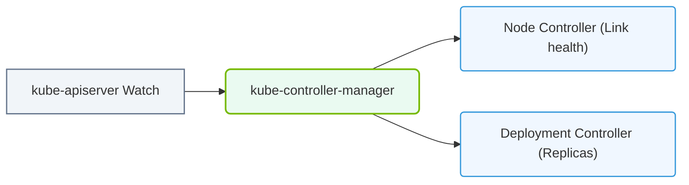

# 26.2d Controller Manager: Deployment controller, ReplicaSet controller, Node controller

#### 🏷️ The Cluster Orchestration — Managing the GPU Fleet at Scale > 26 Kubernetes Fundamentals — Container Orchestration from Scratch > 26.2 Kubernetes Architecture — Control Plane and Worker Nodes

Welcome, new engineer! In this section, we will explore three critical controllers inside the Kubernetes Controller Manager. Think of the Controller Manager as the **brain of the cluster** — it constantly watches the current state of your cluster and works to match it with your desired state. For AI workloads, this is essential because your GPU nodes and containerized training jobs must always be running as expected.

---

### ⚙️ What is the Controller Manager?

The **kube-controller-manager** is a control plane component that runs controller processes. Each controller is a loop that:
- Watches the shared state of the cluster through the API server.
- Makes changes to move the current state toward the desired state.

For an AI infrastructure, this means if a GPU pod crashes or a node goes down, the controller manager detects it and takes corrective action automatically.

---

### 🛠️ The Three Key Controllers Explained

#### 1. 📦 Deployment Controller

The **Deployment controller** manages the lifecycle of your application deployments. It is the highest-level controller and is responsible for:
- Declarative updates to applications (e.g., rolling out a new version of your AI model server).
- Scaling replica counts up or down.
- Rolling back to a previous version if something goes wrong.

**How it works:**
- You define a **Deployment** YAML file that specifies the desired number of replicas, the container image, and update strategy.
- The Deployment controller creates a **ReplicaSet** (see below) to manage those replicas.
- When you update the Deployment (e.g., change the image tag), the controller creates a new ReplicaSet and gradually scales down the old one.

**Example scenario for AI:**
- You have a GPU inference server running 5 replicas. You want to update the model version. The Deployment controller performs a rolling update, ensuring zero downtime for your inference requests.

---

#### 2. 🔄 ReplicaSet Controller

The **ReplicaSet controller** is the middle layer that ensures a specified number of pod replicas are running at any given time.

**Key responsibilities:**
- Maintains a stable set of replica pods.
- If a pod crashes or is deleted, the ReplicaSet controller immediately creates a new pod to replace it.
- Works closely with the Deployment controller (you rarely create a ReplicaSet directly).

**How it works:**
- The ReplicaSet controller watches the API server for pods that match its label selector.
- It compares the current number of running pods to the desired count.
- If there is a mismatch, it creates or deletes pods to correct the count.

**Example scenario for AI:**
- You have a training job that requires exactly 4 GPU pods. If one pod fails due to a GPU memory error, the ReplicaSet controller spins up a new pod automatically, keeping your training job running.

---

#### 3. 🖥️ Node Controller

The **Node controller** is responsible for monitoring the health of every node (worker machine) in your cluster.

**Key responsibilities:**
- Watches the **NodeStatus** and **NodeLease** objects to determine if a node is healthy.
- If a node becomes unreachable (e.g., network failure, hardware crash), the controller:
  - Marks the node as **NotReady**.
  - Evicts pods from the unhealthy node after a timeout period (default is 5 minutes).
  - Reassigns those pods to healthy nodes.

**How it works:**
- Each node sends periodic heartbeats (NodeLease) to the control plane.
- The Node controller checks these heartbeats. If a node misses multiple heartbeats, it is considered dead.
- The controller then updates the node status and triggers pod eviction.

**Example scenario for AI:**
- A GPU node overheats and goes offline. The Node controller detects the missing heartbeats, marks the node as unhealthy, and instructs the scheduler to move your GPU training pods to another healthy node.

---

### 📊 Comparison Table: When to Use Each Controller

| Controller | Primary Purpose | AI Infrastructure Use Case | What Happens on Failure |
|------------|----------------|---------------------------|-------------------------|
| **Deployment Controller** | Manage application updates and scaling | Rolling update of model inference servers | Creates new ReplicaSet and rolls back if update fails |
| **ReplicaSet Controller** | Maintain exact pod count | Keep 4 GPU training pods running | Creates replacement pod immediately |
| **Node Controller** | Monitor node health | Detect GPU node failure | Evicts pods and reassigns to healthy nodes |

---

### 🕵️ How These Controllers Work Together

Imagine you are running a distributed AI training job across 3 GPU nodes.

1. **Deployment controller** defines the desired state: 6 replicas of your training container.
2. **ReplicaSet controller** ensures exactly 6 pods are running across the nodes.
3. **Node controller** monitors each GPU node's health.

**If a node fails:**
- Node controller detects the missing heartbeat.
- Node controller marks the node as **NotReady**.
- After a timeout, the Node controller evicts the pods from the failed node.
- ReplicaSet controller sees only 4 pods running (instead of 6) and creates 2 new pods.
- Scheduler places those 2 new pods on healthy nodes.

All of this happens automatically, keeping your AI training job running without manual intervention.

---

### ✅ Key Takeaways for New Engineers

- **Controller Manager** is the automated brain of Kubernetes — it constantly reconciles the current state with your desired state.
- **Deployment controller** handles updates and rollbacks at the application level.
- **ReplicaSet controller** ensures the exact number of pods are always running.
- **Node controller** keeps the cluster healthy by monitoring worker nodes and evicting pods from failed nodes.
- For AI workloads, these controllers are critical because they ensure GPU pods are always running, even when hardware fails.

Remember: You don't need to interact with these controllers directly. You define your desired state in YAML files (e.g., a Deployment), and the Controller Manager handles the rest. This is the power of Kubernetes — it automates infrastructure management so you can focus on building and training AI models.

### 📊 Visual Representation: kube-controller-manager State Loop
This diagram displays how controllers (Node, Deployment, Namespace) continually resolve states in the background.

