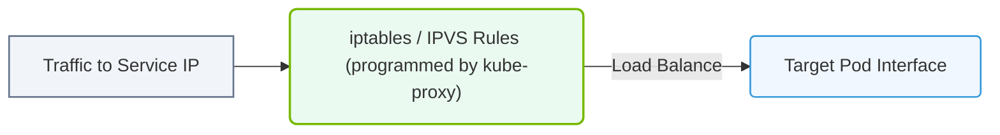

# 26.2f Kube-proxy: network rules for Service routing on each node

#### 🏷️ The Cluster Orchestration — Managing the GPU Fleet at Scale > 26 Kubernetes Fundamentals — Container Orchestration from Scratch > 26.2 Kubernetes Architecture — Control Plane and Worker Nodes

---

## 🧭 Context Introduction

In a Kubernetes cluster, Services provide a stable way to access Pods, which are ephemeral and can be created or destroyed at any time. However, a Service alone doesn't make network traffic flow correctly. This is where **kube-proxy** comes in. Kube-proxy is a network agent that runs on every node in the cluster. Its primary job is to implement the network rules that allow traffic to reach the correct Pods behind a Service. Think of it as the traffic cop on each node, ensuring that requests to a Service are routed to healthy, available Pods.

---

## ⚙️ What is Kube-proxy?

Kube-proxy is a daemon that runs on each node (both control plane and worker nodes). It watches the Kubernetes API server for changes to Services and Endpoints (or EndpointSlices). When a Service is created or updated, kube-proxy translates that information into actual network rules on the node. These rules determine how packets destined for a Service's virtual IP address (ClusterIP) are forwarded to the Pods that back that Service.

---

## 🛠️ How Kube-proxy Works

- **Watches the API Server**: Kube-proxy continuously monitors the Kubernetes API server for any changes to Services and their associated Pod endpoints.
- **Updates Network Rules**: Whenever a Service is created, modified, or deleted, kube-proxy updates the network rules on that node.
- **Routes Traffic**: When a packet arrives at a node destined for a Service's ClusterIP, kube-proxy's rules intercept that packet and redirect it to one of the healthy Pods behind the Service.
- **Load Balances**: For Services with multiple Pod replicas, kube-proxy distributes incoming traffic across those Pods using a simple load-balancing algorithm (usually round-robin).

---

## 🕵️ Modes of Operation

Kube-proxy can operate in different modes, each using a different underlying technology to implement the network rules. The most common modes are:

| Mode | Technology Used | Key Characteristics |
|------|----------------|---------------------|
| **iptables** | Linux kernel's iptables | Default mode; uses NAT rules to redirect traffic; simple and reliable; performance degrades with thousands of Services |
| **IPVS** | Linux kernel's IP Virtual Server | More scalable than iptables; supports more sophisticated load-balancing algorithms (e.g., least connections, shortest expected delay) |
| **userspace** | User-space proxy | Legacy mode; slower because traffic must move between kernel and user space; rarely used today |

---

### 📊 Visual Representation: kube-proxy Network Rules Engine
This diagram displays how kube-proxy programs iptables rules to route service traffic to target Pod interfaces.

## 📊 Kube-proxy and Service Types

Kube-proxy handles routing for all Service types, but its behavior varies slightly:

- **ClusterIP**: Kube-proxy creates rules that make the Service's virtual IP reachable only within the cluster. Traffic is load-balanced to Pods on any node.
- **NodePort**: In addition to ClusterIP rules, kube-proxy opens a specific port on every node's IP address. Traffic arriving on that port is forwarded to the Service's ClusterIP, then load-balanced to Pods.
- **LoadBalancer**: Kube-proxy works with the cloud provider's load balancer. The external load balancer sends traffic to any node's NodePort, and kube-proxy handles the final routing to Pods.
- **ExternalName**: No proxy rules are created; this Service type simply returns a DNS CNAME record.

---

## 🔄 Traffic Flow Example

Here is a simplified example of how traffic flows through kube-proxy when a Pod on Node A wants to reach a Service backed by Pods on Node B:

1. A Pod on Node A sends a packet to the Service's ClusterIP.
2. The packet hits the network stack on Node A.
3. Kube-proxy's rules (e.g., iptables or IPVS) on Node A intercept the packet.
4. The rules rewrite the destination IP from the Service's ClusterIP to the IP of a healthy Pod on Node B.
5. The packet is forwarded over the cluster network to Node B.
6. The Pod on Node B receives the packet and processes it.

---

## ✅ Key Takeaways for New Engineers

- **Kube-proxy runs on every node** — it is not a centralized component.
- **It translates Service definitions into actual network rules** — without kube-proxy, Services would be just metadata.
- **It provides basic load balancing** — traffic is distributed across Pods, but it is not a full-featured load balancer.
- **The iptables mode is the default** — it works well for most clusters, but consider IPVS for very large clusters with many Services.
- **Kube-proxy does not handle DNS** — that is the job of CoreDNS or another DNS add-on.
- **It is transparent to applications** — Pods simply send traffic to a Service's ClusterIP, and kube-proxy handles the rest.

---

## 🧪 Common Troubleshooting Tips

- If a Service is not reachable, check that kube-proxy is running on all nodes. You can verify this by looking for the kube-proxy Pod in the **kube-system** namespace.
- If traffic is not load-balancing correctly, check the number of endpoints for the Service. If there are no endpoints, kube-proxy has no Pods to route to.
- If you are using the iptables mode and experiencing performance issues with many Services, consider switching to IPVS mode.
- Remember that kube-proxy only handles traffic within the cluster. External traffic must first reach a node (via NodePort or LoadBalancer), then kube-proxy routes it internally.

---

## 📚 Summary

Kube-proxy is a fundamental component of Kubernetes networking. It ensures that Services work as expected by creating and maintaining network rules on every node. For new engineers, understanding kube-proxy's role helps demystify how traffic flows in a cluster and provides a foundation for troubleshooting network issues. As you work with Kubernetes, you will rarely interact with kube-proxy directly, but knowing what it does will make you a more effective operator of AI infrastructure at scale.