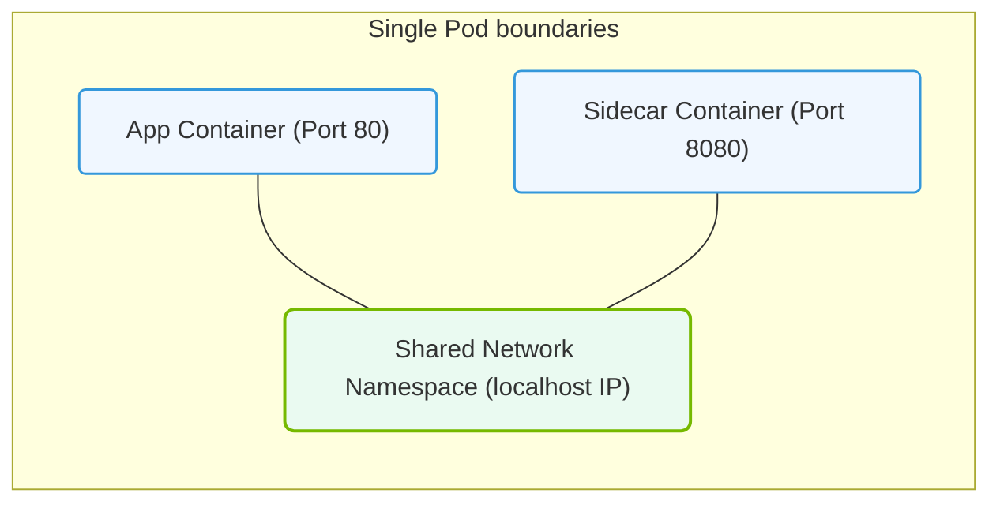

# 26.3a Pods: the smallest deployable unit — one or more containers sharing network/storage

#### 🏷️ The Cluster Orchestration — Managing the GPU Fleet at Scale > 26 Kubernetes Fundamentals — Container Orchestration from Scratch > 26.3 Core Kubernetes Objects for AI Workloads

Welcome to the world of Kubernetes Pods! If you're new to AI infrastructure, think of a Pod as the smallest "package" you can deploy in a Kubernetes cluster. For AI workloads, Pods are where your training scripts, inference servers, or data preprocessing jobs actually run. Let's break down what makes Pods special and why they matter for your AI operations.

---

## 🧠 Context: Why Pods Exist

In traditional computing, you might run a single application in a virtual machine. In Kubernetes, you run containers. But containers alone can be too isolated — sometimes you need multiple containers to work together as a single unit. That's where Pods come in. A Pod wraps one or more containers and gives them a shared environment, making it the perfect building block for AI workloads that need tight coupling between components (like a model server and a logging sidecar).

---

## ⚙️ What Is a Pod?

A Pod is the smallest deployable unit in Kubernetes. It represents a single instance of a running process in your cluster. Key characteristics:

- **One or more containers** inside a single Pod
- **Shared network namespace** — all containers in a Pod share the same IP address and port space
- **Shared storage volumes** — containers can mount and access the same persistent storage
- **Co-scheduled and co-located** — all containers in a Pod run on the same node (physical or virtual machine)

For AI workloads, this means you can run your GPU-accelerated training container alongside a monitoring container that collects metrics, all sharing the same network and storage.

---

## 🛠️ Pod Components at a Glance

| Component | Purpose | AI Workload Example |
|-----------|---------|---------------------|
| **Container(s)** | The actual application code | PyTorch training script, TensorFlow serving |
| **Shared IP Address** | Single network identity for all containers | Inference API endpoint |
| **Shared Volumes** | Persistent data accessible by all containers | Model weights, training datasets |
| **Pod Spec** | Defines containers, resources, and behavior | GPU request limits, environment variables |

---

## 📊 How Pods Work for AI

When you deploy an AI workload, here's what happens inside a Pod:

- **Container 1 (Main)**: Runs your AI model training or inference code, requesting GPU resources
- **Container 2 (Sidecar)**: Collects logs, monitors GPU utilization, or handles data preprocessing
- **Shared Storage**: Both containers can read/write to the same volume (e.g., `/data` for model checkpoints)
- **Shared Network**: Both containers communicate via `localhost`, reducing latency for inter-container calls

This design is especially useful for:
- **Distributed training** where you need a coordinator and worker containers
- **Inference pipelines** with pre-processing and post-processing containers
- **Monitoring stacks** where a sidecar collects Prometheus metrics from the main AI container

---

### 📊 Visual Representation: Kubernetes Pod Resource Sharing
This diagram displays how containers inside a single Pod share namespaces (IP address, volume mounts, ports).

## 🕵️ Pod Lifecycle for AI Engineers

Understanding how Pods behave is critical for troubleshooting AI workloads:

- **Pending**: Pod is scheduled but not yet running (waiting for GPU resources)
- **Running**: All containers are executing (your AI job is active)
- **Succeeded**: All containers exited with zero exit code (training completed)
- **Failed**: At least one container exited with non-zero exit code (training error)
- **CrashLoopBackOff**: Container keeps crashing and restarting (check GPU memory or code errors)

---

## 🔄 Pod vs. Container: Key Differences

| Aspect | Container | Pod |
|--------|-----------|-----|
| **Scope** | Single process | Group of related containers |
| **Network** | Own IP address | Shared IP with other containers |
| **Storage** | Own filesystem | Shared volumes available to all containers |
| **Scheduling** | Not directly scheduled | Scheduled as a unit on a node |
| **Use Case** | Simple microservice | AI workload with sidecar containers |

---

## 🧩 Practical Example: AI Training Pod

Imagine you're running a GPU-based training job. Your Pod might look like this:

- **Main container**: Runs `python train.py` with GPU access (requesting 1 NVIDIA GPU)
- **Sidecar container**: Runs `tensorboard --logdir /logs` to visualize training metrics
- **Shared volume**: `/data` mounted from persistent storage, containing training data and model checkpoints
- **Shared network**: Both containers communicate via `localhost:6006` for TensorBoard access

When you deploy this Pod, Kubernetes ensures both containers start together, share the GPU, and can access the same data — all without complex networking or storage configuration.

---

## ✅ Key Takeaways for New Engineers

- **Pods are the atomic unit** of deployment — you always work with Pods, not individual containers
- **Shared resources** (network, storage) make Pods ideal for AI workloads that need tight integration
- **GPU access** is requested at the Pod level, not per container
- **Sidecar pattern** is common in AI — use it for monitoring, logging, or data preprocessing
- **Pod failures** often indicate resource issues (GPU memory, storage) or code errors — check logs from all containers

Remember: In Kubernetes, you don't deploy containers directly. You deploy Pods that contain your containers. Master this concept, and you'll have a solid foundation for managing AI workloads at scale.