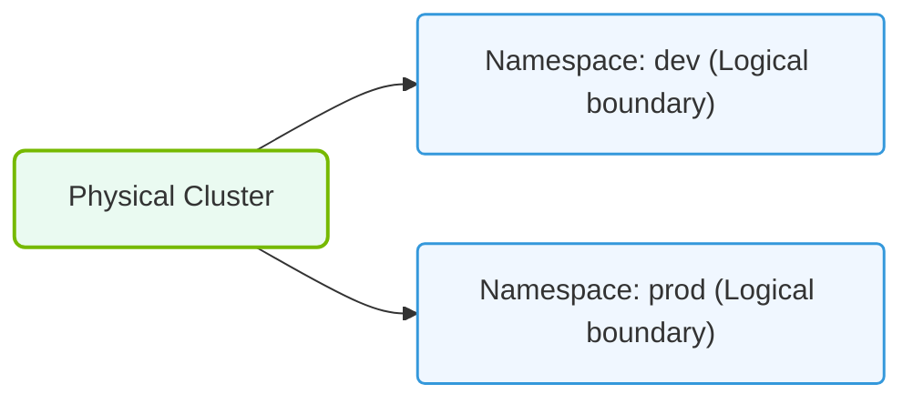

# 26.3h Namespaces: multi-team isolation within one cluster

#### 🏷️ The Cluster Orchestration — Managing the GPU Fleet at Scale > 26 Kubernetes Fundamentals — Container Orchestration from Scratch > 26.3 Core Kubernetes Objects for AI Workloads

## 🧭 Context Introduction

When you have multiple teams training AI models or running inference jobs on the same GPU cluster, you need a way to keep their work separate. Without isolation, one team's experiment could accidentally overwrite another team's data, or a runaway job could consume all the GPUs. **Namespaces** are Kubernetes' built-in solution for creating virtual clusters within a single physical cluster. Think of them as separate workspaces — each team gets their own sandbox with its own resources, policies, and boundaries, while still sharing the same underlying GPU hardware.

---

## ⚙️ What Are Namespaces?

A **Namespace** is a logical partition inside a Kubernetes cluster. It provides a scope for names — meaning you can have two objects (like a Pod or a Service) with the same name as long as they live in different Namespaces.

- Every Kubernetes cluster starts with a default Namespace called **default**.
- You can create additional Namespaces for different teams, projects, or environments (e.g., dev, staging, prod).
- Resources inside one Namespace are invisible to resources in another Namespace by default.

---

## 📊 Why Use Namespaces for AI Workloads?

AI teams often run multiple experiments simultaneously. Namespaces help in the following ways:

- **Resource Quotas** — Limit how many GPUs, CPUs, or memory a team can consume.
- **Access Control** — Restrict which users or service accounts can interact with specific Namespaces.
- **Network Isolation** — Prevent Pods in one Namespace from accidentally talking to Pods in another (unless explicitly allowed).
- **Clean Organization** — Each team sees only their own objects, reducing confusion and mistakes.

---

## 🛠️ Key Concepts for Multi-Team Isolation

### Resource Quotas
A **ResourceQuota** is an object that sets hard limits on the total resources a Namespace can use. For example, you can say "Team A can use at most 4 GPUs and 16 CPU cores."

- Limits can apply to compute resources (GPUs, CPU, memory) and object counts (number of Pods, Services, etc.).
- If a team tries to exceed their quota, Kubernetes rejects the request.

### Limit Ranges
A **LimitRange** sets default minimum and maximum resource requests/limits for individual containers inside a Namespace. This prevents a single Pod from hogging all resources.

- For example, you can enforce that no container can request more than 1 GPU.
- This is especially useful for AI workloads where a single training job might try to claim all available GPUs.

### Network Policies
A **NetworkPolicy** controls traffic flow between Pods. By default, all Pods can communicate with each other across Namespaces. A NetworkPolicy can restrict this.

- You can create a policy that says "only Pods in the same Namespace can talk to each other."
- This prevents accidental data leaks or interference between teams.

### Role-Based Access Control (RBAC)
RBAC lets you define who can do what inside a Namespace. You can grant a team full control over their own Namespace but no access to others.

- A **Role** defines permissions (e.g., create Pods, delete Jobs).
- A **RoleBinding** attaches that Role to a user or group within a specific Namespace.

---

### 📊 Visual Representation: Kubernetes Logical Namespace boundaries
This diagram displays namespaces: partitioning a single physical cluster into isolated logical resource boundaries.

## 🕵️ How Namespaces Work in Practice

When you create a Namespace, Kubernetes automatically creates a set of default objects (like a ServiceAccount) inside it. Every subsequent object you create must specify which Namespace it belongs to.

- If you don't specify a Namespace, the object goes into the **default** Namespace.
- You can switch between Namespaces using context settings in your Kubernetes configuration file.

---

## 📋 Comparison: Single Namespace vs. Multi-Namespace Setup

| Feature | Single Namespace | Multi-Namespace (Isolated) |
|---------|-----------------|----------------------------|
| **GPU sharing** | All teams compete for same GPUs | Each team has a guaranteed quota |
| **Name collisions** | Object names must be unique | Same name allowed in different Namespaces |
| **Visibility** | Everyone sees everything | Teams see only their own objects |
| **Security** | Weak — any user can access any resource | Strong — RBAC restricts access per Namespace |
| **Resource control** | No limits — one team can starve others | ResourceQuotas prevent overuse |
| **Network isolation** | All Pods can communicate freely | NetworkPolicies can restrict traffic |

---

## 🧩 Practical Example: Setting Up a Namespace for an AI Team

1. **Create the Namespace** — Give it a meaningful name like **team-ai-training**.
2. **Define a ResourceQuota** — Set GPU limit to 4, CPU limit to 8 cores, memory limit to 32GB.
3. **Define a LimitRange** — Ensure no single container requests more than 1 GPU.
4. **Create a NetworkPolicy** — Allow all traffic within the Namespace but deny traffic from other Namespaces.
5. **Set up RBAC** — Grant the AI team full access to their Namespace but read-only access to the cluster's monitoring Namespace.

---

## ✅ Key Takeaways

- Namespaces are free and lightweight — you can create hundreds without performance impact.
- They are essential for multi-team environments where AI workloads share GPU clusters.
- Always combine Namespaces with **ResourceQuotas**, **LimitRanges**, **NetworkPolicies**, and **RBAC** for true isolation.
- Namespaces do not provide security isolation by themselves — they must be paired with proper access controls.

---

## 📚 Next Steps

- Practice creating a Namespace and deploying a simple AI training job inside it.
- Experiment with ResourceQuotas by setting a low GPU limit and observing what happens when a job exceeds it.
- Learn how to use **kubectl config set-context** to switch between Namespaces quickly.

Namespaces are one of the first tools you should master when managing AI infrastructure at scale. They keep your cluster organized, your teams productive, and your GPUs fairly shared.