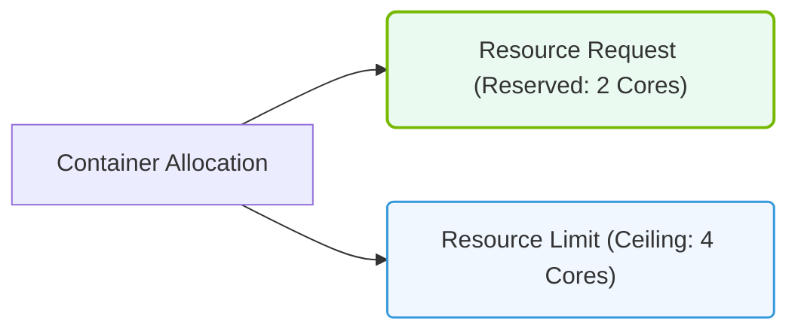

# 26.3i Resource Requests and Limits: CPU and memory budgets for every Pod

#### 🏷️ The Cluster Orchestration — Managing the GPU Fleet at Scale > 26 Kubernetes Fundamentals — Container Orchestration from Scratch > 26.3 Core Kubernetes Objects for AI Workloads

## 🧠 Context Introduction

When running AI workloads in Kubernetes, your Pods compete for the same underlying hardware resources — CPU cores, RAM, and sometimes GPUs. Without clear budgets, a single runaway training job could starve other critical Pods, causing crashes, slowdowns, or failed experiments.

**Resource Requests and Limits** are the mechanism you use to tell Kubernetes exactly how much CPU and memory each Pod needs. Think of them as a reservation system: Requests guarantee a minimum, while Limits cap the maximum. This ensures your GPU fleet runs predictably, even under heavy load.

---

## ⚙️ What Are Resource Requests?

A **Request** is the minimum amount of a resource that Kubernetes guarantees to your Pod. The scheduler uses this value to decide which node can host the Pod.

- **CPU Requests**: Measured in cores (e.g., 0.5 for half a core, 2 for two full cores).  
- **Memory Requests**: Measured in bytes (e.g., 512Mi for 512 mebibytes, 2Gi for 2 gibibytes).  
- **Purpose**: Ensures your Pod always gets at least this much resource, even if other Pods are competing.

---

## 📊 What Are Resource Limits?

A **Limit** is the maximum amount of a resource your Pod is allowed to consume. If the Pod tries to exceed this, Kubernetes takes action.

- **CPU Limits**: Pods can burst above their request but will be throttled if they hit the limit.  
- **Memory Limits**: Pods cannot exceed this value — if they do, the Pod is terminated (OOMKilled).  
- **Purpose**: Prevents a single Pod from hogging all node resources and starving neighbors.

---

## 🛠️ How Requests and Limits Work Together

The relationship between Requests and Limits defines your Pod's quality of service (QoS) class:

| QoS Class | Request vs Limit | Behavior |
|-----------|------------------|----------|
| **Guaranteed** | Request == Limit for all resources | Pod gets exactly what it needs; no bursting. Highest priority. |
| **Burstable** | Request < Limit for at least one resource | Pod can burst up to the limit when resources are available. Medium priority. |
| **BestEffort** | No Requests or Limits set | Pod gets whatever is leftover; first to be evicted under pressure. Lowest priority. |

For AI workloads, **Burstable** is common for training jobs (burst CPU during data loading) while **Guaranteed** is preferred for inference services needing predictable latency.

---

## 🕵️ Why This Matters for AI Workloads

AI training and inference have unique resource patterns:

- **GPU memory is separate** — CPU and memory budgets only cover node-level resources. GPU memory is managed via a different mechanism (device plugins).  
- **Data preprocessing spikes** — CPU and memory usage can spike during dataset loading. Limits protect against memory leaks crashing the node.  
- **Multi-Pod collocation** — Without limits, one training job could consume all node memory, causing other Pods to be evicted.

---


### 📊 Visual Representation: Container Resource Requests vs. Limits
This diagram contrasts resource Requests (guaranteed minimum reserved during scheduling) and Limits (absolute maximum allowed).




## 📋 Best Practices for Setting Requests and Limits

- **Start with monitoring** — Use tools like `kubectl top pod` or Prometheus to observe actual usage over a week.  
- **Set Requests slightly below average usage** — This gives the scheduler flexibility while ensuring baseline performance.  
- **Set Limits 1.5x to 2x above Requests** — Allows for bursts without risking node stability.  
- **Never set Limits without Requests** — This can lead to unpredictable scheduling.  
- **For memory, set Request == Limit** — Memory cannot be compressed like CPU; oversubscription leads to OOM kills.  
- **Review after model changes** — A new model architecture may change memory footprint significantly.

---

## 📝 Example Resource Specification (For Reference)

Below is a typical resource block for an AI training Pod:

```
For reference:
apiVersion: v1
kind: Pod
metadata:
  name: training-pod
spec:
  containers:
  - name: trainer
    image: nvidia/cuda:12.2-base
    resources:
      requests:
        cpu: "2"
        memory: "4Gi"
      limits:
        cpu: "4"
        memory: "8Gi"
```

📤 **Output**: This Pod is guaranteed 2 CPU cores and 4Gi of memory, but can burst to 4 CPU cores and 8Gi of memory. If memory exceeds 8Gi, the Pod is terminated.

---

## 🧪 How to Verify Your Settings

- **Check current usage**: Use `kubectl describe pod <pod-name>` and look for the `Requests` and `Limits` section.  
- **Monitor real-time consumption**: Run `kubectl top pod <pod-name>` to see actual CPU and memory usage.  
- **Inspect node pressure**: Use `kubectl describe node <node-name>` to see if any Pods are being throttled or evicted.  
- **View events**: Run `kubectl get events --field-selector involvedObject.name=<pod-name>` to see OOM or throttling events.

---

## 🚨 Common Pitfalls to Avoid

- **Setting memory Requests too low** — Pod may be scheduled on a node with insufficient memory, causing constant OOM kills.  
- **Setting CPU Limits too low** — Training throughput drops because the Pod is constantly throttled.  
- **Forgetting to set Limits** — One Pod can consume all node resources, crashing other workloads.  
- **Using units incorrectly** — `m` means millicores (e.g., `500m` = 0.5 CPU), while `Mi` and `Gi` are for memory. Mixing them up leads to misconfiguration.

---

## ✅ Key Takeaways

- **Requests** guarantee minimum resources; **Limits** cap maximum consumption.  
- For AI workloads, set memory Requests equal to Limits to avoid OOM kills.  
- CPU can be burstable — set Limits higher than Requests for data loading spikes.  
- Always monitor actual usage before setting values; adjust as models evolve.  
- Proper resource budgets keep your GPU fleet stable and your training jobs reliable.

---

*Next step: Apply these concepts to your own Pod manifests and observe how the scheduler places them across your cluster.*