# 27.1a What the GPU Operator automates: driver DaemonSet, container toolkit, DCGM exporter, MIG config

#### 🏷️ The Cluster Orchestration — Managing the GPU Fleet at Scale > 27 Kubernetes for AI — NVIDIA GPU and Network Operators > 27.1 The NVIDIA GPU Operator — Automating the GPU Software Stack in K8s

---

## 🧠 Context Introduction

When you run AI workloads on Kubernetes, every GPU node needs specific software installed and configured correctly. Without automation, engineers would have to manually install NVIDIA drivers, configure the container runtime, set up monitoring tools, and manage GPU partitioning on every single node. This is tedious, error-prone, and does not scale.

The **NVIDIA GPU Operator** solves this by automating the entire GPU software stack inside your Kubernetes cluster. It treats GPU infrastructure as code — deploying, updating, and managing all GPU-related components as Kubernetes-native resources. This means you can focus on running AI jobs instead of babysitting drivers.

---

## ⚙️ What the GPU Operator Automates

The GPU Operator manages four core components that every GPU node needs. Below is a breakdown of each.

---

### 🛠️ 1. Driver DaemonSet

The **Driver DaemonSet** ensures that every GPU node in your cluster has the correct NVIDIA driver installed and running.

- **What it does:** Deploys the NVIDIA driver as a **DaemonSet** — one pod per GPU node. This pod installs the driver kernel modules and loads them into the node's operating system.
- **Why it matters:** Without the driver, the GPU is just a piece of metal. The driver is the bridge between the GPU hardware and your AI software (like PyTorch or TensorFlow).
- **Key behavior:** The Operator checks the node's GPU model and OS version, then selects the correct driver version automatically. If a node is added later, the DaemonSet ensures the driver is installed without manual intervention.

---

### 📦 2. Container Toolkit

The **Container Toolkit** (formerly known as nvidia-docker2) makes GPUs accessible inside containers.

- **What it does:** Configures the container runtime (like containerd or CRI-O) to recognize and expose NVIDIA GPUs to pods. It installs the **nvidia-container-runtime** and sets up the necessary device plugins.
- **Why it matters:** Without this, your AI containers would not see the GPU. The toolkit handles the low-level plumbing so that when a pod requests a GPU via `resources.limits.nvidia.com/gpu: 1`, Kubernetes can actually allocate it.
- **Key behavior:** The Operator deploys a **Device Plugin** DaemonSet that registers available GPUs with the Kubernetes scheduler. It also configures the container runtime hooks so that GPU libraries and devices are mounted into the container.

---

### 📊 3. DCGM Exporter

**DCGM** stands for **Data Center GPU Manager**. The **DCGM Exporter** is a Prometheus exporter that collects GPU health and performance metrics.

- **What it does:** Runs as a DaemonSet on each GPU node, gathering metrics like GPU utilization, memory usage, temperature, power draw, and PCIe bandwidth.
- **Why it matters:** AI workloads are resource-hungry. You need to monitor GPU health to detect issues like thermal throttling, memory leaks, or failing hardware. The DCGM Exporter feeds this data into your monitoring stack (like Prometheus + Grafana).
- **Key behavior:** Metrics are exposed on a standard HTTP endpoint (port 9400 by default). You can then scrape these metrics and set up alerts — for example, if a GPU temperature exceeds 85°C.

---

### 🧩 4. MIG Configuration

**MIG** stands for **Multi-Instance GPU**. This feature allows you to partition a single NVIDIA GPU (like an A100 or H100) into multiple smaller, isolated GPU instances.

- **What it does:** The GPU Operator automates the configuration of MIG devices on supported GPUs. It creates MIG partitions (called "GPU instances" and "compute instances") and registers them as separate resources in Kubernetes.
- **Why it matters:** MIG enables better GPU utilization. Instead of giving an entire A100 to a small inference job, you can split it into 7 smaller MIG slices (each with 10 GB of memory) and run multiple workloads in parallel — with hardware-level isolation.
- **Key behavior:** The Operator uses a **MIG Manager** DaemonSet to configure MIG profiles on each node. You define the desired MIG partitioning in a ConfigMap, and the Operator applies it. Each MIG slice appears as a separate GPU resource in Kubernetes (e.g., `nvidia.com/gpu: 1` for a slice).

---

## 📋 Comparison Table: GPU Operator Components

| Component | Deployment Type | Primary Function | Why Engineers Need It |
|-----------|----------------|------------------|----------------------|
| **Driver DaemonSet** | DaemonSet | Installs and loads NVIDIA GPU drivers | Without drivers, GPUs are unusable |
| **Container Toolkit** | DaemonSet + Device Plugin | Makes GPUs visible to containers | Enables GPU resource allocation in Kubernetes |
| **DCGM Exporter** | DaemonSet | Collects GPU health and performance metrics | Essential for monitoring and alerting |
| **MIG Configuration** | DaemonSet (MIG Manager) | Partitions GPUs into isolated slices | Maximizes GPU utilization for smaller workloads |

---

### 📊 Visual Representation: NVIDIA GPU Operator Control Loop
This diagram displays how the GPU Operator automatically bootstraps node drivers, container runtimes, and device plugins.

```mermaid
flowchart LR
    K8sNode["New GPU Node Joined"] --> GPUOperator["GPU Operator Daemon"]
    GPUOperator --> Driver["Deploy Driver DaemonSet"]
    Driver --> Toolkit["Configure Container Toolkit"]
    Toolkit --> Plugin["Deploy GPU Device Plugin"]

    classDef cpu fill:#eafaf1,stroke:#76b900,stroke-width:2px,rx:6px,ry:6px;
    classDef memory fill:#f0f7ff,stroke:#3498db,stroke-width:1.5px,rx:4px,ry:4px;
    classDef system fill:#f1f5f9,stroke:#64748b,stroke-width:1.5px;

    class GPUOperator cpu;
    class Driver,Toolkit,Plugin memory;
    class K8sNode system;
```

## 🧭 How These Components Work Together

When you install the GPU Operator, it deploys all four components automatically. Here is the logical flow:

1. **Driver DaemonSet** installs the NVIDIA driver on each GPU node.
2. **Container Toolkit** configures the runtime so containers can see the GPU.
3. **DCGM Exporter** starts collecting metrics from the now-active GPUs.
4. **MIG Configuration** (if enabled) partitions GPUs into slices, and each slice is registered as a separate resource.

The result is a fully automated GPU infrastructure where you can simply request GPU resources in your pod spec and trust that everything works.

---

## ✅ Key Takeaways for New Engineers

- The GPU Operator **eliminates manual GPU software management** in Kubernetes.
- It treats drivers, runtime, monitoring, and partitioning as **Kubernetes-native resources** (DaemonSets, ConfigMaps, etc.).
- **Driver DaemonSet** handles the low-level hardware interface.
- **Container Toolkit** bridges the gap between Kubernetes and GPU hardware.
- **DCGM Exporter** gives you visibility into GPU health and performance.
- **MIG Configuration** enables efficient GPU sharing for smaller workloads.
- You can install the GPU Operator using a Helm chart, and it will automatically detect and configure all GPU nodes in your cluster.

---

## 🔍 Next Steps

Once you understand what the GPU Operator automates, the next logical step is learning how to **install and configure** it. You will define a `ClusterPolicy` custom resource that tells the Operator which components to enable, which driver version to use, and how to configure MIG profiles. This is covered in the next section of this module.