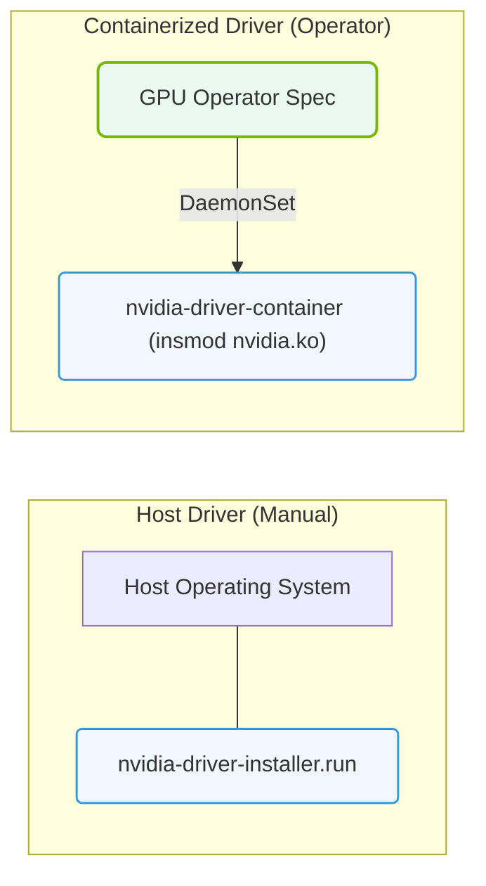

# 27.1e Using pre-installed drivers: operatortype=preinstalled vs. kernel module management

#### 🏷️ The Cluster Orchestration — Managing the GPU Fleet at Scale > 27 Kubernetes for AI — NVIDIA GPU and Network Operators > 27.1 The NVIDIA GPU Operator — Automating the GPU Software Stack in K8s

When deploying NVIDIA GPUs in a Kubernetes cluster, one of the first decisions you'll face is how to manage the GPU drivers on your worker nodes. The NVIDIA GPU Operator gives you two primary approaches: using **pre-installed drivers** (via `operatortype=preinstalled`) or letting the Operator handle **kernel module management** automatically. This topic breaks down the differences so you can choose the right method for your environment.

---

## 🔍 Context: Why This Matters

GPU drivers are the software layer that allows the operating system (and Kubernetes) to communicate with the physical GPU hardware. In a traditional setup, you'd manually install drivers on every node. The NVIDIA GPU Operator automates this, but you can decide how much automation you want:

- **Pre-installed drivers**: You install the drivers yourself before the Operator runs. The Operator simply detects and uses them.
- **Kernel module management**: The Operator installs, loads, and manages the kernel modules (the core driver components) automatically, including handling driver updates and compatibility.

---

## ⚙️ What is `operatortype=preinstalled`?

When you set the Operator to use `operatortype=preinstalled`, you are telling the GPU Operator: *"I have already installed the NVIDIA drivers on this node. Just use what's there."*

- **Who does the work?** You (or your provisioning system) install the drivers manually.
- **What the Operator does**: It detects the existing driver version, verifies compatibility, and configures the rest of the GPU software stack (like the NVIDIA Container Toolkit and device plugin) to work with those drivers.
- **Best for**: Environments where you have strict control over driver versions, air-gapped systems, or nodes with specialized driver configurations.

---

## 🛠️ What is Kernel Module Management?

With kernel module management enabled (the default behavior), the GPU Operator takes full responsibility for installing and loading the NVIDIA kernel modules on each node.

- **Who does the work?** The Operator, using a dedicated DaemonSet called `nvidia-driver-daemonset`.
- **What the Operator does**: It downloads the correct driver package for your GPU model and OS kernel, compiles or loads the kernel module, and ensures it is active before other GPU components start.
- **Best for**: Dynamic clusters where nodes are frequently added or replaced, or when you want fully automated driver lifecycle management.

---

## 📊 Comparison Table: Pre-installed vs. Kernel Module Management

| Feature | Pre-installed Drivers (`operatortype=preinstalled`) | Kernel Module Management (Default) |
|---------|------------------------------------------------------|-------------------------------------|
| **Driver installation responsibility** | You (manual or external tool) | GPU Operator (automated) |
| **Driver updates** | Manual — you must update drivers on each node | Automatic — Operator can update drivers across the cluster |
| **Node provisioning speed** | Faster (no driver download/compile at startup) | Slower initially (driver setup happens on first deployment) |
| **Control over driver version** | Full control | Controlled by Operator configuration |
| **Complexity** | Lower for the Operator, higher for you | Higher for the Operator, lower for you |
| **Air-gapped environments** | Easier (no need for internet access from Operator) | Requires pre-staging driver images or registry mirror |
| **Kernel compatibility** | You must ensure driver matches kernel | Operator handles kernel compatibility checks |

---

### 📊 Visual Representation: Pre-installed Host Driver vs. Containerized Driver
This diagram contrasts the pre-installed host driver strategy (using external installers) against containerized driver delivery (ClusterPolicy).

## 🕵️ When to Use Each Approach

### ✅ Choose `operatortype=preinstalled` when:
- Your organization has a strict change management process for drivers.
- Nodes are provisioned with a golden image that already includes drivers.
- You are operating in an air-gapped or offline environment.
- You need to use a custom or certified driver version not available in the Operator's repository.

### ✅ Choose kernel module management when:
- You want a fully automated, "hands-off" GPU deployment.
- Your cluster is dynamic (nodes are added/removed frequently).
- You want to standardize driver versions across all nodes easily.
- You are comfortable with the Operator downloading and managing driver packages.

---

## 🧩 How to Configure the Operator

To switch between these modes, you modify the GPU Operator's Helm chart values or ClusterPolicy resource.

- **For pre-installed drivers**: Set the value `driver.enabled=false` and `operatortype=preinstalled` in your configuration.
- **For kernel module management**: Leave the default settings (or explicitly set `driver.enabled=true`).

The Operator will then behave accordingly — either skipping driver installation or managing it automatically.

---

## ⚠️ Important Considerations for New Engineers

- **Driver version mismatch**: If you use pre-installed drivers, ensure the installed version is supported by the GPU Operator version you are deploying. Check the NVIDIA documentation for compatibility matrices.
- **Node reboots**: With kernel module management, the Operator automatically reloads the driver after a node reboot. With pre-installed drivers, you must ensure the driver loads at boot (usually via `dkms` or init scripts).
- **Debugging**: If GPU nodes fail to become ready, check whether the driver is actually loaded. With pre-installed drivers, run `nvidia-smi` manually on the node. With kernel module management, check the logs of the `nvidia-driver-daemonset` pod.
- **Security**: Pre-installed drivers give you more control over which driver binary runs. Kernel module management pulls images from NVIDIA's registry — ensure your cluster has proper image security scanning in place.

---

## 🧠 Key Takeaway

The choice between `operatortype=preinstalled` and kernel module management comes down to **control vs. automation**. If you want the Operator to handle everything from driver installation to lifecycle management, use kernel module management. If you need to maintain strict control over driver versions or operate in restricted environments, use pre-installed drivers. As a new engineer, start with kernel module management to see the full automation capabilities of the GPU Operator, then switch to pre-installed drivers as your operational requirements dictate.