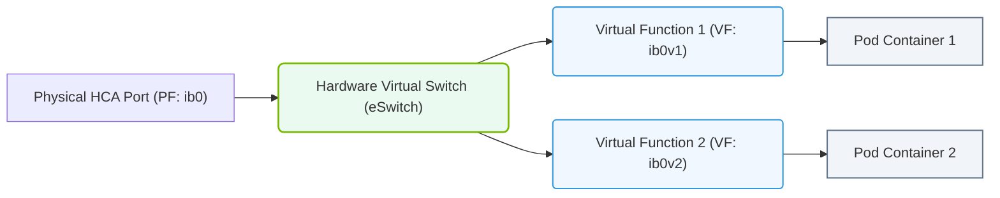

# 27.2c SR-IOV (Single Root I/O Virtualization): virtual functions for containers

#### 🏷️ The Cluster Orchestration — Managing the GPU Fleet at Scale > 27 Kubernetes for AI — NVIDIA GPU and Network Operators > 27.2 The NVIDIA Network Operator — Automating RDMA and InfiniBand in K8s

---

## 🌐 Context Introduction

In AI infrastructure, containers often need direct, high-performance access to network hardware—especially when running distributed training workloads that rely on RDMA (Remote Direct Memory Access) or InfiniBand. Without special configuration, containers share network interfaces through the host kernel, which adds latency and reduces throughput.

**SR-IOV (Single Root I/O Virtualization)** solves this by allowing a single physical network adapter (called a *Physical Function* or PF) to appear as multiple separate, lightweight virtual devices called *Virtual Functions* (VFs). Each VF can be assigned directly to a container, bypassing the host's network stack for near-native performance.

This topic covers how SR-IOV virtual functions are used with containers in Kubernetes, especially when managed by the NVIDIA Network Operator.

---

## ⚙️ How SR-IOV Works at a Glance

- A physical NIC (e.g., Mellanox ConnectX-6) supports SR-IOV and exposes one **Physical Function (PF)**.
- The PF is split into multiple **Virtual Functions (VFs)** — each VF behaves like an independent network card with its own PCIe resources.
- Each VF can be attached directly to a container or virtual machine, giving it dedicated hardware queues and DMA channels.
- The host CPU and kernel are not involved in data path forwarding for VF traffic, reducing overhead.

---

## 🛠️ SR-IOV for Containers in Kubernetes

In Kubernetes, SR-IOV VFs are treated as **accelerated devices** that can be requested by pods. The workflow is:

- The **SR-IOV Network Operator** (or NVIDIA Network Operator) configures VFs on the host.
- A **Network Attachment Definition** (NAD) defines how a VF is exposed to pods.
- Pods request a VF via an annotation or resource field.
- The **Multus CNI** plugin attaches the VF to the pod's network namespace.

---

## 📊 Key Components and Their Roles

| Component | Role |
|-----------|------|
| **Physical Function (PF)** | The full-featured PCIe function of the NIC; managed by the host driver |
| **Virtual Function (VF)** | A lightweight PCIe function with its own memory and interrupt resources |
| **SR-IOV CNI Plugin** | Attaches VFs to pod network namespaces |
| **Multus CNI** | Meta-plugin that allows multiple network interfaces per pod |
| **NVIDIA Network Operator** | Automates SR-IOV configuration, VF allocation, and driver management |
| **Network Attachment Definition** | Kubernetes CRD that defines how a VF network is exposed |

---

## 🕵️ How VFs Are Allocated to Containers

1. **Host Configuration**: The operator creates VFs on the physical NIC (e.g., 8 VFs on port 0).
2. **Resource Advertisement**: Each VF is registered as a consumable resource (e.g., `nvidia.com/sriov_vf`).
3. **Pod Scheduling**: When a pod requests a VF, the scheduler places it on a node with available VFs.
4. **VF Attachment**: The SR-IOV CNI plugin binds the VF to the pod's network namespace.
5. **Traffic Isolation**: Each VF has its own MAC address and VLAN, ensuring isolation between containers.

---

### 📊 Visual Representation: SR-IOV Physical (PF) vs. Virtual (VF) Interfaces
This diagram displays SR-IOV, virtualizing a physical Mellanox HCA into multiple virtual interfaces exposed directly to container namespaces.

## ✅ Benefits of SR-IOV for AI Containers

- **Low latency**: Direct hardware access eliminates kernel overhead.
- **High throughput**: VFs use dedicated hardware queues, not shared host buffers.
- **Deterministic performance**: No "noisy neighbor" effects from other containers.
- **Scalability**: A single 100 Gbps NIC can support dozens of VFs for multiple pods.
- **Compatibility**: Works with RDMA over Converged Ethernet (RoCE) and InfiniBand.

---

## ⚠️ Important Considerations

- **VF Count Limits**: Each NIC model supports a maximum number of VFs (e.g., 64 or 128). Plan your pod density accordingly.
- **Driver Support**: The host must have an SR-IOV-capable driver (e.g., `mlx5_core` for Mellanox).
- **NUMA Awareness**: VFs are tied to a specific PCIe slot and NUMA node. For best performance, schedule pods on the same NUMA node as the VF.
- **Security**: VFs are not fully isolated like physical NICs. Use VLANs or VXLAN for multi-tenant environments.

---

## 🔁 Comparison: SR-IOV vs. Traditional Container Networking

| Aspect | Traditional (bridge/overlay) | SR-IOV |
|--------|-----------------------------|--------|
| Data path | Through host kernel | Direct to hardware |
| Latency | Higher (kernel context switch) | Near-native |
| CPU overhead | Significant | Minimal |
| Throughput | Shared, variable | Dedicated per VF |
| Configuration complexity | Low | Medium (requires operator) |
| Best for | General workloads | High-performance AI/ML |

---

## 🧩 Real-World Example Flow

A pod running NCCL (NVIDIA Collective Communications Library) for distributed training:

1. The pod requests **2 VFs** (one for data, one for control).
2. The SR-IOV operator assigns two VFs from the same physical NIC.
3. The pod sees two network interfaces: `net1` and `net2`.
4. NCCL uses these interfaces for GPU-to-GPU communication across nodes.
5. The result: near line-rate 100 Gbps communication without CPU involvement.

---

## 📌 Summary

SR-IOV virtual functions give containers direct, high-performance access to network hardware—critical for AI workloads that demand low latency and high throughput. When combined with the NVIDIA Network Operator and Multus CNI, engineers can automate VF allocation and achieve bare-metal-like networking performance inside Kubernetes pods.

For new engineers, remember: **SR-IOV is about bypassing the kernel for speed, while keeping the flexibility of containers.** It's a foundational building block for scaling AI infrastructure efficiently.