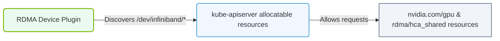

# 27.2e RDMA device plugin: advertising ib0 and rdma resources to the K8s scheduler

#### 🏷️ The Cluster Orchestration — Managing the GPU Fleet at Scale > 27 Kubernetes for AI — NVIDIA GPU and Network Operators > 27.2 The NVIDIA Network Operator — Automating RDMA and InfiniBand in K8s

## 🌐 Context Introduction

When running AI workloads that require high-speed inter-node communication (like distributed training across multiple GPUs), standard Ethernet networking becomes a bottleneck. Remote Direct Memory Access (RDMA) solves this by allowing data to move directly between the memory of different servers without involving the CPU or OS kernel. In Kubernetes, the challenge is making these specialized RDMA network interfaces (like **ib0** for InfiniBand or **rdma0** for RoCE) visible to the Kubernetes scheduler so that Pods can request and use them. The **RDMA device plugin** is the component that bridges this gap.

---

## ⚙️ What is the RDMA Device Plugin?

The RDMA device plugin is a Kubernetes device plugin that:

- **Discovers** RDMA-capable network interfaces on each node (e.g., `ib0`, `rdma0`)
- **Advertises** these interfaces as extended resources to the Kubernetes API server
- **Allocates** specific RDMA devices to Pods that request them
- **Ensures** that Pods requiring RDMA are scheduled only on nodes that have the necessary hardware

This plugin is part of the **NVIDIA Network Operator** and works alongside the GPU Operator to provide a complete accelerated networking solution for AI workloads.

---

## 🛠️ How It Works: Advertising RDMA Resources

The RDMA device plugin follows a standard Kubernetes device plugin pattern:

### Step 1: Discovery
- The plugin scans the node for RDMA-capable network interfaces
- It identifies interfaces like **ib0** (InfiniBand) or **rdma0** (RoCE/Converged Ethernet)
- It checks for associated PCIe devices and their capabilities

### Step 2: Registration
- The plugin registers itself with the **kubelet** on the node
- It advertises the discovered RDMA devices as extended resources

### Step 3: Resource Advertisement
- The node now shows additional allocatable resources, for example:
  - **nvidia.com/ib0**: 1 (one InfiniBand interface available)
  - **nvidia.com/rdma0**: 2 (two RoCE interfaces available)

### Step 4: Scheduling & Allocation
- When a Pod requests these resources, the scheduler ensures it lands on a node with available RDMA devices
- The plugin mounts the device into the Pod's container at allocation time

---

## 📊 Resource Types Advertised

The RDMA device plugin typically advertises the following resource types:

| Resource Name | Description | Example Interface |
|---------------|-------------|-------------------|
| **nvidia.com/ib0** | InfiniBand HCA (Host Channel Adapter) | ib0, ib1 |
| **nvidia.com/rdma0** | RoCE-capable NIC | rdma0, rdma1 |
| **nvidia.com/hostdev** | PCIe passthrough for SR-IOV VFs | Virtual functions |

---

### 📊 Visual Representation: RDMA Device Plugin resource allocation
This diagram displays how the RDMA Device Plugin registers InfiniBand devices as allocatable resources in the Kubernetes Scheduler.

## 🕵️ Key Concepts for New Engineers

### What Engineers Need to Understand:

- **RDMA vs. Standard Networking**: RDMA bypasses the OS kernel for data transfer, reducing latency and CPU overhead. This is critical for AI training where GPUs need to exchange gradients frequently.

- **ib0 vs. rdma0**: 
  - **ib0** refers to native InfiniBand interfaces (dedicated InfiniBand hardware)
  - **rdma0** refers to RDMA over Converged Ethernet (RoCE) interfaces (standard Ethernet with RDMA capabilities)

- **Device Plugin Lifecycle**: The plugin runs as a DaemonSet on every node that has RDMA hardware. It continuously monitors device availability.

- **Resource Requests in Pods**: Pods must explicitly request RDMA resources in their spec, similar to requesting GPUs.

---

## 📝 Example Pod Resource Request (Conceptual)

When an engineer creates a Pod that needs RDMA, the Pod specification would include resource requests like:

**For InfiniBand:**
- **resources.requests["nvidia.com/ib0"]**: 1
- **resources.limits["nvidia.com/ib0"]**: 1

**For RoCE:**
- **resources.requests["nvidia.com/rdma0"]**: 1
- **resources.limits["nvidia.com/rdma0"]**: 1

The scheduler then matches these requests against the advertised resources on each node.

---

## 🔍 Verification Steps (No Commands)

To verify that the RDMA device plugin is working correctly, engineers should:

1. **Check node status** — Look for the node to show extended resources like **nvidia.com/ib0** or **nvidia.com/rdma0** in its allocatable resources list
2. **Verify Pod scheduling** — Create a test Pod requesting RDMA resources and confirm it starts on a node with available RDMA devices
3. **Inspect device plugin logs** — The plugin logs will show discovery and registration events for each RDMA interface found
4. **Test connectivity** — Once a Pod is running, verify that the RDMA interface (e.g., **ib0**) is visible inside the container

---

## 🎯 Common Pitfalls for New Engineers

- **Missing hardware drivers**: The RDMA device plugin requires the appropriate NVIDIA drivers and firmware to be installed on the node
- **Incorrect resource names**: Using the wrong resource name (e.g., **nvidia.com/ib** instead of **nvidia.com/ib0**) will cause scheduling failures
- **Not requesting resources**: Pods will not automatically get RDMA access — they must explicitly request the resources
- **Network Operator not deployed**: The RDMA device plugin is part of the NVIDIA Network Operator; it must be installed and configured correctly

---

## ✅ Summary

The RDMA device plugin is a critical component for running AI workloads that require high-speed inter-node communication. It:

- **Discovers** RDMA-capable interfaces like **ib0** and **rdma0** on each node
- **Advertises** them as allocatable resources to the Kubernetes scheduler
- **Allocates** specific devices to Pods that request them
- **Enables** distributed training and other high-performance computing workloads in Kubernetes

For new engineers, understanding this plugin is essential because it directly impacts whether AI training jobs can communicate efficiently across multiple nodes. Without it, Pods would have no way to access the specialized RDMA hardware, and performance would suffer dramatically.