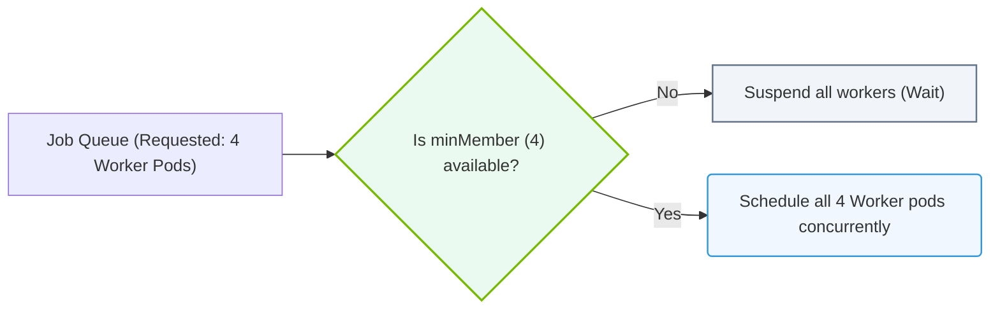

# 27.3e Gang scheduling: all-or-nothing Pod placement for multi-node training

#### 🏷️ The Cluster Orchestration — Managing the GPU Fleet at Scale > 27 Kubernetes for AI — NVIDIA GPU and Network Operators > 27.3 Running AI Training Jobs in Kubernetes

---

## 🧠 Context Introduction

When running large AI training jobs across multiple GPUs and nodes, all Pods in the job must start **simultaneously**. If even one Pod fails to schedule, the entire training job can stall or fail. This is where **Gang scheduling** comes in — it ensures that either **all** Pods are placed and running, or **none** are. This "all-or-nothing" approach prevents wasted resources and deadlocks in multi-node training scenarios.

---

## ⚙️ What Is Gang Scheduling?

Gang scheduling is a scheduling strategy that guarantees a group of Pods (a "gang") are scheduled together. In Kubernetes, this is critical for distributed AI workloads like:

- **NVIDIA NeMo** (large language model training)
- **PyTorch Distributed** or **TensorFlow distributed** training
- **Horovod** jobs across multiple nodes

Without Gang scheduling, you risk:
- Partial Pod allocation causing training to hang
- Resource fragmentation (some GPUs idle while others wait)
- Job timeouts and retries

---

## 🛠️ How It Works: The "All-or-Nothing" Principle

- A training job requests **N Pods** (e.g., 8 Pods across 4 nodes with 2 GPUs each)
- Gang scheduling holds all resources **until all N Pods can be placed**
- If resources are insufficient, **no Pods are scheduled** — the job waits
- Once all Pods are ready, the job starts simultaneously

This is different from standard Kubernetes scheduling, which places Pods one by one as resources become available.

---

## 📊 Gang Scheduling vs. Standard Scheduling

| Feature | Standard Kubernetes Scheduling | Gang Scheduling |
|---------|-------------------------------|-----------------|
| Pod placement | One Pod at a time | All Pods together |
| Risk of partial allocation | High — some Pods run, others wait | None — all or nothing |
| Suitable for multi-node AI training | ❌ Not recommended | ✅ Required |
| Resource waste | Possible (idle GPUs) | Minimized |
| Job startup delay | Lower (but risky) | Slightly higher (waits for all) |

---

## 🕵️ When to Use Gang Scheduling

Use Gang scheduling when:

- **Multi-node training** is involved (e.g., 2+ nodes with GPUs)
- **All Pods must communicate** at startup (e.g., NCCL initialization)
- **Job failure is costly** (e.g., long-running training with checkpoints)
- **You use** frameworks like **NVIDIA NeMo**, **Megatron-LM**, or **DeepSpeed**

Avoid Gang scheduling for:
- Single-node training jobs
- Inference workloads (Pods can start independently)
- Batch processing that tolerates partial execution

---


### 📊 Visual Representation: Gang Scheduling All-or-Nothing pod bindings
This diagram displays Gang scheduling: suspending execution until the minimum pod replica count (minMember) is available in the queue.




## 🔧 Implementing Gang Scheduling in Kubernetes

### Option 1: Volcano Scheduler (Recommended by NVIDIA)

Volcano is a Kubernetes batch scheduling system that supports Gang scheduling natively.

**For reference:**
```yaml
apiVersion: scheduling.volcano.sh/v1beta1
kind: PodGroup
metadata:
  name: training-job-podgroup
spec:
  minMember: 8
  queue: default
```

**For reference:**
```yaml
apiVersion: batch.volcano.sh/v1alpha1
kind: Job
metadata:
  name: nemo-training-job
spec:
  minAvailable: 8
  schedulerName: volcano
  tasks:
    - replicas: 8
      name: worker
      template:
        spec:
          containers:
            - name: nemo-worker
              image: nvcr.io/nvidia/nemo:latest
              resources:
                limits:
                  nvidia.com/gpu: 2
```

📤 **Output:** The job will only start when all 8 Pods (each requesting 2 GPUs) are scheduled.

---

### Option 2: NVIDIA GPU Operator with MIG and Scheduling

The NVIDIA GPU Operator integrates with Volcano or other schedulers to enable Gang scheduling for GPU workloads.

**For reference:**
```yaml
apiVersion: nvidia.com/v1
kind: ClusterPolicy
metadata:
  name: gpu-cluster-policy
spec:
  scheduling:
    gangScheduling: enabled
    scheduler: volcano
```

📤 **Output:** Gang scheduling is enabled cluster-wide for GPU jobs.

---

## 🧪 Testing Gang Scheduling Behavior

To verify Gang scheduling is working:

1. **Check PodGroup status** — all Pods should show as "Scheduled" or "Running" together
2. **Monitor job logs** — look for simultaneous startup messages from all workers
3. **Use kubectl** to inspect Pod phases — no Pod should be in "Pending" while others are "Running"

**For reference:**
```bash
kubectl get podgroup training-job-podgroup -o yaml
```

📤 **Output:** Look for `status.phase: Running` and `status.running` equal to `minMember`.

---

## 🚨 Common Pitfalls and Troubleshooting

| Issue | Cause | Solution |
|-------|-------|----------|
| Job stuck in "Pending" | Not enough GPUs available | Add more nodes or reduce `minMember` |
| Some Pods start, others wait | Gang scheduling not enabled | Switch to Volcano or enable Gang scheduling |
| Job starts but training fails | NCCL timeout due to partial startup | Ensure all Pods have network connectivity |
| Resource fragmentation | Small jobs blocking large ones | Use queues and priorities in Volcano |

---

## ✅ Key Takeaways for New Engineers

- **Gang scheduling = all Pods start together or none start**
- **Essential for multi-node AI training** with frameworks like NeMo and DeepSpeed
- **Volcano is the recommended scheduler** for NVIDIA GPU clusters
- **Always verify** that Gang scheduling is enabled before running distributed training
- **Monitor PodGroup status** to confirm all-or-nothing behavior

---

## 📚 Further Learning

- NVIDIA GPU Operator documentation
- Volcano scheduler GitHub and docs
- Kubernetes batch scheduling best practices
- NCCL and multi-node communication patterns

---

*This guide is part of the NVIDIA-Certified Associate: AI Infrastructure and Operations curriculum.*