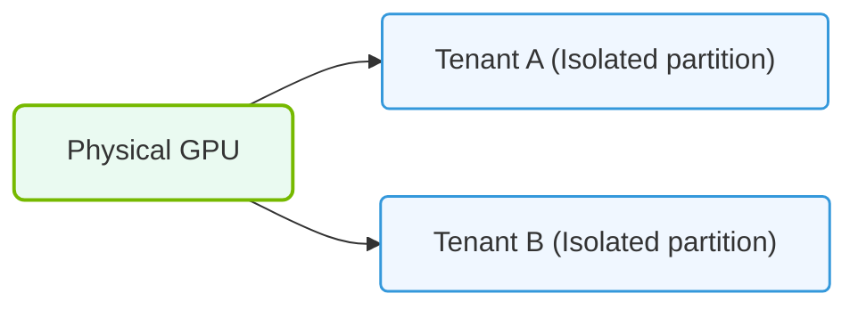

# 28.1b The multi-tenancy challenge: sharing expensive GPUs safely between teams

#### 🏷️ The Cluster Orchestration — Managing the GPU Fleet at Scale > 28 Advanced GPU Resource Management — MIG, MPS, and Time-Slicing > 28.1 The Wasted Compute Problem — Why One Job per GPU Is Inefficient

---

## 🧠 Context Introduction

In any AI infrastructure, GPUs are the most expensive and scarce resource. A single NVIDIA A100 or H100 GPU can cost thousands of dollars. When you assign one entire GPU to a single job, you often waste a significant portion of its compute capacity — especially if that job only uses a fraction of the GPU's memory or processing power.

The **multi-tenancy challenge** is about safely sharing these expensive GPUs across multiple teams, projects, or users without compromising performance, security, or data privacy. Engineers must balance efficiency with isolation, ensuring that one team's workload doesn't interfere with another's.

---

## ⚙️ The Core Problem: Why Sharing Is Hard

- **Resource contention**: Multiple jobs competing for the same GPU can cause slowdowns, out-of-memory errors, or unpredictable performance.
- **Security isolation**: One team's code or data must not be accessible by another team's job running on the same GPU.
- **Fairness**: Without proper controls, a single large job can hog the GPU, starving smaller jobs from other teams.
- **Operational complexity**: Manually scheduling GPU access across teams is error-prone and doesn't scale.

---

## 🛠️ The Multi-Tenancy Solution Stack

NVIDIA provides several technologies to enable safe GPU sharing. Each offers different trade-offs between isolation, performance, and flexibility.

| Technology | Isolation Level | Performance Impact | Best For |
|------------|----------------|-------------------|----------|
| **MIG (Multi-Instance GPU)** | Hardware-level | Minimal | Strict isolation, guaranteed resources |
| **MPS (Multi-Process Service)** | Software-level | Moderate | Cooperative workloads, high GPU utilization |
| **Time-Slicing** | Software-level | Variable | Best-effort sharing, simple setup |

---

## 🕵️ Deep Dive: How Each Technology Works

### 🔒 MIG — Hardware-Level Partitioning

- Physically splits a single GPU into multiple isolated instances (up to 7 on an A100).
- Each instance has its own dedicated memory, cache, and compute units.
- Teams see their MIG instance as a completely separate, smaller GPU.
- **Use case**: Running sensitive workloads from different clients or departments on the same physical card.

### 🔗 MPS — Cooperative Sharing

- Allows multiple processes to share GPU compute resources while maintaining memory isolation.
- Uses a client-server model where a single MPS server manages GPU access for multiple client processes.
- Reduces context-switching overhead compared to time-slicing.
- **Use case**: Batch inference jobs or training runs from the same team that need high throughput.

### ⏱️ Time-Slicing — Simple Fair Sharing

- Divides GPU time into fixed intervals, giving each job a slice of compute time.
- No hardware partitioning — all jobs share the full GPU memory.
- Jobs are paused and resumed automatically by the scheduler.
- **Use case**: Development and testing environments where strict isolation is not required.

---

### 📊 Visual Representation: Multi-Tenant GPU Shared pool
This diagram displays how virtualization partitions a single physical GPU to safely host multiple separate tenant workloads.

## 📊 Comparison Table: Choosing the Right Approach

| Feature | MIG | MPS | Time-Slicing |
|---------|-----|-----|--------------|
| **Memory isolation** | ✅ Full | ✅ Per-process | ❌ Shared |
| **Compute isolation** | ✅ Hardware-level | ⚠️ Software-level | ❌ No isolation |
| **Performance overhead** | Very low | Low | Medium to high |
| **Max instances per GPU** | Up to 7 (A100) | Up to 48 processes | Unlimited (scheduler-dependent) |
| **GPU memory limit** | Fixed per instance | Configurable | Full GPU memory |
| **Best for** | Production, multi-tenant | Batch processing | Dev/test environments |

---

## 🚨 Common Pitfalls to Avoid

- **Overcommitting memory**: With time-slicing, if two jobs each need 40GB on a 40GB GPU, they will crash. Always reserve headroom.
- **Ignoring NUMA affinity**: When sharing GPUs across nodes, ensure jobs are scheduled on GPUs physically close to their CPU to avoid latency.
- **Assuming perfect isolation**: Even with MIG, some shared resources (like PCIe bandwidth) can still cause contention. Monitor these.
- **Skipping monitoring**: Without visibility into per-team GPU usage, you cannot enforce fairness or detect abuse.

---

## ✅ Best Practices for Engineers

- **Start with MIG for production workloads** — it provides the strongest guarantees for safety and performance.
- **Use MPS for internal team workloads** where you trust the code and need higher utilization.
- **Reserve time-slicing for low-priority or experimental jobs** that can tolerate variable performance.
- **Always set resource quotas** — define maximum GPU memory and compute time per team or user.
- **Implement a GPU scheduler** (like Kubernetes with NVIDIA device plugin) to automate allocation and enforce policies.
- **Monitor GPU utilization per partition** — tools like **nvidia-smi** and **DCGM** can show you real-time usage per MIG instance or process.

---

## 🔍 Key Takeaway

The multi-tenancy challenge is not about *if* you should share GPUs — it's about *how* to share them safely. By choosing the right isolation technology (MIG, MPS, or time-slicing) and enforcing clear policies, engineers can dramatically improve GPU utilization while keeping teams secure and workloads predictable. Start simple, monitor aggressively, and scale your sharing strategy as your infrastructure grows.