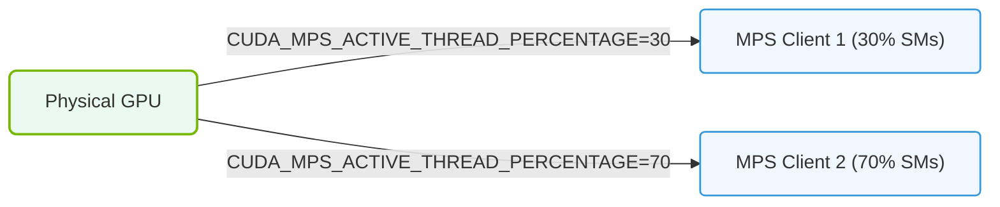

# 28.3b Benefits: Lower Context Switch Overhead vs Time-Slicing, True Concurrent Execution

#### 🏷️ The Cluster Orchestration — Managing the GPU Fleet at Scale > 28 Advanced GPU Resource Management — MIG, MPS, and Time-Slicing > 28.3 Multi-Process Service (MPS) — Concurrent GPU Compute

---

## 🧠 Context Introduction

When multiple workloads need to share a single GPU, engineers must choose how to allocate compute resources. Two common approaches are **time-slicing** (where GPU time is divided into small intervals) and **Multi-Process Service (MPS)** (which allows true concurrent execution). Understanding the benefits of MPS over time-slicing is critical for optimizing GPU utilization in AI workloads.

---

## ⚙️ What Is Context Switch Overhead?

A **context switch** occurs when the GPU stops working on one task and starts working on another. This involves saving and restoring state, which consumes valuable compute cycles.

- **Time-slicing** forces frequent context switches as the GPU rapidly alternates between tasks.
- **MPS** reduces context switches by allowing multiple processes to share the GPU simultaneously.

---

## 📊 Key Benefit 1: Lower Context Switch Overhead

MPS significantly reduces the overhead caused by context switching compared to time-slicing.

| Aspect | Time-Slicing | MPS |
|--------|--------------|-----|
| **Context switch frequency** | High — switches every few milliseconds | Low — processes run concurrently |
| **Overhead impact** | Wasted GPU cycles on state saving/restoring | Minimal overhead — state is shared |
| **Performance for small tasks** | Poor — overhead dominates execution time | Good — tasks execute without interruption |
| **GPU utilization** | Lower due to switching gaps | Higher — GPU stays busy |

**Why this matters:** For AI workloads with many small operations (like inference requests), time-slicing can waste 20-40% of GPU cycles on context switching. MPS eliminates this waste.

---

## 🛠️ Key Benefit 2: True Concurrent Execution

MPS enables **true concurrent execution** of multiple processes on the GPU, unlike time-slicing which only gives the illusion of concurrency.

- **Time-slicing** runs one process at a time, switching rapidly between them. Only one process uses the GPU at any given moment.
- **MPS** allows multiple processes to submit work to the GPU simultaneously. The GPU scheduler can interleave their operations at a finer granularity.

**Real-world analogy:**
- **Time-slicing** = A single checkout lane serving one customer at a time, switching between customers every 10 seconds.
- **MPS** = Multiple checkout lanes open, each serving a different customer simultaneously.

---

### 📊 Visual Representation: MPS Spatial Partitioning Allocation
This diagram displays spatial partitioning: allocating specific VRAM percentages (e.g. 30%) and hardware execution queues to each process.

## 🕵️ Why This Matters for AI Workloads

AI workloads benefit from MPS's concurrent execution in several ways:

- **Inference serving:** Multiple models can process requests simultaneously without waiting for each other.
- **Training with data parallelism:** Multiple training processes can share a GPU without serializing their work.
- **Mixed workloads:** A training job and an inference job can run together without one blocking the other.

---

## 📈 Performance Comparison Example

Consider a scenario with two small AI inference tasks:

**With time-slicing:**
- Task A runs for 2ms, then context switch (0.5ms overhead)
- Task B runs for 2ms, then context switch (0.5ms overhead)
- Total time: 5ms for both tasks
- Effective GPU utilization: 80%

**With MPS:**
- Both tasks run concurrently for 2ms
- No context switch overhead
- Total time: 2ms for both tasks
- Effective GPU utilization: 100%

---

## ✅ Summary of Benefits

- **Lower overhead** — MPS reduces wasted GPU cycles from context switching
- **True concurrency** — Multiple processes execute simultaneously, not just in rapid succession
- **Higher throughput** — More work completed per unit of time
- **Better latency** — Individual tasks finish faster without waiting for context switches
- **Improved utilization** — GPU resources stay busy with productive work

---

## 🔍 When to Choose MPS Over Time-Slicing

- **Choose MPS when:** You have many small, frequent GPU tasks (e.g., inference requests, data preprocessing)
- **Choose time-slicing when:** You need strict isolation between workloads or are using GPUs that don't support MPS
- **Consider both:** For mixed workloads, MPS for compute tasks and time-slicing for memory-intensive tasks can be combined

---

## 📚 Key Takeaway

MPS provides **lower context switch overhead** and **true concurrent execution** compared to time-slicing, making it the preferred choice for maximizing GPU efficiency in multi-process AI environments. Engineers should evaluate their workload patterns to determine if MPS's benefits align with their deployment needs.