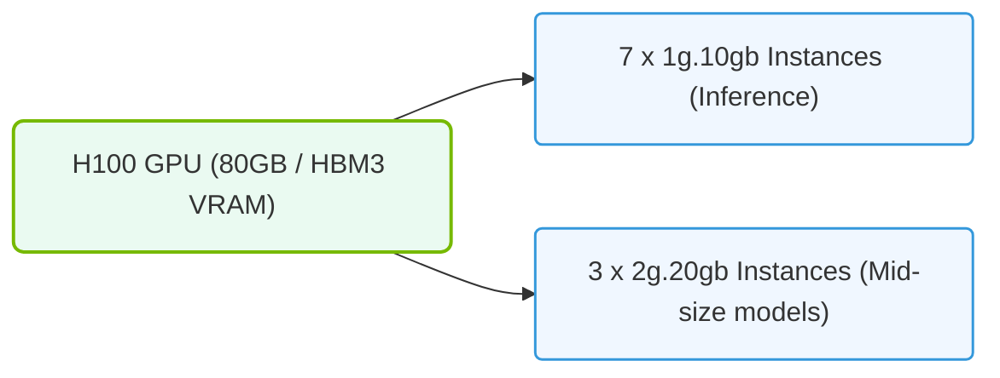

# 28.4c MIG instance profiles on H100: new profiles with 80 GB HBM3 distribution

#### 🏷️ The Cluster Orchestration — Managing the GPU Fleet at Scale > 28 Advanced GPU Resource Management — MIG, MPS, and Time-Slicing > 28.4 Multi-Instance GPU (MIG) — Hardware-Level GPU Partitioning

---

## 🔍 Context Introduction

When working with NVIDIA H100 GPUs, one of the most powerful features available is **Multi-Instance GPU (MIG)**. MIG allows you to physically partition a single GPU into multiple smaller, isolated GPU instances. Each instance has its own dedicated memory, cache, and compute units. This is especially useful when you have multiple workloads that don't need the full power of an H100 but still require guaranteed performance and isolation.

With the H100, NVIDIA introduced **new MIG instance profiles** that take advantage of the **80 GB HBM3 memory**. These profiles give engineers more flexibility to carve up the GPU in ways that better match their workload requirements. This topic explains those new profiles and how they differ from previous generations like the A100.

---

## ⚙️ What Changed from A100 to H100 MIG Profiles

The A100 offered MIG profiles that split its 40 GB or 80 GB memory into chunks like 10 GB, 20 GB, or 40 GB. The H100 builds on this but introduces **new memory distribution options** specifically designed for its faster HBM3 memory architecture.

Key differences:
- **H100 uses HBM3 memory** (vs. HBM2e on A100), offering higher bandwidth and capacity.
- **New profile sizes** are available that were not present on A100, allowing more granular control.
- **Maximum number of instances** increased from 7 on A100 to **7 on H100** as well, but with different memory splits.

---

## 📊 H100 MIG Profile Breakdown (80 GB Total)

Below is a comparison of the available MIG profiles on an H100 GPU with 80 GB HBM3 memory. Each profile defines how much memory and how many compute units (SMs) are assigned to a single GPU instance.

| Profile Name | GPU Memory (GB) | Number of SMs | Max Instances per GPU | Typical Use Case |
|---|---|---|---|---|
| 1g.10gb | 10 | 14 | 7 | Small inference jobs, lightweight containers |
| 2g.20gb | 20 | 28 | 3 | Medium batch inference, small model training |
| 3g.40gb | 40 | 42 | 2 | Larger model inference, fine-tuning |
| 4g.40gb | 40 | 56 | 1 | Single large workload with high compute |
| 7g.80gb | 80 | 98 | 1 | Full GPU for large training jobs |

**Note:** The "g" stands for the GPU slice fraction (e.g., 1g = 1/7th of the GPU), and the "gb" value is the dedicated memory per instance.

---


### 📊 Visual Representation: H100 GPU MIG profile allocations
This diagram displays H100 partition limits, optimizing memory and compute slices based on different training vs. inference workloads.




## 🛠️ New Profiles Exclusive to H100

The H100 introduced **two new profile types** that were not available on A100:

1. **1g.10gb** — This is the smallest profile, giving you 10 GB of memory and 14 SMs. You can create up to **7 instances** on a single H100, each fully isolated.
2. **2g.20gb** — A medium profile with 20 GB memory and 28 SMs. You can create up to **3 instances** per GPU.

These profiles are particularly useful for:
- Running many small inference services simultaneously.
- Isolating multi-tenant workloads where each tenant gets guaranteed resources.
- Testing or development environments where full GPU capacity is not needed.

---

## 🕵️ How to Identify Available MIG Profiles

To see which MIG profiles are supported on your H100 GPU, you can use the NVIDIA management tools. The output will list all possible profile combinations.

**For reference:**
```
nvidia-smi mig -i 0 -lgipp
```

📤 **Output:** A list of all supported MIG profiles with their memory size, SM count, and maximum instances per GPU. You will see entries like `1g.10gb`, `2g.20gb`, `3g.40gb`, etc.

---

## 🧩 Practical Considerations for Engineers

When deciding which MIG profile to use, consider the following:

- **Workload memory requirements:** Always check how much GPU memory your application needs. For example, a small BERT model might fit in 10 GB, while a larger LLM might need 40 GB or more.
- **Number of concurrent users:** If you need to serve many users with small models, use the `1g.10gb` profile to maximize instance count.
- **Performance isolation:** MIG provides hardware-level isolation, meaning one instance cannot affect another's performance. This is critical for production environments.
- **No oversubscription:** Unlike time-slicing, MIG does not allow oversubscription. Each instance gets its dedicated resources permanently.

---

## ✅ Summary

- H100 MIG profiles offer **new 10 GB and 20 GB memory options** that were not available on A100.
- The **80 GB HBM3 memory** is distributed across up to 7 fully isolated instances.
- Engineers can choose from profiles like `1g.10gb`, `2g.20gb`, `3g.40gb`, `4g.40gb`, or `7g.80gb` depending on workload needs.
- Use **nvidia-smi** to list available profiles and verify your GPU's capabilities.
- MIG is ideal for multi-tenant environments, small inference services, and workloads requiring guaranteed resource isolation.

By understanding these new H100 MIG profiles, you can better plan your GPU resource allocation and ensure efficient utilization of your AI infrastructure.