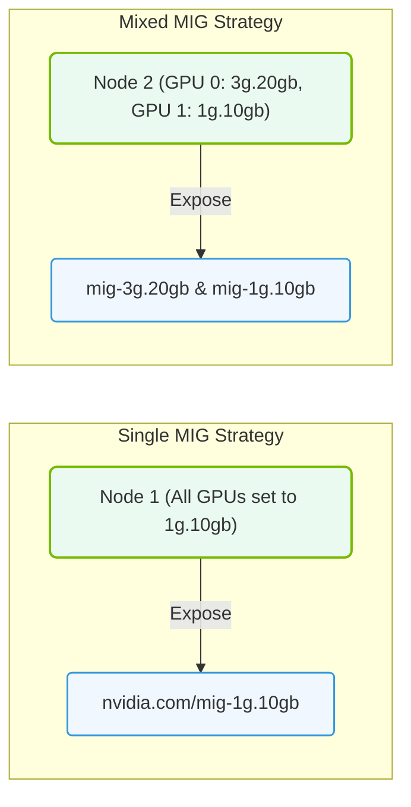

# 28.4f MIG in Kubernetes: GPU Operator MIG strategy (single, mixed, all)

#### 🏷️ The Cluster Orchestration — Managing the GPU Fleet at Scale > 28 Advanced GPU Resource Management — MIG, MPS, and Time-Slicing > 28.4 Multi-Instance GPU (MIG) — Hardware-Level GPU Partitioning

---

## 🌐 Context Introduction

When you have a powerful NVIDIA GPU like an A100 or H100, it can feel wasteful to assign the entire GPU to a single small workload. Multi-Instance GPU (MIG) solves this by physically partitioning a single GPU into multiple smaller, isolated GPU instances. In Kubernetes, the **GPU Operator** helps you manage MIG in three distinct strategies: **single**, **mixed**, and **all**. This guide explains each strategy simply, so you can choose the right one for your AI workloads.

---

## ⚙️ What is MIG in Kubernetes?

MIG allows you to split a single physical GPU into up to 7 separate GPU instances (on A100/H100). Each instance has dedicated memory, cache, and compute units — meaning workloads don't interfere with each other. The GPU Operator automates the configuration of MIG devices so Kubernetes can schedule pods to use these smaller GPU slices.

---

## 🛠️ The Three MIG Strategies Explained

The GPU Operator provides three strategies for exposing MIG devices to Kubernetes. Each strategy controls **how MIG partitions are created** and **how pods request them**.

---

### 1️⃣ Single Strategy

**What it does:**  
Creates one specific MIG profile (e.g., 1g.5gb) across all GPUs in the cluster. Every GPU is partitioned identically.

**When to use:**  
- You have uniform workloads that all need the same GPU slice size.
- You want simplicity — one configuration for everything.

**How it works in practice:**  
- The GPU Operator creates MIG devices using a single profile (e.g., 3g.20gb).
- Pods request MIG resources by specifying the profile name.
- All GPUs in the cluster are configured the same way.

**Key points:**  
- ✅ Simple to manage  
- ✅ Predictable resource allocation  
- ❌ Inflexible — cannot mix different slice sizes on the same GPU  

---

### 2️⃣ Mixed Strategy

**What it does:**  
Allows different MIG profiles to coexist on the same physical GPU. For example, one GPU can have a 3g.20gb slice and a 2g.10gb slice simultaneously.

**When to use:**  
- You have diverse workloads with different GPU memory and compute needs.
- You want to maximize GPU utilization by packing different-sized jobs together.

**How it works in practice:**  
- The GPU Operator creates a pool of available MIG profiles (e.g., 1g.5gb, 2g.10gb, 3g.20gb).
- Pods request a specific profile from the pool.
- Kubernetes schedules pods onto available MIG slices, potentially mixing profiles on the same GPU.

**Key points:**  
- ✅ Flexible — supports multiple slice sizes  
- ✅ Better GPU utilization for mixed workloads  
- ❌ More complex to configure and monitor  

---

### 3️⃣ All Strategy

**What it does:**  
Exposes every possible MIG profile that the GPU supports. Pods can request any profile, and the GPU Operator dynamically creates the MIG partition at pod scheduling time.

**When to use:**  
- You want maximum flexibility — pods can request any slice size at any time.
- You are experimenting or have unpredictable workload patterns.

**How it works in practice:**  
- The GPU Operator lists all available MIG profiles (e.g., 1g.5gb, 2g.10gb, 3g.20gb, 4g.20gb, 7g.40gb).
- When a pod requests a specific profile, the Operator checks if that profile can be created on an available GPU.
- If possible, the Operator dynamically creates the partition and assigns it to the pod.

**Key points:**  
- ✅ Maximum flexibility  
- ✅ Dynamic partitioning on demand  
- ❌ Can lead to fragmentation if not managed carefully  
- ❌ Most complex to configure and troubleshoot  

---

## 📊 Comparison Table: Single vs Mixed vs All

| Feature | Single | Mixed | All |
|---------|--------|-------|-----|
| **Number of profiles per GPU** | 1 | Multiple | All possible |
| **Configuration complexity** | Low | Medium | High |
| **Flexibility for workloads** | Low | Medium | High |
| **GPU utilization efficiency** | Low (if workloads vary) | High | High (but risk of fragmentation) |
| **Best for** | Uniform workloads | Mixed workloads | Experimental / dynamic environments |
| **Dynamic partition creation** | No | No | Yes |
| **Risk of resource fragmentation** | Low | Medium | High |

---

### 📊 Visual Representation: MIG Single-Strategy vs. Mixed-Strategy
This diagram contrasts Single MIG strategy (exposing identical slices across a node) against Mixed MIG strategy (exposing varied slice sizes).

## 🕵️ How to Choose the Right Strategy

**Choose Single if:**  
- All your AI training jobs need exactly the same GPU slice size.
- You want the simplest configuration with minimal operational overhead.

**Choose Mixed if:**  
- You have a mix of small inference jobs and larger training jobs.
- You want to pack multiple different workloads onto the same GPU without interference.

**Choose All if:**  
- You need maximum flexibility and your workloads change frequently.
- You are building a shared cluster where different teams request different slice sizes.
- You are willing to monitor and manage potential fragmentation.

---

## 🧠 Practical Example: How Pods Request MIG Resources

When using any MIG strategy, a pod requests a specific MIG profile using a resource label. For example:

- **Single strategy:** A pod might request **nvidia.com/mig-3g.20gb**  
- **Mixed strategy:** A pod might request **nvidia.com/mig-2g.10gb** (if that profile is available)  
- **All strategy:** A pod might request **nvidia.com/mig-1g.5gb** (dynamically created)

The GPU Operator ensures the requested profile exists (or can be created) before scheduling the pod.

---

## ✅ Summary

- **Single** = One profile for all GPUs — simple but rigid.  
- **Mixed** = Multiple profiles on the same GPU — flexible for diverse workloads.  
- **All** = All profiles available dynamically — maximum flexibility with added complexity.

As a new engineer, start with **Single** to understand MIG basics, then move to **Mixed** as your workloads diversify. Use **All** only when you have operational experience and monitoring in place.

---

## 📚 Further Learning

- Review the GPU Operator documentation for MIG configuration files (called `ClusterPolicy`).  
- Experiment with each strategy in a test cluster to see how pods are scheduled differently.  
- Monitor GPU utilization with tools like `nvidia-smi` and Prometheus to understand which strategy fits your workloads best.