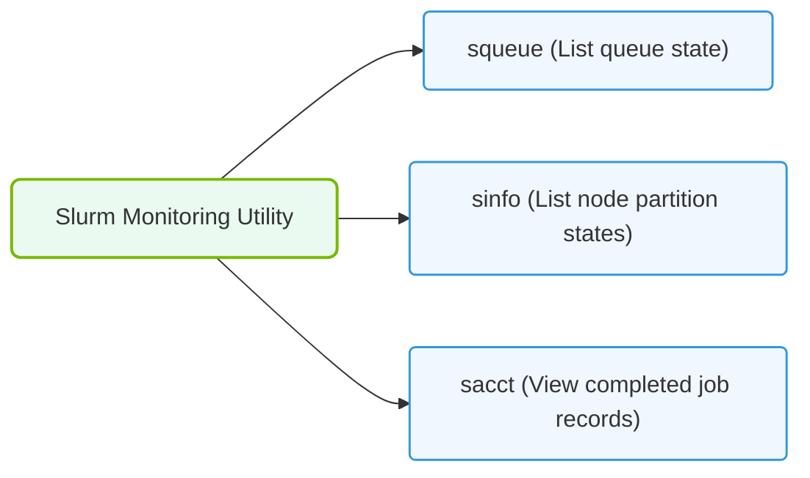

# 29.1e squeue, sinfo, scontrol show job: monitoring and diagnosing job states

#### 🏷️ The Cluster Orchestration — Managing the GPU Fleet at Scale > 29 Traditional HPC Schedulers — Slurm and Apptainer > 29.1 Slurm Workload Manager — Batch Scheduling for HPC Clusters

---

## 🧭 Context Introduction

When you submit a job to a Slurm cluster, it doesn't run immediately. It enters a queue, waits for resources, and then executes. As a new engineer working with AI infrastructure, you need to know how to check what your jobs are doing, what resources are available, and why a job might be stuck or failing.

Three essential Slurm commands give you this visibility: **squeue**, **sinfo**, and **scontrol show job**. Think of them as your dashboard for the cluster — they tell you the status of jobs, nodes, and detailed job configurations.

---

## ⚙️ squeue — Viewing Job Queue and Status

The **squeue** command is your primary tool for seeing all jobs currently in the system — whether they are running, waiting, or held.

**What it shows:**
- Job ID, partition, name, user, job state, and time limits
- Which nodes a job is running on (if active)
- The reason a job is waiting (e.g., resources, priority, dependencies)

**Key job states you will encounter:**

| State Code | Meaning | What It Tells You |
|------------|---------|-------------------|
| **R** | Running | Job is actively executing on allocated nodes |
| **PD** | Pending | Job is waiting for resources or priority |
| **CG** | Completing | Job finished but resources are being released |
| **CD** | Completed | Job finished successfully |
| **F** | Failed | Job ended with an error |
| **CA** | Cancelled | Job was manually cancelled by user or admin |
| **S** | Suspended | Job was paused (e.g., by preemption) |

**Common usage patterns:**
- View all jobs: **squeue**
- View only your jobs: **squeue -u your_username**
- View jobs in a specific partition: **squeue -p gpu_partition**
- View detailed information: **squeue -l** (long format)
- View jobs with specific states: **squeue -t PD** (only pending jobs)

**📤 Output example (inline):**
- **JOBID PARTITION NAME USER ST TIME NODES NODELIST(REASON)**
- **12345 gpu train_job alice R 1:23:45 2 gpu-node-[01-02]**
- **12346 gpu eval_job bob PD 0:00 1 (Resources)**

---

## 📊 sinfo — Checking Cluster and Partition Status

The **sinfo** command gives you a bird's-eye view of the entire cluster — what nodes exist, their state, and available resources.

**What it shows:**
- Partition names and their node counts
- Node states (idle, allocated, down, drained, etc.)
- Available resources per partition (CPUs, memory, GPUs)

**Key node states you will encounter:**

| State Code | Meaning | What It Tells You |
|------------|---------|-------------------|
| **idle** | Node is free and ready for jobs | Good — available for scheduling |
| **alloc** | Node is fully allocated to jobs | All resources in use |
| **mix** | Node is partially allocated | Some resources free, some in use |
| **down** | Node is unavailable (failure or maintenance) | Problem — jobs cannot use it |
| **drain** | Node is being drained (no new jobs) | Admin action — existing jobs finish, then node goes down |
| **drng** | Node is draining and currently allocated | Transition state |

**Common usage patterns:**
- View all partitions and nodes: **sinfo**
- View detailed node information: **sinfo -N -l**
- View only idle nodes: **sinfo -t idle**
- View specific partition: **sinfo -p gpu_partition**

**📤 Output example (inline):**
- **PARTITION AVAIL TIMELIMIT NODES STATE NODELIST**
- **gpu* up infinite 4 idle gpu-node-[01-04]**
- **cpu up infinite 2 alloc cpu-node-[01-02]**
- **debug up 1:00:00 1 mix debug-node-01**

---

### 📊 Visual Representation: Slurm Monitoring Command utility scope
This diagram groups essential Slurm diagnostic commands for viewing queue statuses, job steps, and node details.

## 🛠️ scontrol show job — Deep Diagnosis of a Specific Job

When a job is stuck in **PD** (pending) or has failed unexpectedly, **scontrol show job** is your diagnostic tool. It reveals the full configuration and history of a single job.

**What it shows:**
- Job ID, name, user, account, and partition
- Exact resource request (CPUs, GPUs, memory, nodes)
- Job state and substate (e.g., why it is pending)
- Time limits, priority, and QoS (Quality of Service)
- Dependencies on other jobs
- Work directory and command being run
- Exit code and reason for failure

**Common usage patterns:**
- View full job details: **scontrol show job 12345**
- View a specific field: **scontrol show job 12345 | grep JobState**

**📤 Output example (inline):**
- **JobId=12345 JobName=train_job**
- **UserId=alice(1001) GroupId=users(100)**
- **JobState=PENDING Reason=Dependency**
- **Partition=gpu Nodes=2 NumNodes=2**
- **NumCPUs=16 NumGPUs=4**
- **MinMemoryNode=32G**
- **TimeLimit=2:00:00**
- **WorkDir=/home/alice/projects**
- **Command=/home/alice/run_training.sh**

---

## 🕵️ Diagnosing Common Job Issues

Here is how to use these three commands together to troubleshoot problems:

**Scenario 1: Job is stuck in PD (Pending)**
1. Run **squeue -j JOBID** to see the reason column
2. If reason is **Resources**, run **sinfo -p PARTITION** to check if nodes are idle
3. If reason is **Priority**, check your job's priority with **scontrol show job JOBID** and look for **Priority=**
4. If reason is **Dependency**, use **scontrol show job JOBID** to see which job it depends on

**Scenario 2: Job failed unexpectedly**
1. Run **scontrol show job JOBID** and look for **ExitCode=**
2. Check **WorkDir=** and **Command=** to verify the script path
3. Look for **StdOut=** and **StdErr=** to find log files

**Scenario 3: Cluster seems slow or unresponsive**
1. Run **sinfo** to check if nodes are in **down** or **drain** state
2. Run **squeue** to see if there is a backlog of pending jobs
3. Check **sinfo -N -l** for detailed node health

---

## 🧰 Quick Reference Table

| Command | Purpose | When to Use |
|---------|---------|-------------|
| **squeue** | View job queue and states | Daily monitoring of your jobs |
| **sinfo** | View node and partition status | Checking cluster health and availability |
| **scontrol show job** | View detailed job configuration | Diagnosing stuck or failed jobs |

---

## ✅ Key Takeaways for New Engineers

- **squeue** is your first stop — see what is running and waiting
- **sinfo** tells you if the cluster has free resources
- **scontrol show job** gives you the full story on any single job
- Job states like **PD** (pending) and **F** (failed) are normal — use the reason field to understand why
- Always check **ExitCode** in **scontrol show job** output when a job fails
- Combine all three commands to build a complete picture of cluster activity

Remember: These commands are read-only — they cannot change anything. You can safely run them anytime to explore and learn without affecting running jobs.