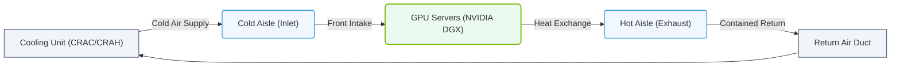

# 2.2b Hot-aisle / cold-aisle containment: the standard data center airflow model

#### 🏷️ The Physical Realm — Data Center Foundations & Hardware Architecture > 2 Data Center Facility Operations > 2.2 Thermal Management — Keeping Petaflops Cool

Welcome to the world of data center airflow! If you're new to AI infrastructure, you might wonder why we care so much about hot and cold air. The simple answer: **heat is the enemy of performance**. Modern AI servers (like NVIDIA DGX systems) can draw thousands of watts of power, and without proper cooling, they will throttle performance or fail entirely. Hot-aisle / cold-aisle containment is the industry-standard way to keep your hardware running smoothly.

---

## 🌡️ Context: Why Airflow Matters

Think of a data center as a giant computer room where every rack is a space heater. Without a smart airflow strategy, hot air from one server gets sucked into the intake of the next server, creating a cascade of overheating. The hot-aisle / cold-aisle model solves this by physically separating where cold air enters and hot air exits.

---

## ⚙️ The Basic Concept: Cold Aisle vs. Hot Aisle

In a standard data center layout, server racks are arranged in rows with alternating aisles:

- **Cold aisle**: The aisle where servers draw in cool air (front of the rack).
- **Hot aisle**: The aisle where servers exhaust hot air (rear of the rack).

Servers are mounted with their **fronts facing the cold aisle** and their **rears facing the hot aisle**. This creates a predictable airflow path:

- **Cold air** → enters server fronts → cools components → **hot air** → exits server rears → into hot aisle → returns to cooling system.

---

## 🛠️ Containment Strategies

To maximize efficiency, engineers use physical barriers to prevent hot and cold air from mixing. Here are the three common approaches:

| Containment Type | What It Does | Best For |
|------------------|--------------|----------|
| **Cold-aisle containment** | Encloses the cold aisle with doors and ceiling panels. Cold air is trapped and pressurized, forcing it into server intakes. | High-density AI clusters where precise cooling is critical. |
| **Hot-aisle containment** | Encloses the hot aisle. Hot air is captured and ducted directly back to the cooling system (CRAC/CRAH units). | Facilities with raised floors or overhead cooling. |
| **Partial containment** | Uses curtains or panels to reduce mixing without full enclosure. | Lower-density environments or retrofit projects. |

---

## 🕵️ How It Works in Practice

Here’s a step-by-step walkthrough of the airflow cycle in a contained hot-aisle setup:

1. **Cooling unit** (CRAC or CRAH) pushes cold air into the raised floor plenum or overhead ductwork.
2. **Cold air** exits through perforated floor tiles or vents in the cold aisle.
3. **Server fans** pull cold air through the front of each server.
4. **Heat exchange** occurs inside the server (GPU, CPU, memory, etc.).
5. **Hot exhaust air** exits the rear of the server into the hot aisle.
6. **Containment** (walls, doors, or curtains) traps the hot air.
7. **Return ducts** carry the hot air back to the cooling unit for re-cooling.

The result: **no mixing of hot and cold air**, which means the cooling system works less hard and your AI hardware stays at safe temperatures.

### 📊 Visual Representation: Hot-Aisle/Cold-Aisle Airflow Containment Cycle
This diagram displays the closed-loop airflow path in a data center, separating cold intake air from hot exhaust air to optimize server cooling.

---

## 📊 Key Metrics for Engineers

When evaluating your airflow setup, watch these numbers:

- **Supply air temperature**: The temperature of cold air entering the cold aisle (typically 18–22°C / 64–72°F).
- **Return air temperature**: The temperature of hot air leaving the hot aisle (typically 27–32°C / 80–90°F).
- **Delta T**: The difference between return and supply temperatures. A larger delta T means more efficient heat removal.
- **Rack inlet temperature**: Measure at the front of each server. Should stay below 25°C (77°F) for most AI hardware.
- **Pressure differential**: In contained cold aisles, a slight positive pressure (0.05–0.10 inches of water) ensures cold air flows into servers, not out into the room.

---

## 🧰 Common Pitfalls for New Engineers

- **Blocked perforated tiles**: Cables or equipment placed over floor tiles reduce cold air delivery.
- **Leaky containment**: Gaps in doors or panels allow hot air to recirculate into the cold aisle.
- **Overhead obstructions**: Cable trays or lighting fixtures blocking airflow paths.
- **Mismatched fan speeds**: Some servers have variable-speed fans that can disrupt pressure balance.
- **Ignoring humidity**: Low humidity causes static discharge; high humidity causes condensation. Target 40–60% relative humidity.

---

## ✅ Quick Checklist for Your First Data Center Walkthrough

- [ ] Identify which aisles are cold (fronts of racks) and which are hot (rears).
- [ ] Check for containment doors or curtains — are they closed properly?
- [ ] Feel the temperature at the front of a server (should be cool).
- [ ] Feel the temperature at the rear of a server (should be warm/hot).
- [ ] Look for gaps in containment panels or under racks.
- [ ] Verify that perforated floor tiles are unobstructed.
- [ ] Ask the facility team: "What is our supply air temperature setpoint?"

---

## 🔁 Summary

Hot-aisle / cold-aisle containment is the foundation of efficient data center cooling. By physically separating intake and exhaust air, you ensure that your AI servers get the cool air they need and that hot air is efficiently returned to the cooling system. As you grow in your role, you'll learn to tune these systems for maximum performance — but for now, understanding this basic airflow model is your first step toward keeping petaflops cool.