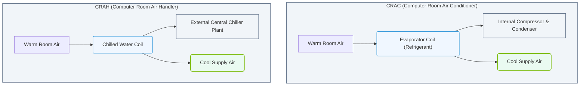

# 2.2c Computer Room Air Conditioners (CRACs) and Air Handlers (CRAHs)

#### 🏷️ The Physical Realm — Data Center Foundations & Hardware Architecture > 2 Data Center Facility Operations > 2.2 Thermal Management — Keeping Petaflops Cool

Welcome to the world of data center cooling! As a new engineer exploring AI infrastructure, you'll quickly learn that keeping powerful GPUs and servers cool is just as important as the software running on them. This section introduces two fundamental cooling devices: **CRACs** and **CRAHs**. Think of them as the HVAC systems of the data center, but designed specifically for the high-density heat loads of modern AI clusters.

---

## 🌡️ Context: Why Cooling Matters for AI

AI workloads, especially training large language models or running inference on NVIDIA GPUs, generate enormous amounts of heat. Without proper thermal management, components throttle performance or fail. CRACs and CRAHs are the workhorses that remove this heat, ensuring your infrastructure stays within safe operating temperatures (typically 18°C to 27°C / 64°F to 80°F).

---

## ⚙️ What is a CRAC (Computer Room Air Conditioner)?

A **CRAC** is a self-contained cooling unit that actively conditions the air. It has its own refrigeration cycle (compressor, condenser, evaporator) to cool and dehumidify the air.

- **How it works:** Draws warm air from the data center, passes it over cold coils filled with refrigerant, then blows the cooled air back into the room.
- **Key feature:** Controls both temperature and humidity precisely.
- **Typical placement:** Along the perimeter of the data center or inside the room.
- **Best for:** Smaller data centers or zones where precise humidity control is critical.

---

## 🔄 What is a CRAH (Computer Room Air Handler)?

A **CRAH** is a simpler unit that uses chilled water from a central chiller plant to cool the air. It does not have its own compressor.

- **How it works:** Warm air passes over coils filled with chilled water (supplied from an external chiller). Fans blow the cooled air back into the room.
- **Key feature:** More energy-efficient than CRACs because the heavy lifting (cooling the water) is done by a central plant.
- **Typical placement:** Often used in large-scale data centers with a centralized cooling infrastructure.
- **Best for:** Large facilities where efficiency and scalability are priorities.

---

## 📊 CRAC vs. CRAH: Quick Comparison

| Feature | CRAC | CRAH |
|---------|------|------|
| **Cooling source** | Internal refrigerant (compressor) | External chilled water |
| **Humidity control** | Built-in (dehumidification) | Requires separate system |
| **Energy efficiency** | Lower (compressor runs constantly) | Higher (uses central chiller) |
| **Maintenance complexity** | Higher (refrigerant system) | Lower (simpler mechanics) |
| **Typical use case** | Small/medium rooms, legacy sites | Large-scale, modern data centers |
| **Cost** | Higher upfront, higher operating | Lower upfront, lower operating |

### 📊 Visual Representation: CRAC vs. CRAH Cooling Mechanisms
This diagram contrasts the internal refrigeration cycle of a CRAC unit with the chilled water loop mechanism of a CRAH unit.

---

## 🛠️ How They Work Together in a Data Center

In a typical AI data center, you'll see a combination of these units working with **hot aisle / cold aisle containment**:

- **Cold aisle:** CRACs or CRAHs supply cool air through perforated floor tiles or overhead ducts.
- **Hot aisle:** Warm exhaust from servers is drawn back into the cooling units.
- **Airflow path:** Servers → hot aisle → cooling unit → cold aisle → servers (closed loop).

**Key principle:** The goal is to keep cold air separate from hot air to maximize cooling efficiency.

---

## 🕵️ Common Monitoring Metrics for Engineers

When operating AI infrastructure, you'll monitor these CRAC/CRAH parameters:

- **Supply air temperature:** The temperature of air leaving the unit (target: 18-22°C).
- **Return air temperature:** The temperature of warm air entering the unit (target: 25-32°C).
- **Humidity levels:** Relative humidity should stay between 40-60% to prevent static discharge.
- **Fan speed:** Variable speed fans adjust based on cooling demand.
- **Chilled water supply/return temperature** (for CRAHs): Typically 7°C supply, 12°C return.

---

## ✅ Simple Rules for New Engineers

- **Never block airflow:** Keep floor tiles clear and ensure no cables obstruct vents.
- **Watch for hot spots:** If a GPU rack is running hot, check if nearby CRAC/CRAH is functioning.
- **Understand redundancy:** Data centers often use N+1 cooling (one extra unit for backup).
- **Report anomalies:** If a unit shows high return air temperature or unusual noise, escalate immediately.

---

## 📝 Final Thought

CRACs and CRAHs are the unsung heroes of AI infrastructure. While you'll spend most of your time on software and networking, knowing how these cooling systems work will help you troubleshoot performance issues and understand why certain racks run hotter than others. Remember: **cool air = happy GPUs = faster AI training.**