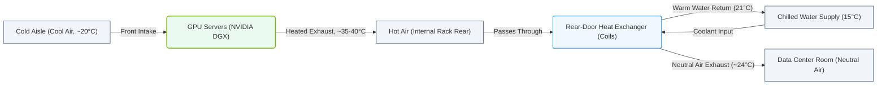

# 2.2h Rear-door heat exchangers as a transitional solution

#### 🏷️ The Physical Realm — Data Center Foundations & Hardware Architecture > 2 Data Center Facility Operations > 2.2 Thermal Management — Keeping Petaflops Cool

---

## 🌡️ Context Introduction

As AI workloads grow, traditional data center cooling methods (like raised-floor air cooling) often struggle to keep up with the heat generated by high-density GPU servers. **Rear-door heat exchangers (RDHx)** offer a practical, cost-effective *transitional solution* — bridging the gap between conventional air cooling and more advanced liquid cooling systems. For new engineers, think of RDHx as an upgrade that fits onto existing server racks, capturing hot exhaust air before it mixes with the room environment.

---

## ⚙️ What Is a Rear-Door Heat Exchanger?

A **rear-door heat exchanger** is a cooling device mounted on the back of a server rack. It uses chilled water (or another coolant) circulating through coils to absorb heat directly from the hot air exiting the servers.

- **How it works:** Hot air from servers passes through the RDHx coils → heat transfers to the coolant → cooled air exits into the room or returns to the HVAC system.
- **Key advantage:** No major changes to existing server racks or room layout — it simply replaces the standard rear door of the rack.
- **Typical coolant temperature:** 60–70°F (15–21°C), which avoids condensation risks.

---

## 🛠️ Why Use RDHx as a Transitional Solution?

RDHx is ideal when engineers need to:
- **Increase cooling capacity** without overhauling the entire facility.
- **Support higher-density racks** (e.g., 20–40 kW per rack) where traditional air cooling falls short.
- **Prepare for future liquid cooling** while maintaining existing air-cooled infrastructure.
- **Reduce energy costs** by lowering fan speeds and improving heat rejection efficiency.

### 📊 Visual Representation: Rear-Door Heat Exchanger Air and Water Flow
This diagram shows how hot server exhaust is cooled to room temperature as it passes through the rear-door heat exchanger coils fed by chilled water.

---

## 📊 Comparison: RDHx vs. Traditional Air Cooling vs. Direct Liquid Cooling

| Feature | Traditional Air Cooling | Rear-Door Heat Exchanger (RDHx) | Direct Liquid Cooling |
|---------|------------------------|----------------------------------|------------------------|
| **Cooling capacity per rack** | Up to ~15 kW | 20–40 kW | 50+ kW |
| **Installation complexity** | Low (existing infrastructure) | Medium (requires water piping) | High (plumbing to each server) |
| **Impact on existing racks** | None | Minimal (replace rear door) | Significant (server modifications) |
| **Energy efficiency** | Moderate | High (reduces fan energy) | Very high |
| **Transition readiness** | N/A | Excellent (stepping stone) | Full liquid cooling |

---

## 🕵️ How Engineers Implement RDHx

When deploying RDHx, engineers follow these practical steps:

1. **Assess rack density** — Identify racks exceeding 15 kW where traditional cooling is insufficient.
2. **Check water supply** — Ensure chilled water lines are available near the rack row (or plan to run new piping).
3. **Select compatible racks** — Most standard 19-inch racks accept RDHx units, but verify dimensions and weight limits.
4. **Install the unit** — Replace the existing rear door with the RDHx, connect water supply and return lines.
5. **Monitor performance** — Use temperature sensors to verify that exhaust air is cooled to 75–85°F (24–29°C) before re-entering the room.

---

## 🔧 Operational Considerations

- **Water quality:** Use treated water to prevent corrosion or scaling in the coils.
- **Condensation control:** Maintain coolant temperature above the room's dew point (typically 60°F / 15°C minimum).
- **Redundancy:** Plan for pump or valve failures — consider dual-loop configurations.
- **Airflow management:** Ensure no obstructions block the rear door (e.g., cables, floor tiles).

---

## ✅ Summary for New Engineers

- **RDHx is a retrofit solution** — it upgrades existing racks without replacing them.
- **It handles medium-density heat loads** (20–40 kW per rack) — a sweet spot for many AI clusters today.
- **It prepares your facility for future liquid cooling** by introducing water-based heat rejection at the rack level.
- **It reduces overall cooling energy** by capturing heat at the source, lowering HVAC fan and chiller loads.

> **Key takeaway:** Rear-door heat exchangers are a smart, low-risk step toward modernizing data center cooling — perfect for engineers looking to boost capacity while planning for more advanced liquid cooling systems down the road.