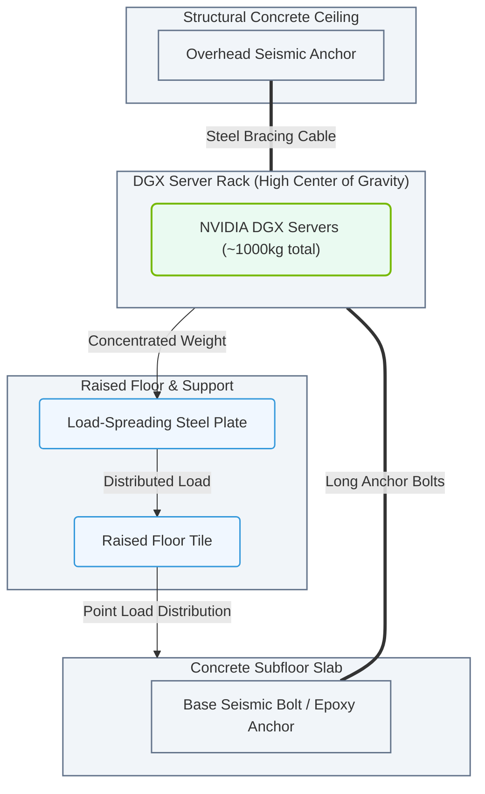

# 2.3b Weight distribution: floor loading limits and seismic bracing for DGX systems

#### 🏷️ The Physical Realm — Data Center Foundations & Hardware Architecture > 2 Data Center Facility Operations > 2.3 Physical Data Center Architecture

---

## 🧭 Context Introduction

When you install an NVIDIA DGX system in a data center, you are placing a very dense, heavy piece of equipment on a raised floor. Unlike a standard server rack, a fully loaded DGX A100 or DGX H100 system can weigh hundreds of kilograms. If the floor cannot support that weight, or if the system is not properly secured against earthquakes, you risk catastrophic structural failure, equipment damage, and safety hazards.

This section covers two critical physical safety considerations: **floor loading limits** (how much weight the floor can hold) and **seismic bracing** (how to keep the system stable during an earthquake). Understanding these concepts helps you plan the physical layout of your data center and ensure compliance with building codes.

---

## ⚙️ Floor Loading Limits — What They Are and Why They Matter

Floor loading limits define the maximum weight a data center floor can safely support. These limits are set by structural engineers and are based on the building's design, materials, and intended use.

### 📊 Key Concepts

- **Dead Load**: The weight of the floor structure itself (concrete, steel, tiles, etc.). This is constant.
- **Live Load**: The weight of everything placed on the floor (servers, racks, people, cooling equipment). This changes over time.
- **Point Load**: Weight concentrated on a small area (e.g., the feet of a server rack). This is more dangerous than distributed weight.
- **Uniform Distributed Load (UDL)**: Weight spread evenly across a large area (e.g., a concrete slab under a raised floor).

### 🛠️ How DGX Systems Affect Floor Loading

A single DGX A100 system (fully loaded with GPUs, networking, and power supplies) can weigh approximately **140–180 kg (310–400 lbs)**. A full rack of DGX systems can easily exceed **1,000 kg (2,200 lbs)**. This weight is concentrated on the rack's four feet, creating high point loads.

**Typical data center raised floor ratings:**
- Standard office floor: **2.4 kN/m² (50 lb/ft²)** — not suitable for DGX racks.
- Typical data center raised floor: **7.2–12 kN/m² (150–250 lb/ft²)** — acceptable for most DGX deployments.
- High-density data center floor: **12+ kN/m² (250+ lb/ft²)** — required for fully loaded DGX racks.

### 📋 Comparison Table: Floor Loading Scenarios

| Scenario | Floor Rating | DGX Rack Weight | Safe? | Notes |
|----------|--------------|-----------------|-------|-------|
| Office floor | 2.4 kN/m² (50 lb/ft²) | 1,000 kg | ❌ No | Risk of floor collapse |
| Standard data center | 7.2 kN/m² (150 lb/ft²) | 1,000 kg | ✅ Yes | Distribute weight with load-spreading plates |
| High-density zone | 12 kN/m² (250 lb/ft²) | 1,500 kg | ✅ Yes | No additional reinforcement needed |
| Older raised floor | 4.8 kN/m² (100 lb/ft²) | 1,000 kg | ⚠️ Conditional | Requires structural assessment and load-spreading |

### 🕵️ How to Verify Floor Loading Limits

1. **Check the building's structural drawings** — look for the "live load" rating in kN/m² or lb/ft².
2. **Contact the facility manager** — they should have the original load test reports.
3. **Perform a point load calculation** — divide the total weight of the DGX rack by the area of its feet. If the result exceeds the floor's point load rating, you need load-spreading plates.
4. **Use load-spreading plates** — these are steel or aluminum plates placed under the rack's feet to distribute weight over a larger area.

**Example calculation (inline):**
- DGX rack weight: **1,200 kg (2,646 lbs)**
- Rack foot area (four feet): **0.04 m² (0.43 ft²)**
- Point load: **1,200 kg / 0.04 m² = 30,000 kg/m² (6,150 lb/ft²)**
- Floor rating: **12 kN/m² (250 lb/ft²)**
- **Result: Point load exceeds floor rating by 24x. Load-spreading plates are required.**

---

## 🏗️ Seismic Bracing — Keeping DGX Systems Stable During Earthquakes

Seismic bracing is the system of brackets, anchors, and restraints that prevent heavy equipment from tipping over or sliding during an earthquake. DGX systems are particularly vulnerable because of their high center of gravity and dense weight.

### 🌍 Why Seismic Bracing Matters

- **Safety**: A toppling DGX rack can injure personnel or block emergency exits.
- **Equipment protection**: A falling rack can destroy the DGX system and surrounding equipment.
- **Operational continuity**: Even a minor shift can disconnect power or networking cables, causing downtime.
- **Compliance**: Most building codes (e.g., IBC, ASCE 7) require seismic bracing for equipment over a certain weight threshold.

### 🛠️ Seismic Bracing Components

- **Overhead bracing**: Steel cables or struts connecting the top of the rack to the building structure.
- **Base anchors**: Bolts securing the rack's feet to the raised floor or concrete slab.
- **Side restraints**: Brackets that prevent lateral movement.
- **Snubbers**: Devices that limit horizontal displacement during shaking.

### 📊 Seismic Zone Requirements (Simplified)

| Seismic Zone | Typical Location | Bracing Requirement | DGX Rack Action |
|--------------|------------------|---------------------|-----------------|
| Zone 0 (Low) | Central US, parts of Europe | Minimal | Base anchors only |
| Zone 1 (Moderate) | East Coast US, UK | Standard | Base anchors + overhead bracing |
| Zone 2 (High) | West Coast US, Japan | Full | Base anchors + overhead bracing + side restraints |
| Zone 3 (Very High) | California, Chile, Indonesia | Maximum | Full system + seismic isolation platform |

### 📊 Visual Representation: Seismic Bracing and Floor Load Distribution
This diagram shows the structural safety architecture for securing a heavy DGX server rack, combining overhead cable bracing with load-spreading floor plates and concrete slab anchors.

### 🕵️ How to Implement Seismic Bracing for DGX Systems

1. **Identify the seismic zone** of your data center location using local building codes.
2. **Calculate the required bracing force** based on the DGX rack weight and seismic acceleration factor (typically 0.5g to 1.0g).
3. **Install base anchors** — use expansion bolts or epoxy anchors into the concrete slab (not just the raised floor tiles).
4. **Attach overhead bracing** — connect the rack's top frame to the building's structural steel or concrete ceiling using rated cables and turnbuckles.
5. **Add side restraints** — install brackets on the rack's sides that connect to adjacent racks or structural columns.
6. **Test the system** — after installation, perform a pull test to verify the bracing can withstand the required force.

**Example bracing force calculation (inline):**
- DGX rack weight: **1,200 kg**
- Seismic acceleration factor: **0.7g (7.0 m/s²)**
- Required bracing force: **1,200 kg × 7.0 m/s² = 8,400 N (1,888 lbf)**
- **Each overhead cable must be rated for at least 8,400 N.**

---

## ✅ Best Practices for New Engineers

- **Always verify floor loading limits before placing any DGX system.** Never assume the floor can handle the weight.
- **Use load-spreading plates** for any rack that exceeds 75% of the floor's point load rating.
- **Install seismic bracing in all zones** — even low-seismic areas can experience minor tremors that cause equipment shifts.
- **Document all bracing installations** with photos and load test results for compliance audits.
- **Coordinate with the facility team** — they know the building's structural limits and can help with anchor placement.
- **Plan for future expansion** — leave room for additional bracing if you add more DGX systems later.

---

## 📚 Summary

| Topic | Key Takeaway |
|-------|--------------|
| Floor loading limits | Always check the live load rating. Use load-spreading plates if point loads exceed the floor's capacity. |
| Seismic bracing | Required by code in most regions. Use base anchors, overhead bracing, and side restraints. |
| DGX system weight | A fully loaded DGX rack can exceed 1,000 kg. Treat it as a concentrated point load. |
| Safety first | A falling DGX system can cause serious injury or death. Never skip bracing. |

---

**Next step:** Before installing a DGX system, obtain the building's structural drawings and seismic zone classification. Then calculate the required floor loading and barding forces using the methods above.