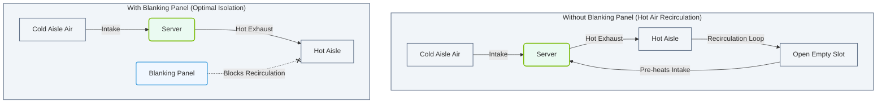

# 2.3e Overhead cable trays, blanking panels, and airflow management best practices

#### 🏷️ The Physical Realm — Data Center Foundations & Hardware Architecture > 2 Data Center Facility Operations > 2.3 Physical Data Center Architecture

Welcome to the physical layer of AI infrastructure. As a new engineer, you might think that once servers are racked and cables are plugged, the job is done. But in reality, how you manage **cables**, **air**, and **space** inside a data center directly impacts system reliability, cooling efficiency, and overall performance. This section covers three foundational physical practices that keep your AI infrastructure running smoothly.

---

## 🔍 Context: Why these details matter

AI workloads generate massive heat and require dense cabling (think hundreds of high-speed links between GPUs). Without proper physical management:
- **Overhead cable trays** prevent tangled, dangerous cable messes.
- **Blanking panels** stop hot air from recirculating into cold aisles.
- **Airflow management** ensures cooling reaches every GPU, not just the front row.

These are not "nice-to-haves" — they are **operational necessities** for uptime and energy efficiency.

---

## 🧱 Overhead Cable Trays

### What they are
Overhead cable trays are metal or fiberglass structures mounted above server racks. They carry power cables, network cables, and fiber optics from one rack to another — keeping them off the floor and out of airflow paths.

### Best practices for new engineers

- **Use separate trays for power and data** — this reduces electromagnetic interference (EMI) and simplifies troubleshooting.
- **Leave slack loops** — cables need room to move when you swap hardware. A service loop of 1–2 meters per cable is standard.
- **Bundle cables gently** — use Velcro straps, not zip ties. Zip ties can crush fiber optics and damage copper cables over time.
- **Label both ends** — every cable should have a unique ID at the tray entry point and at the device port. This saves hours during maintenance.
- **Keep weight limits in mind** — a fully loaded tray can sag or detach. Check manufacturer load ratings before adding cables.

### Common mistake to avoid
❌ Running cables directly over server exhaust vents. This blocks hot air and can melt cable jackets over time.

---

## 🧩 Blanking Panels

### What they are
Blanking panels are simple metal or plastic plates that fill empty 1U or 2U spaces in a server rack. They look minor, but they are **critical for airflow**.

### Why they matter
Without blanking panels, hot exhaust air from the rear of a server can loop back into the front intake of the rack above or below. This "hot air recirculation" forces cooling systems to work harder — and can cause GPU throttling or failure.

### Best practices

- **Install blanking panels in every empty slot** — even a single missing panel can raise intake temperatures by 5–10°C.
- **Use brush-style panels for cable pass-throughs** — these allow cables to exit while still blocking most airflow.
- **Check panels during every hardware change** — when you remove a server, immediately replace it with a blanking panel.
- **Match panel material to your environment** — plastic is fine for low-heat zones; metal is better near high-power GPUs.

### Comparison: With vs. Without Blanking Panels

| Aspect | Without Blanking Panels | With Blanking Panels |
|--------|------------------------|----------------------|
| Hot air recirculation | High — air loops back into intakes | Low — air stays in exhaust path |
| Cooling efficiency | Reduced by 15–30% | Optimal |
| GPU/CPU temperature | Can spike 5–10°C above baseline | Stable within design range |
| Energy cost | Higher (more fan/cooling power) | Lower |
| Hardware lifespan | Shortened due to thermal stress | Extended |

### 📊 Visual Representation: Airflow Recirculation with and without Blanking Panels
This diagram contrasts the thermal recirculation path created by an empty rack slot with the clean, isolated airflow provided by installing a blanking panel.

---

## 🌬️ Airflow Management Best Practices

### The goal
Create a clear, predictable path for cold air to enter server intakes and hot air to exit through exhausts — without mixing.

### Key concepts for new engineers

- **Hot aisle / cold aisle layout** — racks face each other with intakes on one side (cold aisle) and exhausts on the other (hot aisle). This is the standard for modern data centers.
- **Containment** — physical barriers (doors, curtains, or panels) that seal the hot or cold aisle. This prevents air mixing and improves cooling efficiency by 20–40%.
- **Underfloor vs. overhead cooling** — most AI racks use overhead cooling (CRAC units blow cold air from above) because underfloor systems struggle with high-density GPU racks.

### Best practices checklist

- ✅ **Seal all cable openings** — any hole in the floor, ceiling, or rack wall is a path for hot air to escape into the cold aisle. Use grommets or firestop putty.
- ✅ **Monitor intake temperatures** — keep front-of-rack intake temps below 27°C (80°F) for most NVIDIA GPUs. Use a simple handheld thermometer or rack-mounted sensors.
- ✅ **Avoid "short-circuit" airflow** — never place a server directly above or below another server without a blanking panel between them.
- ✅ **Balance fan speeds** — in a mixed rack (different server models), set all fans to a common speed profile to avoid pressure imbalances.
- ✅ **Use perforated tiles strategically** — in raised-floor setups, place perforated tiles only in cold aisles, and only where servers actually need airflow.

### A simple rule of thumb
> **Cold air in the front, hot air out the back, and nothing in between.**

---

## 🛠️ Practical tips for your first day on the job

1. **Walk the aisles** — before touching anything, look at how cables are routed and where blanking panels are missing. Take photos.
2. **Carry Velcro straps and blanking panels** — you will always find a missing panel or a loose cable bundle.
3. **Use a thermal camera (or phone attachment)** — it instantly shows you where hot air is leaking into cold aisles.
4. **Never block a server's front intake** — even a single loose cable draped over a fan grill can cause overheating.
5. **Document everything** — take notes on cable tray loads, panel locations, and airflow patterns. This becomes your reference for future changes.

---

## 📊 Quick Reference Table: Common Airflow Problems & Fixes

| Problem | Symptom | Fix |
|---------|---------|-----|
| Missing blanking panel | Hot spot at top of rack | Install blanking panel |
| Cable bundle blocking exhaust | GPU fan running at 100% | Reroute cables via overhead tray |
| Open floor grommet | Cold aisle temperature rises | Seal with firestop putty |
| Mixed hot/cold aisle layout | Inconsistent server temps | Reorient racks to standard layout |
| Overloaded cable tray | Tray sagging, cables pinched | Distribute load or add support brackets |

---

## ✅ Final takeaway for new engineers

Overhead cable trays, blanking panels, and airflow management are the **plumbing and insulation** of the AI data center. They are invisible when done right — and catastrophic when done wrong. Start by observing, then practice on a single rack. You will quickly see the difference in temperature readings and system stability.

Remember: **Every cable has a path, every slot has a panel, and every rack has a clear airflow direction.** Master these three, and you have mastered the physical foundation of AI infrastructure operations.