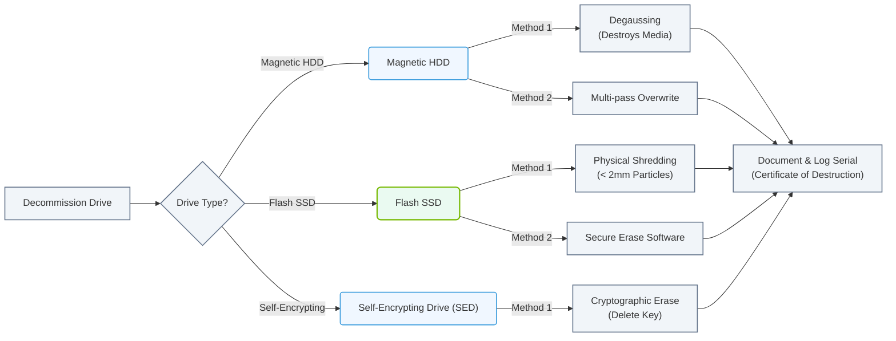

# 2.4c Secure hardware decommissioning and drive destruction standards

#### 🏷️ The Physical Realm — Data Center Foundations & Hardware Architecture > 2 Data Center Facility Operations > 2.4 Physical Security & Access Control

---

## 🔍 Context Introduction

When hardware reaches the end of its life in an AI data center, simply throwing it away is not an option. Drives and servers contain sensitive data—trained models, customer information, proprietary algorithms—that must never be recoverable. Secure decommissioning ensures that no data survives the disposal process. This topic covers the standards and methods engineers use to safely retire hardware, from verification to physical destruction.

---

## ⚙️ Why Secure Decommissioning Matters

- **Data Liability** — Even deleted files can be recovered with forensic tools. Residual magnetic data on drives poses a compliance risk.
- **Regulatory Compliance** — Standards like NIST SP 800-88, GDPR, HIPAA, and PCI-DSS mandate specific destruction methods.
- **Environmental Responsibility** — Proper decommissioning includes recycling materials (metals, plastics) after data is destroyed.
- **Audit Trail** — Every decommissioned asset must have a documented chain of custody to prove data was destroyed.

---

## 🛠️ Key Decommissioning Steps

1. **Asset Identification** — Locate and tag all hardware slated for decommissioning (servers, storage arrays, SSDs, HDDs, tapes).
2. **Data Sanitization** — Choose a method based on drive type and sensitivity:
   - **Overwriting** — Write patterns (zeros, random data) over the entire drive multiple times.
   - **Degaussing** — Expose magnetic media to a strong magnetic field to erase data (destroys HDDs, not SSDs).
   - **Cryptographic Erase** — For self-encrypting drives (SEDs), delete the encryption key, making data inaccessible.
   - **Physical Destruction** — Shredding, crushing, or incineration renders the drive unusable.
3. **Verification** — Confirm data is unrecoverable using tools or inspection.
4. **Documentation** — Log serial numbers, destruction method, date, and witness signatures.

---

## 📊 Comparison of Destruction Methods

| Method | Best For | Reusability | Security Level | Notes |
|--------|----------|-------------|----------------|-------|
| **Overwriting** | HDDs, SSDs (if supported) | Drive can be reused | Moderate | Requires multiple passes; time-consuming |
| **Degaussing** | HDDs, magnetic tape | Drive destroyed | High | Does not work on SSDs or flash media |
| **Cryptographic Erase** | Self-encrypting drives | Drive can be reused | High | Fast; key must be securely deleted |
| **Physical Shredding** | All drive types | Drive destroyed | Very High | Common for SSDs; particles must be < 2mm |
| **Incineration** | All drive types | Drive destroyed | Very High | Used for top-secret data; requires specialized facility |

### 📊 Visual Representation: Drive Sanitization Decision Logic
This flowchart displays the technical routing decision for choosing an appropriate sanitization or physical destruction method based on the drive technology.



---

## 🕵️ Verification and Certification

After destruction, engineers must verify that data is unrecoverable. Common verification methods include:

- **Visual Inspection** — Confirm drive platters are shattered or shredded into small pieces.
- **Software Validation** — Use tools to scan for readable sectors on overwritten drives.
- **Third-Party Certification** — Some organizations require a certificate of destruction from a certified vendor.

**Example verification process for a shredded HDD:**
- Inspect that platter fragments are less than 2mm in size.
- Document the destruction with photos and serial numbers.
- Obtain a signed certificate from the destruction vendor.

---

## 📋 Documentation and Audit Trail

Every decommissioning event must be recorded. A typical log entry includes:

- Asset serial number and model
- Date and time of destruction
- Method used (e.g., shredding, degaussing)
- Name and signature of the engineer performing destruction
- Name and signature of a witness
- Final disposition (e.g., recycled, disposed as e-waste)

This log is critical for compliance audits and proving that data was properly destroyed.

---

## 🧰 Common Tools and Equipment

- **Degaussers** — Industrial magnetic erasers for HDDs and tapes.
- **Hard Drive Shredders** — Machines that physically crush or shred drives into small pieces.
- **Secure Erase Software** — Tools that perform multi-pass overwrites (e.g., **nwipe**, **DBAN**).
- **Cryptographic Erase Utilities** — Built into some enterprise drives (e.g., **hdparm** for SEDs).

**For reference:**
```
nwipe --method=zero --verify=on /dev/sda
```
📤 Output: **Wipe completed successfully. Verification passed — no readable sectors found.**

---

## ✅ Best Practices for New Engineers

- **Never assume a drive is blank** — Always sanitize or destroy, even if the drive appears empty.
- **Separate SSDs from HDDs** — SSDs require different destruction methods (shredding or cryptographic erase).
- **Use a chain of custody form** — Track hardware from removal to destruction.
- **Follow your organization's policy** — Many companies have a **Data Sanitization Policy** that specifies approved methods.
- **When in doubt, destroy physically** — Shredding is the most reliable method for all drive types.

---

## 🔐 Final Takeaway

Secure hardware decommissioning is not optional—it is a fundamental part of data center operations. Engineers must understand the different destruction standards, choose the right method for each drive type, and document every step. By following these practices, you protect sensitive data, meet compliance requirements, and ensure that retired hardware poses zero risk to your organization.