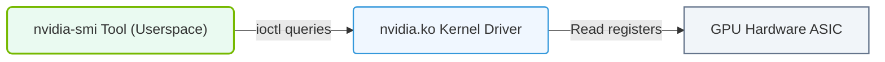

# 30.1a nvidia-smi basic output: reading driver version, CUDA version, GPU list

#### 🏷️ The Virtualization and Cloud — Extending AI Infrastructure Beyond Bare Metal > 30 GPU Diagnostics and nvidia-smi Mastery > 30.1 nvidia-smi — The Primary GPU Management Tool

---

## 🧠 Context Introduction

When you start working with AI infrastructure, the very first tool you'll encounter is **nvidia-smi** (NVIDIA System Management Interface). Think of it as the "health dashboard" for your NVIDIA GPUs. For new engineers, understanding its basic output is like learning to read the vital signs of your AI compute hardware. This section will walk you through the three most critical pieces of information you can get from a simple nvidia-smi command: the **driver version**, the **CUDA version**, and the **list of GPUs** installed on your system.

---

## ⚙️ What is nvidia-smi?

nvidia-smi is a command-line utility that comes bundled with NVIDIA GPU drivers. It provides:
- Real-time monitoring of GPU status
- Information about driver and CUDA toolkit compatibility
- Details about each GPU (memory usage, temperature, processes running)

For engineers, this is the first place to check when something goes wrong with GPU workloads.

---

## 📊 Reading the Basic Output

When you run the basic nvidia-smi command (without any special flags), you'll see a table-like output. Here's how to read the three key sections:

### 🕵️ Driver Version
- Located at the **top of the output**, usually on the right side
- Example format: **Driver Version: 535.154.05**
- **Why it matters**: The driver version determines which CUDA toolkit versions are compatible. Older drivers may not support newer CUDA features.

### 🕵️ CUDA Version
- Found right next to the driver version, typically labeled as **CUDA Version: 12.2**
- This is the **maximum CUDA toolkit version** your driver supports
- **Important note**: This is NOT the version of CUDA you have installed — it's the compatibility ceiling. You can install older CUDA versions and they will work, but you cannot use a CUDA version higher than this number.

### 🕵️ GPU List
- Below the header, you'll see a table with each GPU listed
- Each GPU row includes:
  - **GPU Index** (e.g., 0, 1, 2...)
  - **GPU Name** (e.g., NVIDIA A100, RTX 4090)
  - **Persistence Mode** (usually On or Off)
  - **Bus-ID** (PCIe location)
  - **Memory Usage** (Total, Used, Free)
  - **GPU-Util** (percentage of compute usage)
  - **Temperature** (in Celsius)

---

### 📊 Visual Representation: nvidia-smi Host Driver Query path
This diagram displays how the nvidia-smi tool queries telemetry from kernel space driver files (/dev/nvhost) to present hardware statuses.

## 🛠️ Comparison Table: Key Output Fields

| Field | What It Tells You | Why Engineers Care |
|-------|-------------------|-------------------|
| **Driver Version** | The NVIDIA driver release number | Determines OS compatibility and CUDA support ceiling |
| **CUDA Version** | Max CUDA toolkit version supported | Prevents you from installing incompatible CUDA versions |
| **GPU Name** | Model of the GPU (e.g., A100, H100) | Identifies hardware capabilities (memory, compute power) |
| **GPU Index** | Numeric identifier (0, 1, 2...) | Used to target specific GPUs in commands and scripts |
| **Memory Usage** | How much GPU memory is used vs free | Critical for workload sizing — running out of memory crashes jobs |
| **GPU-Util** | Percentage of compute capacity used | Helps identify if a GPU is idle or overloaded |

---

## 🔍 Practical Interpretation for New Engineers

When you first look at nvidia-smi output, here's what to check:

- **Is the driver version recent?** Newer drivers often have better performance and security fixes.
- **Is the CUDA version high enough for your workload?** If your AI framework requires CUDA 12.0, but your driver only supports CUDA 11.8, you'll need to update the driver.
- **Are all GPUs visible?** If you have 8 GPUs but only see 6 listed, something is wrong (bad seating, driver issue, or hardware failure).
- **Is memory usage reasonable?** An idle GPU should show very low memory usage. High memory usage with no active processes might indicate a memory leak.

---

## 🧪 Common Scenarios

**Scenario 1: Driver too old for new CUDA**
- You see **CUDA Version: 11.4** but need CUDA 12.0
- Solution: Update the NVIDIA driver to a version that supports CUDA 12.0

**Scenario 2: GPU not showing up**
- You expect 4 GPUs but only see 3
- Check: Power cables, PCIe seating, or run **nvidia-smi -L** to list all GPUs by UUID

**Scenario 3: Memory full but no processes**
- GPU memory shows 100% used but **No running processes found**
- This often means a previous job crashed without releasing memory — restart the GPU or the system

---

## ✅ Key Takeaways for New Engineers

- **nvidia-smi** is your first diagnostic tool — always start here when troubleshooting GPU issues
- The **driver version** and **CUDA version** at the top are the most critical compatibility numbers
- The **GPU list** tells you the health and availability of each GPU
- Always check that the number of GPUs matches your expectations
- Memory and utilization percentages give you a quick health check of your AI infrastructure

Remember: mastering nvidia-smi is like learning to read a car's dashboard — once you know what each gauge means, you can quickly diagnose problems and keep your AI workloads running smoothly.