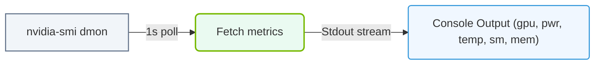

# 30.1f nvidia-smi dmon: continuous device monitoring with configurable metrics

#### 🏷️ The Virtualization and Cloud — Extending AI Infrastructure Beyond Bare Metal > 30 GPU Diagnostics and nvidia-smi Mastery > 30.1 nvidia-smi — The Primary GPU Management Tool

When managing AI workloads, you often need to watch GPU behavior over time — not just take a single snapshot. The **nvidia-smi dmon** command provides continuous, real-time monitoring of GPU devices, allowing you to track performance metrics like utilization, memory usage, temperature, and power consumption as they change. This is especially useful for identifying bottlenecks, spotting overheating trends, or verifying that your training jobs are using GPUs efficiently.

---

## ⚙️ What is nvidia-smi dmon?

**nvidia-smi dmon** stands for "device monitor." Unlike the standard **nvidia-smi** command that gives you a one-time status report, **dmon** runs continuously and updates metrics at a regular interval (default is every second). You can think of it as a live dashboard for your GPUs.

Key characteristics:
- Runs in your terminal and refreshes automatically
- Displays metrics in a compact, table-like format
- Supports customization to show only the metrics you care about
- Works on all NVIDIA GPUs supported by the NVIDIA driver

---

## 📊 Default Monitoring Behavior

When you run **nvidia-smi dmon** without any options, it shows a default set of metrics for all GPUs in your system. The output refreshes every second.

The default columns typically include:
- **GPU index** — which GPU is being reported
- **pwr** — current power draw (in Watts)
- **temp** — GPU temperature (in degrees Celsius)
- **sm** — Streaming Multiprocessor utilization (percentage)
- **mem** — memory utilization (percentage)
- **enc** — video encoder utilization (percentage)
- **dec** — video decoder utilization (percentage)
- **mclk** — memory clock frequency (in MHz)
- **pclk** — graphics clock frequency (in MHz)

---

## 🛠️ Configuring Metrics with the -d Flag

The real power of **nvidia-smi dmon** comes from its ability to show only the metrics you need. You use the **-d** flag followed by a comma-separated list of metric names.

Common metric options include:

- **pwr** — power usage
- **temp** — temperature
- **sm** — SM utilization
- **mem** — memory utilization
- **enc** — encoder utilization
- **dec** — decoder utilization
- **mclk** — memory clock
- **pclk** — graphics clock
- **pcie** — PCIe link generation and width
- **tx** — PCIe transmit throughput
- **rx** — PCIe receive throughput

For reference:
```
nvidia-smi dmon -d pwr,temp,sm,mem
```
📤 **Output:** A continuous display showing only power, temperature, SM utilization, and memory utilization for all GPUs.

---

## 🕵️ Selecting Specific GPUs

By default, **nvidia-smi dmon** monitors all GPUs. You can focus on a single GPU or a subset using the **-i** flag followed by the GPU index number.

For reference:
```
nvidia-smi dmon -i 0
```
📤 **Output:** Continuous monitoring for GPU 0 only.

For reference:
```
nvidia-smi dmon -i 0,2
```
📤 **Output:** Continuous monitoring for GPUs 0 and 2 only.

---


### 📊 Visual Representation: nvidia-smi dmon continuous polling
This diagram shows how dmon streams real-time GPU statistics at fixed time-intervals directly to the stdout terminal console.




## ⏱️ Controlling the Update Interval

You can change how often the metrics refresh using the **-s** flag, followed by the number of seconds between updates.

For reference:
```
nvidia-smi dmon -s 5
```
📤 **Output:** Updates every 5 seconds instead of the default 1 second.

---

## 📋 Comparison: nvidia-smi vs. nvidia-smi dmon

| Feature | nvidia-smi (standard) | nvidia-smi dmon |
|---------|----------------------|-----------------|
| Output type | One-time snapshot | Continuous stream |
| Update interval | Manual re-run | Automatic (configurable) |
| Metric selection | Fixed set | Fully configurable |
| Use case | Quick health check | Long-term monitoring |
| GPU selection | All or one | All, one, or subset |

---

## 🧠 Practical Tips for New Engineers

- **Start with defaults first** — Run **nvidia-smi dmon** without any flags to get familiar with the output layout.
- **Focus on SM and memory** — For AI training, the **sm** and **mem** metrics are your best friends. Low SM utilization may indicate a bottleneck elsewhere.
- **Watch temperature trends** — If you see temperatures climbing steadily, your cooling might be insufficient.
- **Use a longer interval for long jobs** — For overnight training runs, set **-s 10** or **-s 30** to reduce terminal clutter.
- **Combine with other tools** — Use **nvidia-smi dmon** alongside system monitoring tools (like **htop** or **iostat**) to get a complete picture of your AI infrastructure.

---

## ✅ Summary

**nvidia-smi dmon** is an essential tool for anyone working with NVIDIA GPUs in AI environments. It provides a live, customizable view of GPU performance that helps you diagnose issues, optimize workloads, and ensure your hardware is running smoothly. By mastering the **-d** flag for metric selection and the **-i** flag for GPU targeting, you can tailor the monitoring experience to exactly what your AI operations require.