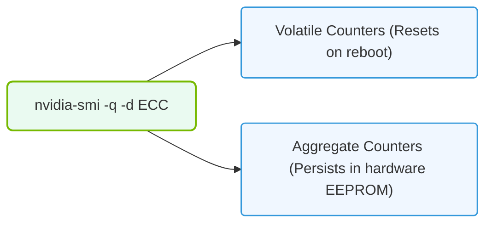

# 30.2d nvidia-smi --query-gpu=ecc.errors.uncorrected.volatile.total: querying ECC counters

#### 🏷️ The Virtualization and Cloud — Extending AI Infrastructure Beyond Bare Metal > 30 GPU Diagnostics and nvidia-smi Mastery > 30.2 Hardware Error Detection and Diagnosis

---

## 🔍 Context Introduction

When you're working with NVIDIA GPUs in AI infrastructure, memory reliability is critical. GPUs use **Error-Correcting Code (ECC)** memory to detect and fix data corruption. However, sometimes errors are too severe to fix — these are called **uncorrectable errors**. The command **nvidia-smi --query-gpu=ecc.errors.uncorrected.volatile.total** lets you check how many of these serious errors have occurred since the last GPU driver reset. This is a vital health check for any engineer managing AI workloads.

---

## ⚙️ What Are ECC Errors?

ECC memory can handle two types of errors:

- **Corrected errors** — The GPU fixes the error automatically. No data is lost.
- **Uncorrected errors** — The GPU cannot fix the error. Data corruption or application crashes may occur.

The **volatile** counter tracks errors since the last driver reset. When you reboot or reload the driver, this counter resets to zero.

---

## 🕵️ What Does This Query Tell You?

When you run the query, you get a single number. That number represents the **total count of uncorrected ECC errors** that have occurred since the GPU driver was last loaded.

**What the number means:**

- **0** — No uncorrected errors. Your GPU memory is healthy.
- **Small number (1–5)** — Possible intermittent hardware issues. Investigate further.
- **Large number (10+)** — Serious hardware problem. The GPU may need replacement.

---

## 📊 Comparison: Volatile vs. Aggregate ECC Counters

| Counter Type | Description | Resets When? |
|--------------|-------------|--------------|
| **Volatile** | Errors since last driver load | Driver reload or reboot |
| **Aggregate** | Total errors over the GPU's lifetime | Never (manual reset only) |

For daily health checks, **volatile** is more useful because it shows recent issues.

---

### 📊 Visual Representation: Querying ECC Error counters
This diagram displays how nvidia-smi queries volatile (since boot) vs. aggregate (lifetime) correctable/uncorrectable ECC events.

## 🛠️ How to Interpret the Results

**Scenario 1: You see 0**
- ✅ GPU memory is clean.
- No action needed.

**Scenario 2: You see a small number (1–3)**
- ⚠️ Possible transient error (e.g., cosmic ray hit).
- Monitor over time. If it stays low, it may be a one-time event.

**Scenario 3: You see a growing number**
- 🚨 Hardware degradation is likely.
- Check other GPUs in the system. If only one GPU shows errors, replace it.
- If multiple GPUs show errors, check power supply, cooling, or motherboard.

---

## 📋 Best Practices for Engineers

- **Run this check daily** as part of your GPU health monitoring.
- **Log the results** to a file or monitoring system to track trends.
- **Compare with corrected error counters** — if corrected errors are also high, the memory may be failing slowly.
- **Never ignore uncorrected errors** — they can silently corrupt AI model training data.

---

## 🧠 Common Misunderstandings

- **"ECC errors mean the GPU is broken."** — Not always. A single error could be a random event. Multiple errors over time indicate a problem.
- **"Volatile counters are useless."** — They are actually the most useful for daily monitoring because they show recent activity.
- **"All GPUs support ECC."** — Only professional-grade GPUs (Tesla, Quadro, A-series, H-series) support ECC. Consumer GPUs (GeForce) do not.

---

## ✅ Summary

The **nvidia-smi --query-gpu=ecc.errors.uncorrected.volatile.total** query is your early warning system for GPU memory failures. By checking this value regularly, you can catch hardware problems before they disrupt AI training or inference workloads. A value of **0** is ideal. Any non-zero value deserves investigation.