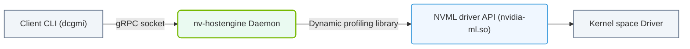

# 31.1b DCGM architecture: nv-hostengine, libdcgm, and the DCGM API

#### 🏷️ The Virtualization and Cloud — Extending AI Infrastructure Beyond Bare Metal > 31 Cluster-Wide Telemetry — DCGM, Prometheus, and Grafana > 31.1 Data Center GPU Manager (DCGM)

Welcome, new engineer! This section breaks down how the Data Center GPU Manager (DCGM) is built. Think of DCGM as the nervous system for your GPU cluster — it collects health signals from every GPU. To understand how it works, you need to know its three main components: the **nv-hostengine**, the **libdcgm** library, and the **DCGM API**.

---

## 🧠 Context: Why This Architecture Matters

When you manage many GPUs across multiple servers, you cannot log into each machine to check temperatures or memory usage. DCGM solves this by providing a centralized way to monitor, diagnose, and manage GPUs. Its architecture is split into three layers:

- **nv-hostengine** — the background service that does the heavy lifting.
- **libdcgm** — the library that programs use to talk to the engine.
- **DCGM API** — the set of functions you call to get GPU data.

---

## ⚙️ Component 1: nv-hostengine (The Engine)

The **nv-hostengine** is a daemon (a background process) that runs on every host machine with NVIDIA GPUs. It is the core of DCGM.

**Key points about nv-hostengine:**

- It starts automatically when DCGM is installed and runs as a system service.
- It communicates directly with the NVIDIA driver and GPU firmware to collect raw metrics.
- It caches data so that multiple clients can request information without hammering the GPU hardware.
- It supports both local queries (on the same machine) and remote queries (from another machine over the network).
- It manages GPU health checks, policy violations, and diagnostic routines.

**How you interact with it:** You typically start, stop, or check its status using system commands. For example, you would use a command like **systemctl status nv-hostengine** to see if it is running.

---

## 📚 Component 2: libdcgm (The Library)

**libdcgm** is a shared library (a `.so` file on Linux) that acts as the bridge between your application and the nv-hostengine.

**Key points about libdcgm:**

- It provides a C-based API that any programming language can call (via bindings).
- It handles all the low-level communication with the nv-hostengine, including socket connections and data serialization.
- It abstracts away the complexity of GPU hardware details — you just ask for "temperature" and it returns a number.
- It is installed automatically when you install DCGM.

**What happens behind the scenes:** When your program calls a function from libdcgm, the library sends a request to the nv-hostengine. The engine fetches the data from the GPU driver, formats it, and sends it back through libdcgm to your program.

---

## 🛠️ Component 3: DCGM API (The Interface)

The **DCGM API** is the set of functions, structures, and constants that you use in your code to get GPU metrics. It is the "front door" to DCGM.

**Key points about the DCGM API:**

- It is a C API, but wrappers exist for Python, Go, and other languages.
- It is divided into several groups:
  - **Field groups** — request specific metrics (e.g., GPU temperature, memory usage, power draw).
  - **Group management** — organize multiple GPUs into logical groups for batch queries.
  - **Policy management** — set thresholds that trigger alerts (e.g., "warn if GPU temperature exceeds 85°C").
  - **Diagnostics** — run health checks on GPUs.
- It is designed to be stateless — each call is independent.

**Example of how you would use it (conceptually):**

1. You initialize the DCGM API in your program.
2. You connect to the nv-hostengine (either locally or remotely).
3. You request a specific field, like **DCGM_FI_DEV_GPU_TEMP**.
4. The API returns the current temperature value.

---

### 📊 Visual Representation: DCGM Service Daemon Architecture
This diagram displays how the nv-hostengine service communicates with driver APIs to serve metrics to client connections.

## 🕵️ How They Work Together (The Data Flow)

Here is the step-by-step journey of a single GPU metric request:

1. **Your application** calls a DCGM API function (e.g., get GPU temperature).
2. **libdcgm** receives the call and formats it into a network request.
3. **libdcgm** sends the request to the **nv-hostengine** via a Unix socket (local) or TCP socket (remote).
4. **nv-hostengine** receives the request and queries the **NVIDIA driver** for the raw GPU data.
5. **nv-hostengine** caches the result and sends it back to **libdcgm**.
6. **libdcgm** returns the data to your application as a clean value.

---

## 📊 Comparison Table: The Three Components

| Component | Role | Where It Runs | How You Use It |
|-----------|------|---------------|----------------|
| **nv-hostengine** | Background service that collects GPU data | On every host with GPUs | Start/stop via system commands |
| **libdcgm** | Library that connects your code to the engine | Linked into your application | Include in your code (C, Python, etc.) |
| **DCGM API** | Set of functions to request GPU metrics | In your application code | Call functions like **dcgmGetLatestValues** |

---

## 🧩 Real-World Example (No Code)

Imagine you are writing a monitoring script that checks GPU memory usage every 5 seconds.

- Your script uses the **DCGM API** to call a function named **dcgmGetLatestValues**.
- The **libdcgm** library translates this into a message for the **nv-hostengine**.
- The **nv-hostengine** reads the memory usage from the GPU driver and sends it back.
- Your script receives the value and logs it to a file.

All of this happens in milliseconds, and you never have to touch the GPU hardware directly.

---

## ✅ Key Takeaways for New Engineers

- **nv-hostengine** is the workhorse — it must be running for DCGM to work.
- **libdcgm** is the middleman — it makes the API easy to use.
- **DCGM API** is your toolbox — it gives you all the functions you need.
- You can run DCGM locally (same machine) or remotely (across the network).
- The architecture is modular: you can replace or upgrade each component independently.

---

## 🔍 Next Steps

Now that you understand the architecture, you are ready to:
- Install and start the **nv-hostengine** on a GPU server.
- Write a simple script using the **DCGM API** to query GPU health.
- Explore how tools like Prometheus use the DCGM API to scrape metrics at scale.

Remember: DCGM is your best friend for keeping GPUs healthy and your AI workloads running smoothly.