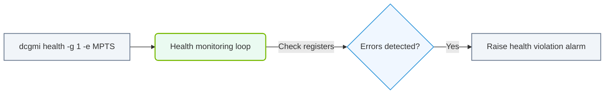

# 31.1e DCGM health watches: proactive monitoring for ECC, PCIe, NVLink, and power

#### 🏷️ The Virtualization and Cloud — Extending AI Infrastructure Beyond Bare Metal > 31 Cluster-Wide Telemetry — DCGM, Prometheus, and Grafana > 31.1 Data Center GPU Manager (DCGM)

---

## 🔍 Context Introduction

When you manage a cluster of NVIDIA GPUs, hardware failures can silently degrade performance or cause job failures. DCGM (Data Center GPU Manager) provides **health watches** — a proactive monitoring feature that continuously checks critical GPU subsystems. Instead of waiting for a crash, you can detect issues early with ECC memory errors, PCIe link problems, NVLink connectivity faults, or power anomalies.

This topic explains how DCGM health watches work and what each watch monitors, so you can set up early warning systems for your AI infrastructure.

---

## ⚙️ What Are DCGM Health Watches?

DCGM health watches are built-in diagnostic checks that run at regular intervals on each GPU. Each watch targets a specific hardware component and reports a **health status** (healthy, warning, or critical). You can configure these watches to trigger alerts or log events when problems arise.

Key characteristics:
- **Proactive** — checks run continuously, not just during boot or maintenance
- **Granular** — each watch focuses on one subsystem (e.g., ECC, PCIe)
- **Actionable** — results can feed into Prometheus, Grafana, or custom scripts
- **Lightweight** — minimal performance overhead during normal operation

---

## 🕵️ The Four Core Health Watches

DCGM provides four essential health watches. Each one monitors a different hardware vulnerability.

| Watch Name | What It Monitors | Common Failure Signs |
|------------|------------------|----------------------|
| **ECC** | Error Correction Code memory errors (single-bit and double-bit) | Increasing corrected errors, uncorrectable errors causing crashes |
| **PCIe** | PCI Express link health (replay counters, link speed/width degradation) | Link down events, reduced bandwidth, transaction errors |
| **NVLink** | NVLink connection health between GPUs (link errors, CRC failures) | Stalled multi-GPU communication, training slowdowns |
| **Power** | Power consumption, voltage, and thermal limits | Throttling, unexpected shutdowns, performance drops |

---

## 🛠️ How Each Watch Works

### 🧠 ECC Health Watch
- Checks for **single-bit correctable errors** and **double-bit uncorrectable errors** in GPU memory
- Tracks error counters over time to detect trends
- A sudden spike in correctable errors may indicate impending uncorrectable failures
- **Action**: Replace GPU if uncorrectable errors appear

### 🔌 PCIe Health Watch
- Monitors **PCIe replay counters** (number of retransmitted packets due to errors)
- Checks **link speed** (e.g., Gen4 vs Gen3) and **link width** (e.g., x16 vs x8)
- Detects when a GPU is running at reduced bandwidth
- **Action**: Reseat GPU or check motherboard slot

### 🔗 NVLink Health Watch
- Verifies **NVLink link status** (up/down) and **CRC error counts**
- Monitors **link bandwidth utilization** and **data transmission errors**
- Critical for multi-GPU training where NVLink bridges are essential
- **Action**: Check NVLink bridge connections or replace cables

### ⚡ Power Health Watch
- Tracks **GPU power draw** against rated TDP (Thermal Design Power)
- Monitors **voltage rail stability** and **thermal throttling events**
- Detects when power delivery is insufficient or overheating occurs
- **Action**: Check power cables, PSU capacity, or cooling system

---

### 📊 Visual Representation: DCGM Health system monitoring
This flowchart demonstrates how enabling DCGM health watches checks parameters and generates telemetry alerts.

## 📊 Comparison: Health Watch vs. Standard Monitoring

| Aspect | Standard Monitoring (e.g., `nvidia-smi`) | DCGM Health Watch |
|--------|-------------------------------------------|-------------------|
| Frequency | On-demand or periodic polling | Continuous, configurable interval |
| Depth | Basic metrics (temp, power, memory) | Subsystem-level diagnostics |
| Alerting | Requires external logic | Built-in health status reporting |
| Error Detection | Only current state | Trend analysis and threshold crossing |
| Use Case | General health checks | Proactive failure prevention |

---

## 🚦 Health Watch Status Values

Each watch reports one of three statuses:

- **Healthy** — No issues detected. GPU subsystem is operating normally.
- **Warning** — Minor anomalies detected (e.g., a few corrected ECC errors). No immediate action needed, but should be investigated.
- **Critical** — Serious problem detected (e.g., uncorrectable ECC error, PCIe link down). Immediate action required.

---

## 🔄 Integrating Health Watches into Operations

To make health watches useful, you typically:

1. **Enable watches** on all GPUs in the cluster
2. **Collect results** via DCGM's telemetry pipeline (e.g., DCGM exporter for Prometheus)
3. **Set up alerts** in Grafana or your monitoring system when status changes to Warning or Critical
4. **Automate responses** — for example, automatically drain a node if a Critical health watch fires

---

## ✅ Best Practices for New Engineers

- **Start with all four watches enabled** — they have minimal overhead and provide broad coverage
- **Set warning thresholds conservatively** — a few corrected ECC errors are normal, but a sudden increase is not
- **Correlate health watch data with other metrics** — e.g., combine power watch results with temperature readings
- **Test your alerting pipeline** — ensure that health watch status changes actually trigger notifications
- **Document baseline values** — record typical error counts during normal operation for comparison

---

## 📝 Summary

DCGM health watches give you **early visibility** into GPU hardware issues before they cause failures. By monitoring ECC, PCIe, NVLink, and power, you can:

- Reduce unplanned downtime
- Improve cluster reliability
- Extend GPU lifespan
- Make informed decisions about hardware replacements

For new engineers, mastering these four watches is a foundational step toward managing AI infrastructure at scale. Start by enabling them on a test GPU, observe the output, and gradually integrate them into your cluster monitoring stack.