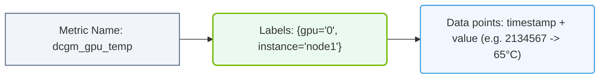

# 31.3a Prometheus data model: time-series metrics with labels

#### 🏷️ The Virtualization and Cloud — Extending AI Infrastructure Beyond Bare Metal > 31 Cluster-Wide Telemetry — DCGM, Prometheus, and Grafana > 31.3 Prometheus — The Metrics Collection Engine

---

## 🌐 Context Introduction

When you start monitoring an AI cluster, you need to collect and store many measurements over time — GPU temperature, memory usage, power draw, and network throughput. Prometheus is the engine that collects all these measurements. But to make sense of this data, you need to understand how Prometheus organizes it. The **Prometheus data model** is built around **time-series metrics with labels**. Think of it as a smart spreadsheet where every row is a timestamp, every column is a metric name, and labels act like sticky notes that add context (e.g., which GPU, which node, which job). This structure makes it easy to query and visualize your cluster's health.

---

## ⚙️ What Is a Time-Series Metric?

A **time-series metric** is simply a sequence of data points, each with a timestamp and a numeric value. Prometheus stores these sequences efficiently.

- **Metric name**: Describes what is being measured (e.g., `gpu_temperature_celsius`).
- **Timestamp**: When the measurement was taken (in Unix epoch time).
- **Value**: The actual numeric reading (e.g., `65.3`).

**Example of a single time-series data point** (conceptual, not code):
- Metric: `gpu_memory_used_bytes`
- Timestamp: `1696000000`
- Value: `8589934592`

Every new measurement from your cluster appends a new data point to the correct time-series.

---

## 🏷️ Labels: The Key to Context

Labels are key-value pairs attached to every metric. They turn a flat number into a rich, queryable data point. Labels answer questions like: "Which GPU?" "Which node?" "Which container?"

**Common labels in an AI cluster:**
- `gpu="0"` — identifies a specific GPU on a node
- `node="gpu-server-01"` — identifies the physical server
- `job="dcgm-exporter"` — identifies the exporter that collected the metric
- `instance="10.0.0.1:9400"` — identifies the specific endpoint

**Why labels matter:**
- Without labels, you only know the total GPU memory across your cluster.
- With labels, you can see memory usage per GPU, per node, per job.

---

## 📊 How Metrics and Labels Work Together

Every unique combination of metric name and label set creates a separate time-series. This is the core of the Prometheus data model.

**Example breakdown:**

| Metric Name | Labels | Meaning |
|---|---|---|
| `gpu_temperature_celsius` | `gpu="0", node="node-a"` | Temperature of GPU 0 on node-a |
| `gpu_temperature_celsius` | `gpu="1", node="node-a"` | Temperature of GPU 1 on node-a |
| `gpu_temperature_celsius` | `gpu="0", node="node-b"` | Temperature of GPU 0 on node-b |

Each row above represents a separate time-series. Prometheus stores the history of values for each one.

---

### 📊 Visual Representation: Prometheus Time-Series Data Model
This diagram displays how Prometheus stores metric attributes as labeled time-series key-value pairs.

## 🕵️ Metric Types in Prometheus

Prometheus supports four core metric types. For AI infrastructure, you will mostly use **Gauge** and **Counter**.

- **Gauge**: A value that can go up or down (e.g., GPU temperature, memory usage, power draw).
- **Counter**: A value that only increases (e.g., total GPU errors, total packets sent).
- **Histogram**: Samples observations and counts them in configurable buckets (e.g., request latency).
- **Summary**: Similar to histogram but calculates configurable quantiles over a sliding time window.

**For AI operations, you will work with Gauges most often** because GPU metrics like temperature and memory fluctuate continuously.

---

## 🛠️ How Labels Enable Powerful Queries

Labels allow you to slice and dice your data. Prometheus uses a query language called **PromQL** to do this.

**Example queries you might run (conceptual, not code):**
- Show temperature for GPU 0 on node-a: filter by `gpu="0"` and `node="node-a"`
- Show average temperature across all GPUs: aggregate without the `gpu` label
- Show total memory used per node: sum by `node` label

Labels make these queries possible without storing duplicate data.

---

## 📈 Comparison: Without Labels vs. With Labels

| Aspect | Without Labels | With Labels |
|---|---|---|
| **Data granularity** | One number for the whole cluster | One number per GPU, per node, per job |
| **Query flexibility** | Can only ask "what is total?" | Can ask "what is per GPU?" or "per node?" |
| **Storage efficiency** | Simple but loses context | Slightly more storage but rich context |
| **Troubleshooting** | Hard to find which GPU is overheating | Easy to pinpoint the exact GPU |

---

## 🧠 Key Takeaways for New Engineers

- **Every metric** in Prometheus is a time-series: a name, a timestamp, and a value.
- **Labels** add context like which GPU, which node, or which job.
- **Unique label combinations** create separate time-series — this is how Prometheus stores detailed data.
- **Gauges** are the most common metric type for GPU monitoring (temperature, memory, power).
- **Labels make queries powerful** — you can filter, group, and aggregate your cluster data easily.

---

## ✅ Summary

The Prometheus data model is simple but powerful. A metric name tells you *what* is being measured, and labels tell you *where* and *which* component. Together, they create a flexible system for storing and querying the massive amount of telemetry data generated by an AI cluster. As you start working with DCGM and Prometheus, remember: every GPU, every node, and every job gets its own set of labels — and that is what makes cluster-wide monitoring possible.