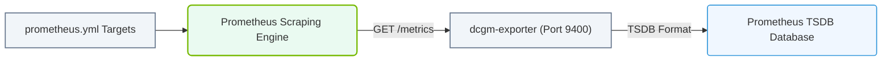

# 31.3b Prometheus scrape configuration: targeting dcgm-exporter and node-exporter

#### 🏷️ The Virtualization and Cloud — Extending AI Infrastructure Beyond Bare Metal > 31 Cluster-Wide Telemetry — DCGM, Prometheus, and Grafana > 31.3 Prometheus — The Metrics Collection Engine

---

## 🧠 Context Introduction

In an AI infrastructure cluster, you need to collect two distinct types of metrics:

- **GPU-level metrics** — temperature, memory usage, power draw, and utilization (provided by **dcgm-exporter**)
- **Node-level metrics** — CPU, memory, disk, and network usage (provided by **node-exporter**)

Prometheus acts as the central metrics collection engine. To gather data from both exporters, you must configure Prometheus with **scrape targets** — specific endpoints it will periodically pull metrics from. This topic explains how to set up those scrape configurations correctly.

---

## ⚙️ Understanding the Two Exporters

| Exporter | What It Monitors | Default Port | Metrics Prefix |
|---|---|---|---|
| **dcgm-exporter** | NVIDIA GPU metrics (via DCGM) | **9400** | `DCGM_` or `nv_` |
| **node-exporter** | Linux host metrics (CPU, RAM, disk, network) | **9100** | `node_` |

Both exporters expose metrics in a plaintext format at the `/metrics` endpoint. Prometheus scrapes these endpoints at a defined interval.

---

## 🛠️ Prometheus Scrape Configuration Basics

Prometheus configuration is stored in a YAML file (typically `/etc/prometheus/prometheus.yml`). The key section for defining targets is **`scrape_configs`**.

Each scrape job has:
- A **job_name** (descriptive label)
- A **scrape_interval** (how often to pull metrics)
- A list of **targets** (IP:port or hostname:port of the exporter)

---

## 🕵️ Adding dcgm-exporter as a Scrape Target

To collect GPU metrics, you define a job that points to the dcgm-exporter instances running on your GPU nodes.

**Configuration structure (conceptual):**

- **job_name:** `dcgm-exporter`
- **scrape_interval:** `15s` (recommended for GPU metrics)
- **targets:** list of all GPU node IPs or hostnames with port **9400**

Example of a single target entry in the configuration:
- Target: `gpu-node-01:9400`
- Target: `gpu-node-02:9400`

Prometheus will visit each target at the specified interval and pull all metrics exposed by dcgm-exporter.

---

### 📊 Visual Representation: Prometheus Scrape target pipeline
This flowchart shows how Prometheus pulls metrics from target HTTP endpoints defined in Prometheus scrape configurations.

## 🖥️ Adding node-exporter as a Scrape Target

For host-level metrics, you add a separate job for node-exporter.

**Configuration structure (conceptual):**

- **job_name:** `node-exporter`
- **scrape_interval:** `30s` (host metrics change less rapidly)
- **targets:** list of all cluster nodes (both GPU and CPU-only nodes) with port **9100**

Example of a single target entry:
- Target: `node-01:9100`
- Target: `gpu-node-01:9100`

---

## 📊 Comparison: dcgm-exporter vs node-exporter Scrape Jobs

| Feature | dcgm-exporter Job | node-exporter Job |
|---|---|---|
| **Job name** | `dcgm-exporter` | `node-exporter` |
| **Default port** | 9400 | 9100 |
| **Scrape interval** | 15 seconds | 30 seconds |
| **Metrics collected** | GPU utilization, memory, temperature, power | CPU, RAM, disk, network, load |
| **Nodes targeted** | Only GPU-equipped nodes | All nodes in the cluster |

---

## 🔍 Verifying the Scrape Configuration

After updating the Prometheus configuration file, you must reload or restart Prometheus for changes to take effect.

**Steps to verify:**

1. Check the Prometheus web UI (typically at `http://<prometheus-server>:9090`)
2. Navigate to **Status > Targets**
3. Look for both `dcgm-exporter` and `node-exporter` jobs
4. Each target should show a **UP** state with a green checkmark
5. If a target shows **DOWN**, verify the exporter is running and the port is reachable

**Common issues to troubleshoot:**
- Firewall blocking ports 9400 or 9100
- Exporter service not running on the target node
- Incorrect IP address or hostname in the targets list
- Prometheus configuration YAML syntax error (use `promtool check config` to validate)

---

## ✅ Summary

- **dcgm-exporter** runs on GPU nodes at port **9400** — provides GPU telemetry
- **node-exporter** runs on all nodes at port **9100** — provides host telemetry
- Prometheus uses **scrape_configs** in its YAML configuration to define jobs and targets
- Each job has a unique name, scrape interval, and list of target endpoints
- Always verify targets are **UP** in the Prometheus UI after configuration changes

With both exporters properly targeted, Prometheus will continuously collect the full picture of your AI infrastructure — from GPU performance to host health — enabling powerful dashboards and alerting in Grafana.