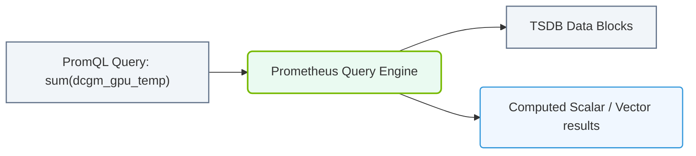

# 31.3c PromQL basics: querying GPU temperature, utilization, and memory across nodes

#### 🏷️ The Virtualization and Cloud — Extending AI Infrastructure Beyond Bare Metal > 31 Cluster-Wide Telemetry — DCGM, Prometheus, and Grafana > 31.3 Prometheus — The Metrics Collection Engine

## 🔍 Context Introduction

Welcome to the world of PromQL — the query language that lets you ask questions about your GPU cluster's health and performance. Think of it as a search engine for your infrastructure metrics. Instead of typing keywords, you write expressions that Prometheus understands, and it returns the exact data you need.

For a new engineer, the most common questions are: "Are my GPUs too hot?", "Are they being used efficiently?", and "Is memory running out?" This guide will teach you the basic PromQL queries to answer these questions across all your nodes.

---

## ⚙️ Understanding PromQL Basics

PromQL works with **metrics** (like `DCGM_FI_DEV_GPU_TEMP`) and **labels** (like `gpu="0"` or `host="node-01"`). Every metric has a name and optional labels that describe it.

### Key Concepts:
- **Instant vector**: A single data point at the current time (e.g., current GPU temperature)
- **Range vector**: Multiple data points over a time window (e.g., temperature over the last 5 minutes)
- **Aggregation operators**: Combine data across multiple GPUs or nodes (e.g., `avg`, `max`, `sum`)
- **Label matchers**: Filter data by specific attributes (e.g., `gpu=~"0|1"` for GPUs 0 and 1)

---

## 🌡️ Querying GPU Temperature

GPU temperature is critical — overheating can throttle performance or damage hardware. Here's how to check it.

### Basic Temperature Query
To see the current temperature of every GPU in your cluster:
- **Query**: `DCGM_FI_DEV_GPU_TEMP`
- **Result**: Returns a list of all GPUs with their temperature in Celsius

### Filtering by Node
To check temperature on a specific node:
- **Query**: `DCGM_FI_DEV_GPU_TEMP{host="node-01"}`
- **Result**: Shows only GPUs on `node-01`

### Finding the Hottest GPU
To identify the GPU with the highest temperature across all nodes:
- **Query**: `max(DCGM_FI_DEV_GPU_TEMP)`
- **📤 Output**: A single number representing the hottest GPU temperature in the cluster

### Temperature Over Time
To see how temperature changed in the last 10 minutes:
- **Query**: `DCGM_FI_DEV_GPU_TEMP[10m]`
- **📤 Output**: A range vector with multiple temperature readings per GPU

---

## 📊 Querying GPU Utilization

Utilization tells you how busy your GPUs are. High utilization is good for training, but low utilization might mean idle resources.

### Basic Utilization Query
To see the current utilization percentage for all GPUs:
- **Query**: `DCGM_FI_DEV_GPU_UTIL`
- **📤 Output**: Values from 0 to 100, where 100 means fully utilized

### Average Utilization Per Node
To get the average GPU utilization across all GPUs on each node:
- **Query**: `avg by (host) (DCGM_FI_DEV_GPU_UTIL)`
- **📤 Output**: One value per node showing average GPU utilization

### GPUs with Low Utilization
To find GPUs running below 20% utilization (potential idle resources):
- **Query**: `DCGM_FI_DEV_GPU_UTIL < 20`
- **📤 Output**: Only GPUs with utilization less than 20%

### Utilization Rate of Change
To see if utilization is increasing or decreasing over the last 5 minutes:
- **Query**: `rate(DCGM_FI_DEV_GPU_UTIL[5m])`
- **📤 Output**: Change in utilization per second (useful for spotting trends)

---

### 📊 Visual Representation: PromQL query evaluation
This diagram displays how PromQL queries parse, filter, and aggregate time-series metric databases.

## 🧠 Querying GPU Memory

Memory is a finite resource — running out can crash your AI workloads. Monitoring memory usage helps you plan capacity.

### Total Memory
To see total memory (in bytes) for each GPU:
- **Query**: `DCGM_FI_DEV_FB_TOTAL`
- **📤 Output**: Total frame buffer memory per GPU

### Used Memory
To see how much memory is currently used:
- **Query**: `DCGM_FI_DEV_FB_USED`
- **📤 Output**: Used memory in bytes per GPU

### Free Memory
To calculate free memory (total minus used):
- **Query**: `DCGM_FI_DEV_FB_TOTAL - DCGM_FI_DEV_FB_USED`
- **📤 Output**: Free memory in bytes per GPU

### Memory Utilization Percentage
To see memory usage as a percentage:
- **Query**: `(DCGM_FI_DEV_FB_USED / DCGM_FI_DEV_FB_TOTAL) * 100`
- **📤 Output**: Percentage of memory used per GPU

### Nodes with High Memory Pressure
To find nodes where any GPU has more than 90% memory used:
- **Query**: `max by (host) ((DCGM_FI_DEV_FB_USED / DCGM_FI_DEV_FB_TOTAL) * 100) > 90`
- **📤 Output**: Only nodes with at least one GPU above 90% memory usage

---

## 🕵️ Combining Queries Across Nodes

The real power of PromQL comes from combining metrics and aggregating across your entire cluster.

### Comparison Table: Common Aggregation Operators

| Operator | What It Does | Example Query | 📤 Output |
|----------|--------------|---------------|-----------|
| `avg` | Average across all GPUs | `avg(DCGM_FI_DEV_GPU_TEMP)` | Single average temperature |
| `max` | Maximum value | `max(DCGM_FI_DEV_GPU_UTIL)` | Highest utilization |
| `min` | Minimum value | `min(DCGM_FI_DEV_FB_USED)` | Lowest memory usage |
| `sum` | Total across all GPUs | `sum(DCGM_FI_DEV_FB_USED)` | Total cluster memory used |
| `count` | Count of GPUs | `count(DCGM_FI_DEV_GPU_TEMP)` | Number of GPUs in cluster |

### Grouping by Labels
To see results grouped by node:
- **Query**: `avg by (host) (DCGM_FI_DEV_GPU_TEMP)`
- **📤 Output**: Average temperature per node

To see results grouped by GPU index across all nodes:
- **Query**: `avg by (gpu) (DCGM_FI_DEV_GPU_UTIL)`
- **📤 Output**: Average utilization for GPU 0, GPU 1, etc., across all nodes

### Top 5 Hottest GPUs
To find the five GPUs with the highest temperature:
- **Query**: `topk(5, DCGM_FI_DEV_GPU_TEMP)`
- **📤 Output**: The five highest temperature values with their labels

---

## 🛠️ Practical Query Examples for Daily Monitoring

Here are ready-to-use queries for common monitoring scenarios:

### Health Check Dashboard
- **All GPUs temperature**: `DCGM_FI_DEV_GPU_TEMP`
- **All GPUs utilization**: `DCGM_FI_DEV_GPU_UTIL`
- **All GPUs memory used**: `DCGM_FI_DEV_FB_USED`

### Alerting Conditions
- **GPU overheating** (temperature > 85°C): `DCGM_FI_DEV_GPU_TEMP > 85`
- **GPU idle** (utilization < 5% for 10 minutes): `avg_over_time(DCGM_FI_DEV_GPU_UTIL[10m]) < 5`
- **Memory almost full** (used > 95%): `(DCGM_FI_DEV_FB_USED / DCGM_FI_DEV_FB_TOTAL) * 100 > 95`

### Capacity Planning
- **Total cluster GPU memory**: `sum(DCGM_FI_DEV_FB_TOTAL)`
- **Total cluster GPU memory used**: `sum(DCGM_FI_DEV_FB_USED)`
- **Cluster-wide memory utilization**: `(sum(DCGM_FI_DEV_FB_USED) / sum(DCGM_FI_DEV_FB_TOTAL)) * 100`

---

## ✅ Key Takeaways for New Engineers

- **Start simple**: Begin with basic queries like `DCGM_FI_DEV_GPU_TEMP` to see all data, then add filters and aggregations
- **Use labels to narrow down**: Always filter by `host`, `gpu`, or other labels to get specific results
- **Aggregate for big picture**: Use `avg`, `max`, `sum` to understand cluster-wide trends
- **Combine metrics**: Subtract or divide metrics (like memory used / total) to calculate percentages
- **Practice with range vectors**: Add `[5m]` to see how metrics change over time
- **Remember units**: Temperature is in Celsius, memory in bytes, utilization in percentage (0-100)

PromQL is your window into the health of your GPU cluster. With these basics, you can now ask meaningful questions about temperature, utilization, and memory — and get answers that help you keep your AI infrastructure running smoothly.